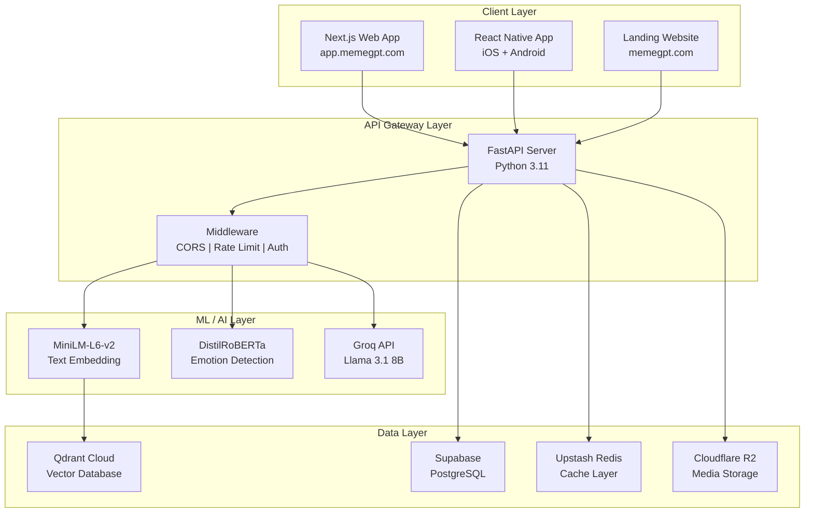
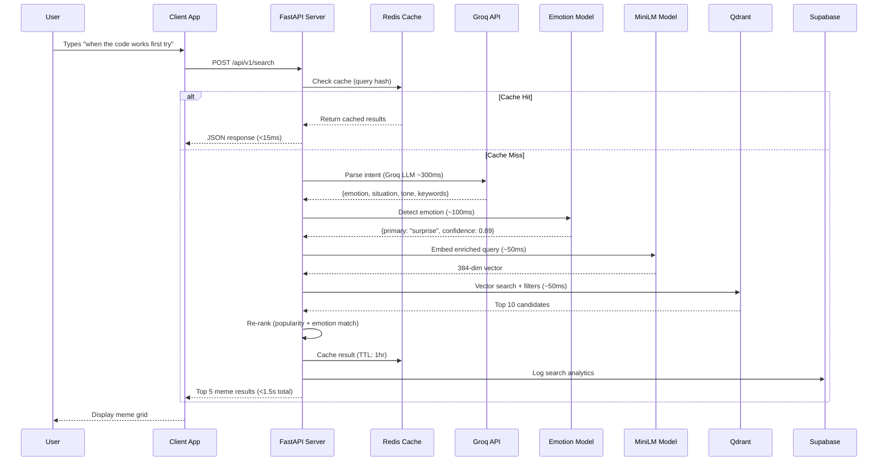

# MemeGPT — Project Overview

> **Document Version:** 2.0  
> **Last Updated:** 2026-08-01  
> **Document Owner:** Senior Software Architect  
> **Classification:** Internal — Engineering Knowledge Base  
> **Status:** Active

---

## Executive Summary

MemeGPT is an **AI-powered meme recommendation engine** that accepts any text input — a sentence, conversation snippet, mood description, or full script — and returns the most contextually accurate, emotionally resonant meme in any format (GIF, image, video, sticker, WebP).

Unlike traditional meme search engines (Google Images, Giphy, Tenor) that rely on keyword matching and metadata tags, MemeGPT leverages a multi-model AI pipeline combining **semantic text embeddings**, **large language model context parsing**, **emotion detection**, and **image-text alignment scoring** to deliver results that truly match the user's intent.

**Tagline:** *"Say anything. Get the perfect meme."*

**Core Promise:** Zero effort. Maximum relatability. Instant meme.

**Mission:** Build the world's most accurate AI-powered meme recommendation engine — free, fast, and fun.

---

## Problem Statement

### The Universal Problem

Every day, billions of messages are sent across WhatsApp, Discord, Telegram, Slack, and iMessage. Users frequently experience emotions and situations where a meme would be the perfect response — but they **cannot find the right one**. The gap between "I know a meme exists for this" and "I can find it" is what MemeGPT solves.

### Why Existing Solutions Fail

Existing meme discovery tools rely on **keyword matching** and **tag-based search**, which fundamentally cannot understand:

1. **Context** — The broader meaning behind a query, not just the literal words. When a user types "when you fix the bug at 3am but create two more," keyword search looks for "bug," "3am," and "fix" independently.
2. **Emotion** — The tone, sentiment, and affective state behind the search. A sarcastic "great" and a sincere "great" should return completely different memes.
3. **Cultural Nuance** — The evolving language of meme culture. Slang like "no cap," "bruh moment," or "it's giving" carries meaning that metadata tags cannot capture.
4. **Conversational Context** — The ability to paste an entire conversation and have the AI understand the overall vibe, not just individual words.

| Capability | Google Images | Giphy | Tenor | **MemeGPT** |
|---|---|---|---|---|
| Understands full context | ❌ | ❌ | ❌ | ✅ |
| Matches emotion to meme | ❌ | ❌ | ❌ | ✅ |
| Processes conversations | ❌ | ❌ | ❌ | ✅ |
| Multi-format output | Image only | GIF only | GIF only | ✅ GIF+Image+Video+WebP |
| AI re-ranking | ❌ | ❌ | ❌ | ✅ |
| Works offline (cached) | ❌ | ❌ | ❌ | ✅ |
| Privacy-first | ❌ | ❌ | ✅ | ✅ |

---

## High-Level System Architecture

---

## Product Value Proposition

### Core Differentiators

| # | Differentiator | Description |
|---|---|---|
| 1 | **Context Understanding** | Processes natural language, understands subtext, sarcasm, and emotional tone using LLM context parsing |
| 2 | **Emotion Matching** | Maps user's emotional state to meme templates known to express that emotion via dedicated emotion classifier |
| 3 | **Multi-format Support** | Returns GIFs, static images, videos, stickers, and WebP in one unified search interface |
| 4 | **Conversational Interface** | Accepts multi-turn conversation input, follow-up refinements, and full chat paste |
| 5 | **AI Re-ranking** | Machine learning pipeline reranks initial search results based on vector similarity, emotion match, and popularity |
| 6 | **Privacy-first Architecture** | No account required, minimal data collection, works offline with cached memes |

### Target Outcomes

| Metric | Target (Month 3) | Target (Month 6) | Target (Year 1) |
|---|---|---|---|
| Daily Active Users (DAU) | 1,000 | 10,000 | 50,000 |
| Search accuracy (perceived relevance) | >80% | >85% | >90% |
| Response time (P50) | <1.5s | <1.0s | <0.8s |
| Response time (P95) | <3.0s | <2.0s | <1.5s |
| App Store Rating | >4.3 | >4.5 | >4.7 |
| Meme Database Size | 5,000 | 25,000 | 100,000+ |
| Copy/Download Rate | >30% | >40% | >50% |
| Monthly Cost | $0 | $0 | <$72 |

---

## System Boundaries

### In Scope (Phase 1)

- Natural language to meme search via semantic embeddings
- Multi-format meme retrieval (GIF, PNG, JPG, MP4, WebP, stickers)
- AI-based context extraction, emotion analysis, and re-ranking
- Web application (Next.js, dark mode, PWA-enabled)
- Mobile application (React Native + Expo, iOS + Android)
- REST API for developer access
- Copy, download, and share functionality
- Search history and favorites (local storage)
- Trending memes section
- SEO-optimized individual meme pages

### Out of Scope (Phase 1)

- Meme creation/editing tools (canvas-based meme generator)
- Video editing or GIF creation from scratch
- Social networking feed or user-to-user interactions
- User-generated meme uploads and community tagging
- Payment processing and monetization engine
- Enterprise white-label solutions
- Browser extension (deferred to Phase 2)

---

## Technology Footprint

| Layer | Component | Technology | Hosting | Free Tier |
|---|---|---|---|---|
| Frontend (Web) | Web App + Landing | Next.js 14, React, Tailwind CSS | Vercel | 100GB bandwidth |
| Frontend (Mobile) | iOS + Android App | React Native, Expo SDK 51 | App Store / Play Store | — |
| Backend | API Server | FastAPI (Python 3.11) | Render.com / Railway | 750 hrs/month |
| AI Models | Text Embedding | sentence-transformers/all-MiniLM-L6-v2 | Self-hosted (CPU) | Free |
| AI Models | Emotion Detection | j-hartmann/emotion-english-distilroberta-base | Self-hosted (CPU) | Free |
| AI Models | Context Parsing | Llama 3.1 8B via Groq API | Groq Cloud | 6K req/day |
| AI Models | Image Captioning | Salesforce/blip-image-captioning-base | Self-hosted (indexing) | Free |
| AI Models | Image Embedding | openai/clip-vit-base-patch32 | Self-hosted (indexing) | Free |
| AI Models | OCR | Tesseract OCR | Self-hosted (indexing) | Free |
| Vector Database | Meme Vectors | Qdrant | Qdrant Cloud | 1GB, 1M vectors |
| SQL Database | Metadata + Users | PostgreSQL | Supabase | 500MB |
| Cache | Query Results | Redis | Upstash | 10K ops/day |
| Media Storage | Meme Files | Cloudflare R2 | Cloudflare | 10GB |
| DNS + CDN | Global Distribution | Cloudflare | Cloudflare | Free |

---

## Business Model

### Free Tier (Launch — 95% of Users)

- Unlimited meme searches
- All formats (GIF, PNG, MP4, WebP)
- Copy, download, share
- Web, mobile, and API access
- Rate limit: 60 requests/minute

### Pro Tier ($5/month — Future)

- Unlimited rate limits
- HD downloads
- Custom collections with cloud sync
- Priority API access
- API key for commercial use

### Team Tier ($15/month — Future)

- Everything in Pro
- Team shared library
- Custom branding
- Webhook integrations

### API Tier (Pay-per-use — Future)

- $0.001 per search call
- Bulk pricing available
- SLA guarantees

> **Launch Strategy:** 100% free at launch. No paywalls. Get users first, monetize later.

---

## Governance & Compliance

| Domain | Policy |
|---|---|
| **GDPR** | No PII stored, search queries anonymized after 30 days, data deletion on request |
| **COPPA** | No user accounts for core experience, no data collection from users under 13 |
| **Copyright** | Meme metadata stored with source attribution, original links preserved, DMCA takedown process at legal@memegpt.com (48-hour response) |
| **Content Moderation** | NSFW classifier (CLIP-based) rejects adult content during indexing, community flagging system, manual review dashboard |
| **Accessibility** | AI-generated alt text on all memes, keyboard navigation, screen reader support, WCAG 2.1 AA compliance target |
| **Open Source** | MIT license for client SDKs, server components under AGPL |

---

## Request Flow (End-to-End)

---

## Document Navigation

This document serves as the **root entry point** for the complete MemeGPT engineering knowledge base. Navigate to specific domains:

| Section | Path | Description |
|---|---|---|
| **Getting Started** | [01_Getting_Started/](../01_Getting_Started/README.md) | Onboarding, environment setup, first contribution |
| **Architecture** | [02_Project_Architecture/](../02_Project_Architecture/README.md) | System architecture, component design, data flow |
| **Backend** | [03_Backend/](../03_Backend/README.md) | FastAPI server, services, models, middleware |
| **Frontend** | [04_Frontend/](../04_Frontend/README.md) | Web and mobile application architecture |
| **AI System** | [05_AI_System/](../05_AI_System/README.md) | ML models, NLP pipeline, training infrastructure |
| **Database** | [06_Database/](../06_Database/README.md) | Data models, indexing strategies, migration guides |
| **APIs** | [07_APIs/](../07_APIs/README.md) | REST API reference, client SDKs, rate limiting |
| **Features** | [08_Features/](../08_Features/README.md) | Feature specifications, user stories, acceptance criteria |
| **Development** | [09_Development/](../09_Development/README.md) | Local dev setup, coding standards, contribution workflow |
| **Testing** | [10_Testing/](../10_Testing/README.md) | Test strategy, unit/integration/e2e test examples |
| **Security** | [11_Security/](../11_Security/README.md) | Security architecture, threat model, best practices |
| **Deployment** | [12_Deployment/](../12_Deployment/README.md) | CI/CD, infrastructure-as-code, release process |
| **Project Management** | [13_Project_Management/](../13_Project_Management/README.md) | Roadmap, sprint boards, stakeholder communication |
| **Troubleshooting** | [14_Troubleshooting/](../14_Troubleshooting/README.md) | Debugging guides, common errors, incident runbooks |
| **FAQs** | [15_FAQs/](../15_FAQs/README.md) | Frequently asked questions |
| **References** | [16_References/](../16_References/README.md) | External documentation, papers, blog posts |
| **Appendix** | [17_Appendix/](../17_Appendix/README.md) | Tool configurations, environment variables, scripts |

---

> **Next Document:** [Vision.md](./Vision.md) — Full product vision and mission statement.