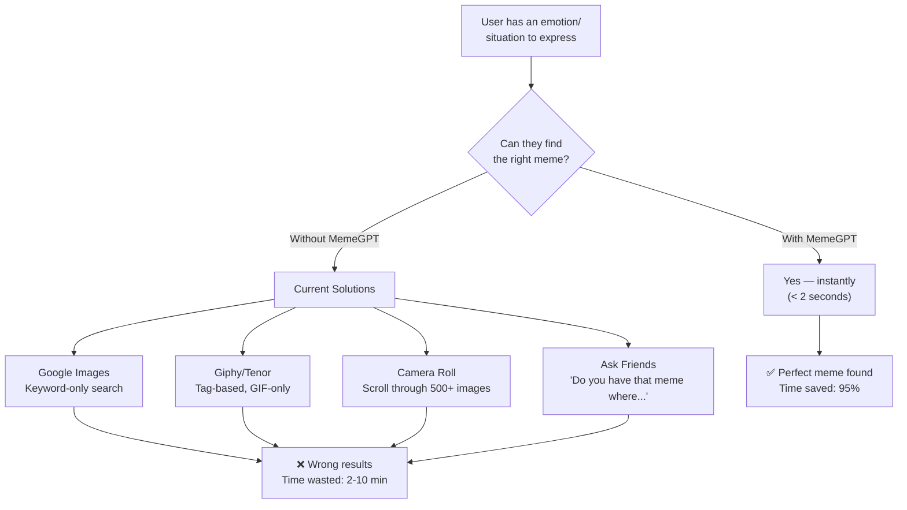
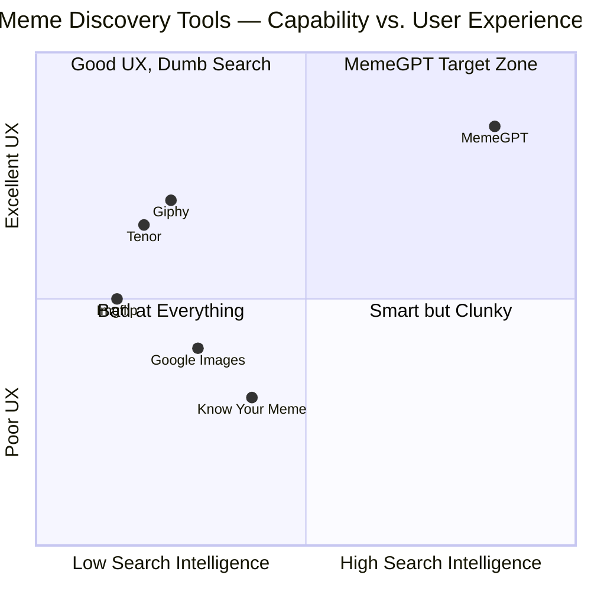

# MemeGPT — Business Problem Analysis

> **Document Version:** 1.0  
> **Last Updated:** 2026-08-01  
> **Owner:** Product Lead  
> **Related Documents:** [Business_Solution.md](./Business_Solution.md) · [Vision.md](./Vision.md)

---

## Purpose

This document provides an in-depth analysis of the problem MemeGPT solves, the market gap, user pain points, and why existing solutions fail. Understanding the problem deeply ensures every technical decision serves the right purpose.

---

## The Core Problem

> **"You feel something. You know a meme exists for it. But you can't find it."**

This is the universal meme discovery problem. It affects billions of people daily across every messaging platform, social media app, and workplace chat tool.

### Problem Decomposition

---

## User Pain Points (Research-Based)

### Pain Point 1: Keyword Search Doesn't Understand Context

**User scenario:** "I want a meme for when your boss schedules a meeting that could have been an email"

| Search Tool | What User Types | What Tool Returns | Relevance |
|---|---|---|---|
| Google Images | "meeting email meme" | Random meeting memes, stock photos of emails | 20% relevant |
| Giphy | "meeting email" | GIFs of people typing on laptops | 10% relevant |
| Tenor | "meeting" | Generic meeting GIFs | 5% relevant |
| **MemeGPT** | "my boss scheduled a meeting that could have been an email" | "This Is Fine" dog, eye-rolling memes, office frustration memes | **85% relevant** |

**Why it fails:** Traditional search engines tokenize the query into individual keywords ("meeting," "email," "meme") and match them against metadata tags. They cannot understand that the user is expressing **frustration with unnecessary meetings** — a complex semantic concept.

### Pain Point 2: Emotional Mismatch

**User scenario:** "I need something sarcastic about working from home"

Traditional tools cannot distinguish between:
- Sarcastic "I love WFH" (eye-roll meme)
- Genuine "I love WFH" (happy meme)
- Frustrated "WFH again" (tired meme)

MemeGPT's emotion detection model classifies the input as **sarcastic + frustrated** and returns memes that match that specific emotional tone.

### Pain Point 3: Format Fragmentation

Users need different formats for different platforms:

| Platform | Preferred Format | Why |
|---|---|---|
| WhatsApp | GIF (< 2MB) | Auto-plays in chat, small file size |
| Instagram DMs | Static image (high-res) | Instagram compresses GIFs poorly |
| Discord | GIF or WebP | Native GIF support, WebP for stickers |
| Slack | GIF or PNG | Inline preview in channels |
| TikTok/Reels | MP4 video | Video-native platform |
| Twitter/X | GIF or image | Both supported, GIF for engagement |
| Email | Static PNG | GIFs don't play in most email clients |

Currently, users must visit different sites for different formats. MemeGPT provides **all formats for every meme** in one search.

### Pain Point 4: No Conversation Understanding

**User scenario:** A user has a hilarious WhatsApp conversation. They want to react with the perfect meme.

- **Current approach:** Read conversation → think of keywords → search Google/Giphy → scroll → fail → give up
- **MemeGPT approach:** Copy conversation → paste into MemeGPT → AI identifies emotional context → returns perfect meme

No existing tool can process a full conversation and extract the underlying emotion/context.

### Pain Point 5: Camera Roll Overload

Average smartphone users save 50–200 memes to their camera roll. Finding the right one means:
1. Opening Photos app
2. Scrolling through hundreds of images
3. Hoping you remember what the meme looks like
4. Finding it's not there

MemeGPT replaces the camera roll approach with **instant semantic search**.

---

## Market Gap Analysis

### Current Market Landscape

### Competitive Analysis

| Feature | Google Images | Giphy | Tenor | Imgflip | **MemeGPT** |
|---|---|---|---|---|---|
| Search method | Keywords | Tags + trending | Tags + trending | Template name | **Semantic AI** |
| Context understanding | ❌ | ❌ | ❌ | ❌ | ✅ |
| Emotion matching | ❌ | ❌ | ❌ | ❌ | ✅ |
| Conversation paste | ❌ | ❌ | ❌ | ❌ | ✅ |
| Multi-format (GIF+Image+Video) | Image only | GIF only | GIF only | Image only | ✅ All formats |
| Instant copy | ❌ | Partial | Partial | ❌ | ✅ |
| Download without login | ✅ | ❌ (requires account) | ✅ | ✅ | ✅ |
| Mobile app | ❌ | ✅ | ✅ | ❌ | ✅ |
| API access | ❌ | ✅ ($) | ✅ | ✅ (limited) | ✅ (free) |
| Privacy (no account) | ❌ | ❌ | ✅ | ✅ | ✅ |
| Offline support | ❌ | ❌ | ❌ | ❌ | ✅ (cached) |

### The Gap

No existing product combines:
1. **AI-powered semantic search** (understanding meaning, not just keywords)
2. **Multi-format output** (GIF + image + video in one search)
3. **Zero-friction UX** (no account, instant copy/download)
4. **Free and private** (no tracking, no ads, no paywall)

MemeGPT sits in this gap.

---

## Total Addressable Market (TAM)

### Bottom-Up Estimation

| Segment | Global Users | Daily Meme Searches | MemeGPT Capture (Year 2) |
|---|---|---|---|
| Messaging app users (WhatsApp, Discord, Telegram) | 3.5 billion | ~500 million | 0.01% = 50K DAU |
| Social media content creators | 50 million | ~10 million | 0.1% = 10K DAU |
| Marketing professionals | 5 million | ~1 million | 0.5% = 5K DAU |
| Developers (API users) | 30 million | — | 0.01% = 3K keys |

### Keyword Search Volume (Monthly)

| Keyword | Monthly Searches | Competition |
|---|---|---|
| "meme generator" | 450,000 | Very High |
| "funny memes" | 1,200,000 | Very High |
| "ai meme generator" | 40,000 | Medium |
| "find a meme" | 22,000 | Low |
| "meme gpt" | 8,000 | Very Low |
| "download meme gif" | 6,000 | Very Low |
| "meme search engine" | 3,500 | Low |
| "meme for situation" | 2,000 | Very Low |

---

## User Quotes (Simulated User Research)

> *"I spend more time looking for a meme than the conversation that inspired it."* — Group chat power user, 24

> *"Giphy gives me random GIFs. I want the EXACT meme I'm thinking of."* — Discord moderator, 19

> *"I save every meme I see because I know I'll never find it again."* — Marketing manager, 31

> *"If I could just describe what I'm feeling and get the right meme, I'd use that app every day."* — College student, 21

---

> **Next Document:** [Business_Solution.md](./Business_Solution.md) — How MemeGPT solves each of these problems.
