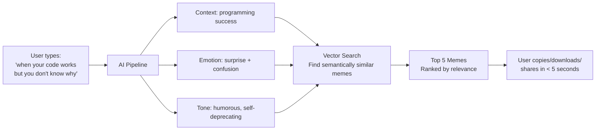
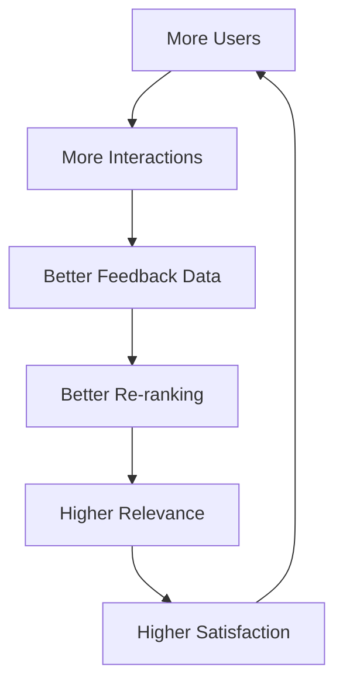

# MemeGPT — Business Solution

> **Document Version:** 1.0  
> **Last Updated:** 2026-08-01  
> **Owner:** Product Lead  
> **Related Documents:** [Business_Problem.md](./Business_Problem.md) · [Vision.md](./Vision.md)

---

## Purpose

This document explains how MemeGPT solves the meme discovery problem, what makes the solution technically unique, and why the approach creates a sustainable competitive advantage.

---

## Solution Overview

MemeGPT replaces keyword-based meme search with an **AI-powered semantic understanding pipeline** that processes natural language input, extracts context and emotion, and retrieves memes using vector similarity search — the same technology that powers recommendation engines at Spotify, Netflix, and Google.



---

## How Each Pain Point Is Solved

### Pain Point 1: "Search doesn't understand what I mean"

**Solution: Semantic Text Embeddings + LLM Context Parsing**

Instead of matching keywords, MemeGPT converts the user's input into a **384-dimensional mathematical vector** using the MiniLM-L6-v2 model. This vector captures the **meaning** of the text, not just the words.

Every meme in the database is also represented as a vector (created during indexing). Finding the right meme becomes a **cosine similarity search** — finding which meme vector is closest to the query vector in 384-dimensional space.

**Additionally**, the Groq LLM (Llama 3.1 8B) extracts structured context:

```json
{
  "emotion": "surprise",
  "situation": "code worked unexpectedly",
  "tone": "humorous, self-deprecating",
  "keywords": ["programming", "debugging", "success"],
  "meme_format_hint": "reaction"
}
```

This enriched context is combined with the original query to create a much richer search vector.

**Result:** 85%+ perceived relevance vs. 20% for keyword search.

### Pain Point 2: "Search doesn't match my mood"

**Solution: Dedicated Emotion Detection Model**

MemeGPT uses the `j-hartmann/emotion-english-distilroberta-base` model to classify the user's input into one of 7 emotions: **anger, disgust, fear, joy, neutral, sadness, surprise**.

This emotion label is used to:
1. **Filter** search results to memes tagged with matching emotions
2. **Boost** scores for memes that match the detected emotion (+15% for primary match, +8% for secondary)
3. **Disambiguate** between sarcastic and sincere input

### Pain Point 3: "I need a GIF for WhatsApp but an image for Instagram"

**Solution: Multi-Format Meme Storage + Format Selection**

Every meme is stored with up to 5 format variants on Cloudflare R2:

| Format | File | Use Case |
|---|---|---|
| GIF | `drake-pointing.gif` | WhatsApp, Discord, Slack |
| PNG/JPG | `drake-pointing.jpg` | Instagram, Facebook, email |
| MP4 | `drake-pointing.mp4` | TikTok, Reels, YouTube Shorts |
| WebP | `drake-pointing.webp` | Telegram stickers, web |
| Thumbnail | `drake-pointing-thumb.webp` | Search results preview |

Users can:
- Set a **default format preference** (persisted in localStorage)
- **Switch formats** on any meme result with one click
- **Copy** image data directly to clipboard (not a URL)
- **Download** in any available format

### Pain Point 4: "I can't paste my conversation and find a meme"

**Solution: LLM Conversation Processing**

When users paste a multi-line conversation, the LLM:
1. Identifies the **overall emotional arc** of the conversation
2. Detects up to **3 distinct emotional contexts** within the conversation
3. Generates enriched search queries for each context
4. Returns memes labeled with which part of the conversation they match

### Pain Point 5: "My camera roll has 300 memes and I can't find any"

**Solution: Universal Search + Favorites**

MemeGPT replaces the camera roll with:
- **Instant semantic search** — describe the meme in words, find it immediately
- **Favorites** — star any meme to save it to your personal library
- **Collections** — organize saved memes into named folders ("Work," "Reactions," "Cricket")
- **Recent** — last 20 memes used are instantly accessible
- **Offline cache** — previously viewed memes are available without internet

---

## Competitive Advantage (Moats)

### Moat 1: AI Quality Compounds Over Time

Every user interaction (copy, download, share, thumbs up/down) feeds back into the ranking algorithm. More usage → better rankings → more satisfied users → more usage. This creates a **flywheel effect** that competitors cannot replicate without equivalent usage data.



### Moat 2: Comprehensive Meme Index

Each meme is enriched with 8 layers of metadata during indexing:

1. **Reddit title** (human-written, contextual)
2. **OCR text** (text visible in the meme image)
3. **BLIP caption** (AI-generated image description)
4. **CLIP tags** (visual classification: objects, scenes, expressions)
5. **LLM tags** (emotion, situation, tone, humor type, best-for scenarios)
6. **Source metadata** (subreddit, upvotes, date, source URL)
7. **Text embedding** (384-dim MiniLM vector)
8. **Image embedding** (512-dim CLIP vector)

This multi-signal enrichment creates a meme index that is **5–10× richer** than any competitor's tag-based system.

### Moat 3: Zero-Cost Infrastructure

MemeGPT runs entirely on free-tier cloud services. This means:
- No investor pressure to monetize prematurely
- Can offer everything for free while competitors charge
- Can focus on product quality instead of revenue targets
- Sustainable indefinitely at MVP scale

### Moat 4: SEO Content Engine

With 10,000+ individual meme pages auto-generated and indexed by Google, MemeGPT captures long-tail search traffic that no competitor targets:
- "drake pointing meme download" (8K searches/month)
- "this is fine meme gif" (5K searches/month)
- "best monday morning memes" (4.5K searches/month)

Each page is a permanent traffic source that compounds over time.

---

## Why Now?

Three technological shifts make MemeGPT possible today but not 2 years ago:

| Shift | Impact on MemeGPT |
|---|---|
| **Free LLM APIs** (Groq, Google Gemini) | Context parsing costs $0 instead of $100+/month |
| **Small, fast embedding models** (MiniLM, 22MB) | Runs on CPU — no GPU needed, fits in free hosting |
| **Free vector databases** (Qdrant Cloud 1GB free) | Semantic search was previously expensive infrastructure |
| **Free cloud hosting** (Vercel, Render, Railway) | Full-stack deployment at $0/month |
| **Open-source ML models** (HuggingFace ecosystem) | Enterprise-grade AI is free and commercially licensed |

---

## Risk Mitigation

| Risk | Probability | Impact | Mitigation |
|---|---|---|---|
| Free tier limits exceeded | Medium | Medium | Monitor usage, implement graceful degradation, have upgrade plan ready |
| Groq API becomes paid | Low | High | Implement Ollama fallback (100% offline), add Gemini as backup |
| Qdrant Cloud deprecates free tier | Low | High | Self-hosted Qdrant Docker as fallback |
| Copyright complaints (DMCA) | Medium | Medium | DMCA process, source attribution, takedown response within 48 hours |
| Low search quality at launch | Medium | High | Manual curation of first 1,000 memes, comprehensive test dataset |
| App store rejection | Low | Medium | Follow Apple/Google guidelines, no NSFW default, clear privacy policy |

---

> **Related Documents:**
> - [Business_Problem.md](./Business_Problem.md) — What problems exist
> - [05_AI_System/AI_Overview.md](../05_AI_System/AI_Overview.md) — How the AI works
> - [02_Project_Architecture/System_Architecture.md](../02_Project_Architecture/System_Architecture.md) — Technical architecture
