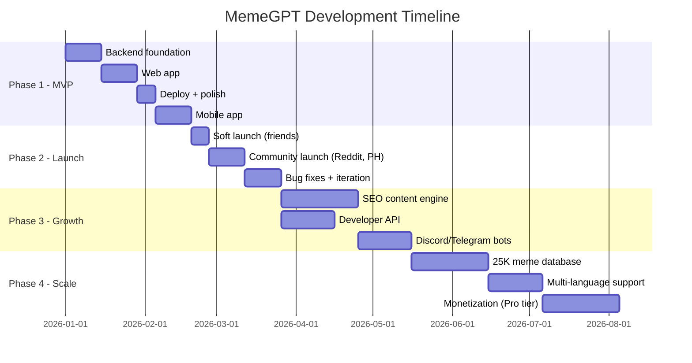

# MemeGPT — Goals & Success Metrics

> **Document Version:** 1.0  
> **Last Updated:** 2026-08-01  
> **Owner:** Product Lead  
> **Related Documents:** [Vision.md](./Vision.md) · [Product_Scope.md](./Product_Scope.md)

---

## Purpose

This document defines the measurable business goals, technical goals, and key performance indicators (KPIs) for MemeGPT across all project phases. Every engineering and product decision should trace back to one of these goals.

---

## Business Goals

### Goal 1: Build the Most Accurate Meme Search Engine

**Description:** Users should find the perfect meme faster on MemeGPT than on any other platform.

| Metric | Measurement Method | Target |
|---|---|---|
| Search relevance (user-perceived) | In-app thumbs up/down ratio | >75% positive |
| Precision@5 | Offline evaluation on test set | >70% |
| Mean Reciprocal Rank (MRR) | First relevant result position | >0.80 |
| Zero-result rate | Queries with similarity score <0.3 | <5% |

### Goal 2: Achieve Product-Market Fit

**Description:** Users actively return to MemeGPT because it solves a real problem better than alternatives.

| Metric | Target (Month 3) | Target (Month 6) | Target (Year 1) |
|---|---|---|---|
| Daily Active Users (DAU) | 1,000 | 10,000 | 50,000 |
| Weekly retention (D7) | >30% | >40% | >50% |
| Monthly retention (D30) | >15% | >25% | >35% |
| Net Promoter Score (NPS) | >30 | >50 | >60 |
| Organic installs (no paid ads) | 500/month | 5,000/month | 20,000/month |

### Goal 3: Maintain $0 Infrastructure Cost at MVP Scale

**Description:** The entire platform runs on free-tier cloud services through at least 10,000 DAU.

| Service | Free Tier Limit | Estimated Usage at 10K DAU | Status |
|---|---|---|---|
| Vercel | 100GB bandwidth | ~20GB | ✅ Within limit |
| Render.com / Railway | 750 hrs/month | ~720 hrs | ✅ Within limit |
| Qdrant Cloud | 1GB storage | ~200MB (25K memes) | ✅ Within limit |
| Supabase | 500MB DB | ~100MB | ✅ Within limit |
| Upstash Redis | 10K ops/day | ~8K ops/day | ✅ Within limit |
| Cloudflare R2 | 10GB storage | ~5GB | ✅ Within limit |
| Groq API | 6K req/day | ~2K req/day | ✅ Within limit |

### Goal 4: Build a Sustainable Growth Engine

**Description:** Growth is driven by organic channels (SEO, word-of-mouth, app store) — not paid advertising.

| Channel | Strategy | Target Traffic |
|---|---|---|
| SEO (meme pages) | 10,000+ indexed pages, each targeting long-tail keywords | 50% of traffic |
| App Store (ASO) | Optimized title, keywords, screenshots | 25% of traffic |
| Social/word-of-mouth | Share buttons, short links, demo videos | 20% of traffic |
| Developer API | Free tier attracts integrations | 5% of traffic |

---

## Technical Goals

### Goal T1: Sub-1.5-Second Search Response

```
Target Latency Budget:
─────────────────────────────────────
Intent parsing (Groq LLM):    300ms
Emotion detection (local):    100ms
Query embedding (MiniLM):      50ms
Vector search (Qdrant):        50ms
Re-ranking (Python):           10ms
Network overhead:              50ms
─────────────────────────────────────
TOTAL:                        560ms  (well under 1.5s)

With Redis cache hit:          15ms  ✅✅
```

### Goal T2: 99.5% Uptime

| Component | Uptime Strategy |
|---|---|
| API Server | Health check pings every 5 min (UptimeRobot), auto-restart on failure |
| Vector DB | Qdrant Cloud managed SLA |
| Cache | Graceful degradation — app works without cache, just slower |
| Frontend | Vercel CDN — globally distributed, auto-scaled |

### Goal T3: Horizontal Scalability

The architecture is designed so that scaling requires **configuration changes, not code changes**:

- Stateless API server → add replicas
- CDN-served media → no server load for images
- Redis cache → increase cache size
- Qdrant → scales to 1M+ vectors without architecture change

### Goal T4: Mobile App Under 60MB

| Component | Size | Optimization |
|---|---|---|
| React Native runtime (Hermes) | 15 MB | Hermes engine (not JSC) |
| JavaScript bundle | 4 MB | Tree shaking, minification |
| Expo modules | 8 MB | Only import used modules |
| App assets | 2 MB | Compressed PNG, no bundled fonts |
| **Total** | **~29 MB** | ✅ Well under 60MB target |

### Goal T5: Developer-Friendly API

- Auto-generated OpenAPI docs at `/docs`
- Consistent JSON response format
- Meaningful error messages with error codes
- Rate limiting with clear headers (`X-RateLimit-*`)
- Free tier: 100 requests/day (no credit card)

---

## Key Performance Indicators (KPIs) Dashboard

### Product KPIs

| KPI | How Measured | Frequency | Owner |
|---|---|---|---|
| DAU / MAU | PostHog analytics | Daily | Product |
| Searches per day | Server logs → Supabase | Daily | Engineering |
| Copy/Download rate | Feedback events / Search count | Daily | Product |
| App Store Rating | App Store Connect / Google Play Console | Weekly | Product |
| Session success rate | Sessions with ≥1 interaction / Total sessions | Daily | Product |

### Engineering KPIs

| KPI | How Measured | Frequency | Owner |
|---|---|---|---|
| P50 / P95 latency | Server-side timing | Real-time | Engineering |
| Error rate | Sentry error count / Request count | Daily | Engineering |
| Cache hit ratio | Redis hits / Total requests | Daily | Engineering |
| Uptime | UptimeRobot monitoring | Monthly | Engineering |
| Deploy frequency | GitHub Actions runs | Weekly | Engineering |

### AI/ML KPIs

| KPI | How Measured | Frequency | Owner |
|---|---|---|---|
| Precision@5 | Offline evaluation script | Weekly | ML |
| Click-through rate | Clicks / Impressions | Daily | ML |
| Thumbs up rate | Upvotes / Total votes | Daily | ML |
| Zero-result rate | Queries with score <0.3 / Total queries | Daily | ML |
| Model inference latency | Per-model timing | Real-time | ML |

---

## Milestones



---

## Anti-Goals

Things we explicitly **will NOT** optimize for:

1. **Viral growth at any cost** — We will not sacrifice privacy or add dark patterns for growth
2. **Maximum meme database size** — Quality over quantity. 5,000 well-tagged memes > 100,000 poorly tagged
3. **Feature completeness before launch** — Ship MVP fast, iterate based on user feedback
4. **Paid infrastructure** — Stay on free tiers as long as possible. Premature scaling is waste
5. **Perfection** — 80% accuracy shipped is better than 95% accuracy in development

---

> **Related Documents:**
> - [Vision.md](./Vision.md) — Why we're building this
> - [Product_Scope.md](./Product_Scope.md) — What we're building
> - [13_Project_Management/Roadmap.md](../13_Project_Management/Roadmap.md) — Detailed timeline
