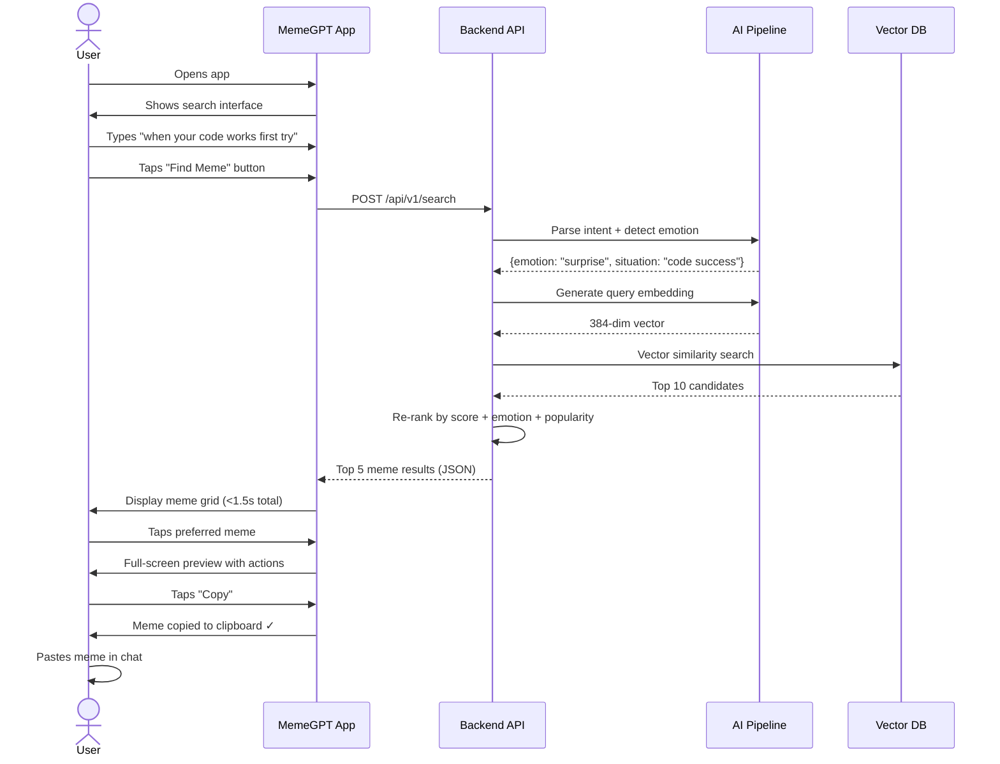
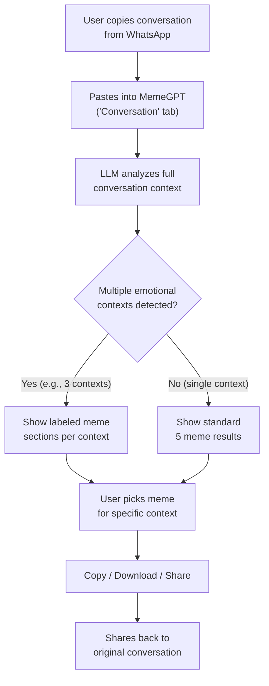
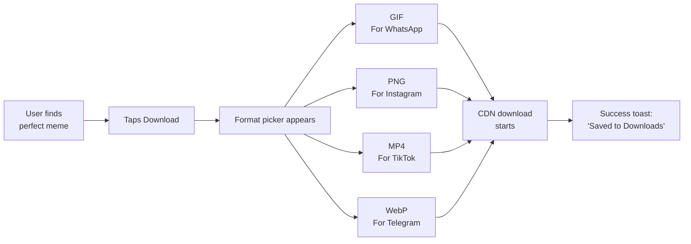
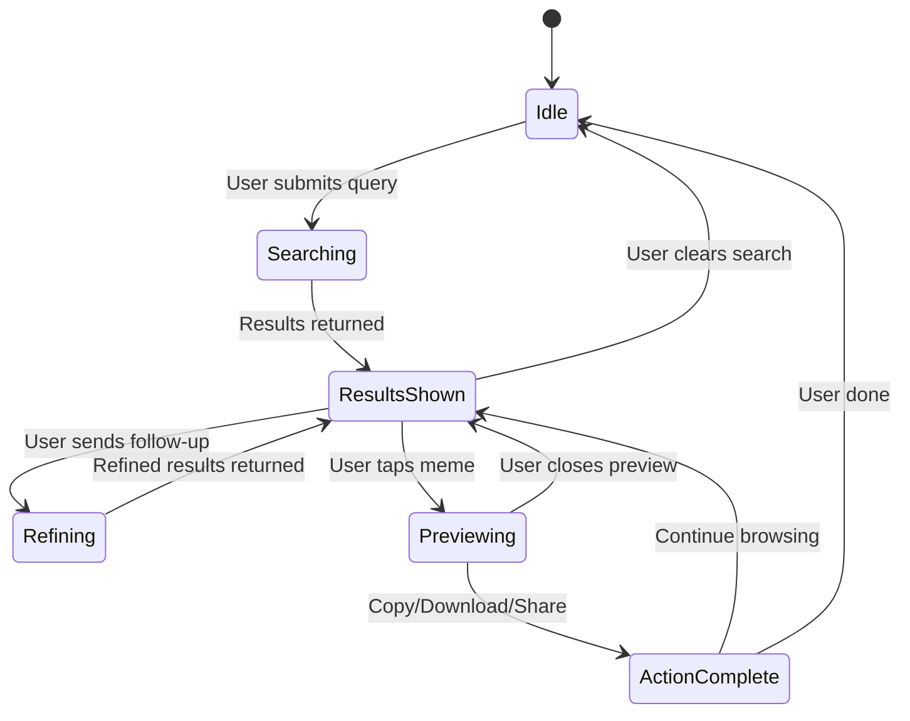
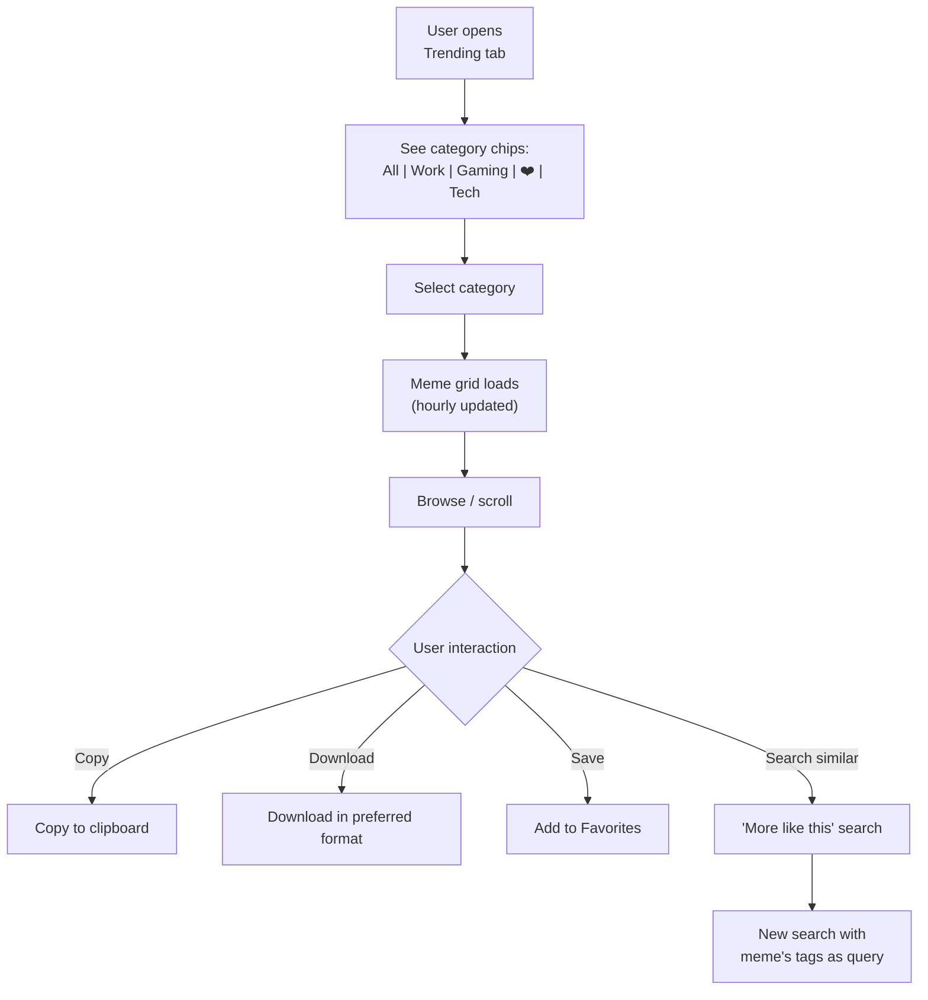
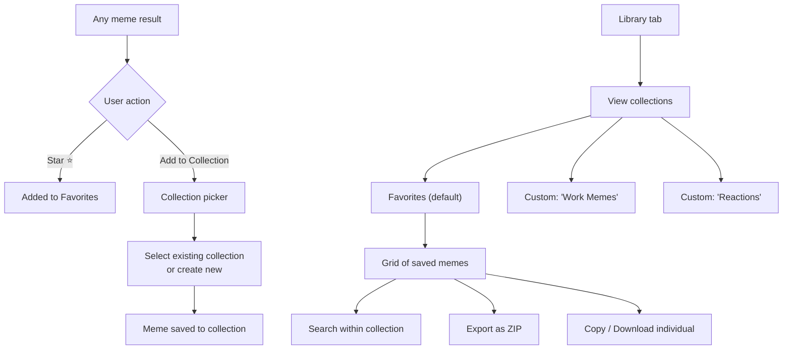
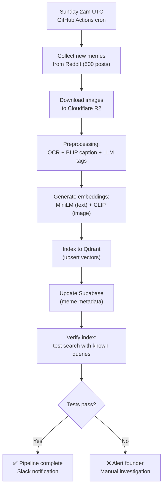
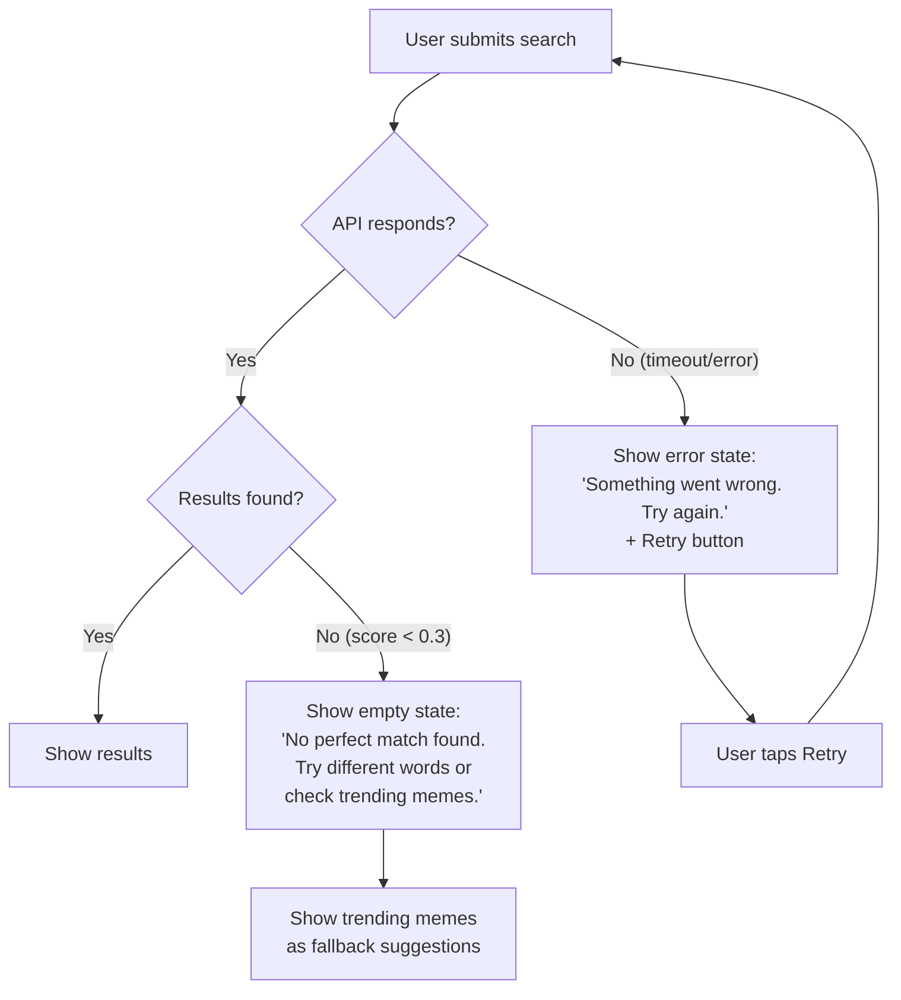
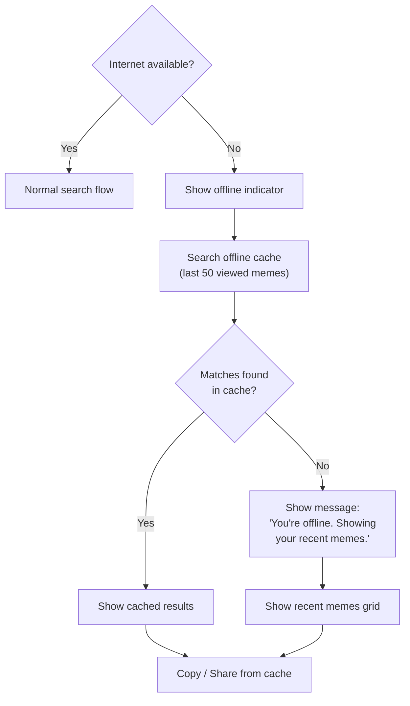

# MemeGPT — Product Workflow

> **Document Version:** 1.0  
> **Last Updated:** 2026-08-01  
> **Owner:** Product Lead  
> **Related Documents:** [User_Personas.md](./User_Personas.md) · [00_Project_Overview.md](./00_Project_Overview.md)

---

## Purpose

This document maps every user journey through MemeGPT with detailed sequence diagrams, flow charts, and step-by-step explanations. It serves as the reference for both product design and engineering implementation.

---

## Core User Flows

### Flow 1: Basic Meme Search (Primary Flow)

This is the most common user journey — the "happy path" that 80% of sessions follow.



**Step-by-Step Detail:**

| Step | Action | Duration | Technical Detail |
|---|---|---|---|
| 1 | User opens app | 0ms | App is already loaded (PWA) or cold starts in <2s |
| 2 | User types query | Variable | Search input auto-focuses, max 2000 chars |
| 3 | User taps "Find Meme" | 0ms | Triggers API call, shows loading skeleton |
| 4 | LLM context parsing | ~300ms | Groq API extracts emotion, situation, tone, keywords |
| 5 | Emotion detection | ~100ms | Local DistilRoBERTa model classifies primary/secondary emotion |
| 6 | Query embedding | ~50ms | MiniLM-L6-v2 converts enriched query to 384-dim vector |
| 7 | Vector search | ~50ms | Qdrant cosine similarity search with filters |
| 8 | Re-ranking | ~10ms | Apply emotion boost, popularity score, format preference |
| 9 | Response rendered | ~50ms | Client receives JSON, renders meme cards with thumbnails |
| 10 | User interaction | Variable | Copy (instant), Download (~1s), Share (opens sheet) |

---

### Flow 2: Conversation-Based Search

Users paste an entire WhatsApp/Discord conversation for context-aware meme recommendation.



**LLM Conversation Analysis Example:**

```
Input (pasted conversation):
─────────────────────────────
Friend 1: "Bro did you study for tomorrow's exam?"
Friend 2: "I haven't even started 💀"
Friend 1: "The exam is in 8 hours"
Friend 2: "I'll just pray at this point"
Friend 1: "LMAO same"

LLM Output:
─────────────────────────────
{
  "contexts": [
    {
      "label": "Exam panic",
      "emotion": "fear",
      "tone": "humorous self-deprecation",
      "search_query": "student hasn't studied for exam panic humor"
    },
    {
      "label": "Accepting defeat",
      "emotion": "resignation",
      "tone": "sarcastic acceptance",
      "search_query": "giving up on studying acceptance meme"
    }
  ]
}
```

---

### Flow 3: Multi-Format Download

Users download the same meme in different formats for different platforms.



---

### Flow 4: Chat Refinement (Multi-Turn)

Users can refine results conversationally, similar to ChatGPT.

```
Turn 1:
  User:   "I just submitted my project at 11:59pm"
  MemeGPT: [Shows 5 memes — stressed + relief themed]

Turn 2:
  User:   "Give me something more triumphant"
  MemeGPT: [Re-searches with triumph + victory filter]
           [Shows 5 new results — celebration memes]

Turn 3:
  User:   "Show me a GIF version of the third one"
  MemeGPT: [Returns GIF format of meme #3]

Turn 4:
  User:   "Perfect, download it"
  MemeGPT: [Triggers GIF download]
           [Shows: ✓ Downloaded to your device]
```

**Technical Implementation:**



---

### Flow 5: Trending Discovery

Users browse trending memes without searching.



---

### Flow 6: Favorites & Collections

Users manage their personal meme library.



---

## Admin Workflows

### Weekly Meme Indexing Pipeline



---

## Error Flows

### Search Error Handling



---

## Platform-Specific Workflows

### Web App Keyboard Shortcuts

| Shortcut | Action |
|---|---|
| `⌘/Ctrl + Enter` | Submit search |
| `Escape` | Close lightbox/preview |
| `←` `→` | Navigate between results in preview |
| `C` | Copy current meme (in preview) |
| `D` | Download current meme (in preview) |
| `S` | Save to favorites (in preview) |
| `F` | Toggle format filter |
| `/` | Focus search input |

### Mobile App Gestures

| Gesture | Action |
|---|---|
| Swipe left/right (preview) | Navigate between results |
| Long press (meme card) | Quick copy to clipboard |
| Pull down (results) | Refresh results |
| Double tap (meme) | Add to favorites |
| Pinch zoom (preview) | Zoom into meme image |

---

## Offline Workflow



---

> **Related Documents:**
> - [User_Personas.md](./User_Personas.md) — Who uses these workflows
> - [07_APIs/Search_API.md](../07_APIs/Search_API.md) — API contract for search
> - [08_Features/Smart_Meme_Search.md](../08_Features/Smart_Meme_Search.md) — Feature spec
> - [04_Frontend/Components.md](../04_Frontend/Components.md) — UI component specs
