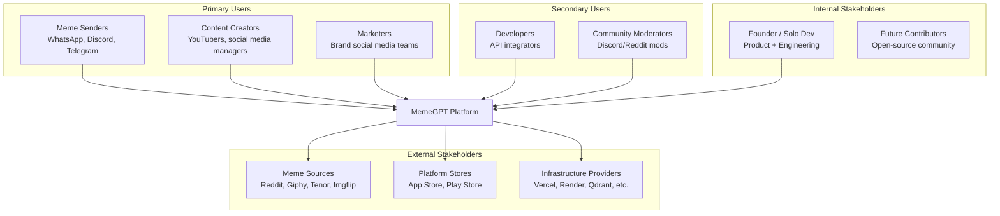

# MemeGPT — Stakeholders

> **Document Version:** 1.0  
> **Last Updated:** 2026-08-01  
> **Owner:** Product Lead  
> **Related Documents:** [User_Personas.md](./User_Personas.md) · [Vision.md](./Vision.md)

---

## Purpose

This document identifies all stakeholders of the MemeGPT platform — the people who interact with, benefit from, or are affected by the product. Understanding stakeholders ensures the product serves the right people in the right way.

---

## Stakeholder Map

---

## Primary Stakeholders

### 1. Meme Senders (Core User Base)

| Attribute | Detail |
|---|---|
| **Who** | People who share memes in group chats daily |
| **Age Range** | 16–35 |
| **Platforms** | WhatsApp, Discord, Telegram, Instagram DMs, iMessage |
| **Daily Meme Usage** | Send 5–15 memes/day |
| **Primary Need** | Find the right reaction meme in <10 seconds |
| **Current Pain** | Scrolling camera roll, Googling keywords, asking friends |
| **Success Metric** | Time from "I need a meme" to "meme sent" < 10 seconds |
| **Preferred Format** | GIF (auto-plays in chat) |

### 2. Content Creators

| Attribute | Detail |
|---|---|
| **Who** | YouTubers, streamers, meme page admins, social media influencers |
| **Size** | ~50 million globally |
| **Primary Need** | Trending memes, high-resolution downloads, multiple format exports |
| **Current Pain** | Using 3–4 tools for different formats, quality degradation |
| **Success Metric** | Download meme in 3+ formats with one search |
| **Revenue Impact** | High — these users drive word-of-mouth and API adoption |

### 3. Marketing Professionals

| Attribute | Detail |
|---|---|
| **Who** | Brand social media managers, marketing teams |
| **Primary Need** | Culturally relevant memes for campaigns, embed codes, team sharing |
| **Current Pain** | Risk of using outdated/inappropriate memes, no quality control |
| **Success Metric** | Find brand-safe, trending meme with embed code |
| **Revenue Potential** | Team tier subscribers ($15/month per team) |

---

## Secondary Stakeholders

### 4. Developers (API Users)

| Attribute | Detail |
|---|---|
| **Who** | Software developers building apps that need meme functionality |
| **Primary Need** | Reliable REST API with documentation, free tier |
| **Current Pain** | Giphy API is limited, Tenor requires Google Cloud project |
| **Success Metric** | Integrate meme search into their app in <30 minutes |
| **Revenue Potential** | API tier (pay-per-use at scale) |

### 5. Community Moderators

| Attribute | Detail |
|---|---|
| **Who** | Discord server mods, Reddit subreddit mods |
| **Primary Need** | Quick reaction memes for moderation humor |
| **Current Pain** | No efficient way to find specific reaction memes |
| **Success Metric** | Find reaction GIF in <5 seconds during live chat |

---

## Internal Stakeholders

### 6. Founder / Solo Developer

| Attribute | Detail |
|---|---|
| **Role** | Product owner, architect, developer, designer, marketer |
| **Primary Concern** | Building a sustainable product that grows organically |
| **Constraints** | Time (evenings + weekends), budget ($0 infrastructure target) |
| **Success Metric** | 10K DAU within 6 months with $0 monthly cost |

### 7. Future Contributors (Open Source Community)

| Attribute | Detail |
|---|---|
| **Who** | Open-source developers interested in AI/ML projects |
| **Primary Need** | Clear documentation, easy setup, well-defined contribution process |
| **What They Offer** | Bug fixes, feature contributions, internationalization |
| **Success Metric** | First-time contributor can set up and contribute within 1 hour |

---

## External Stakeholders

### 8. Meme Data Sources

| Source | Relationship | Risk | Mitigation |
|---|---|---|---|
| Reddit | Data source via API | Rate limits, API changes | Cache data locally, use datasets |
| Giphy | GIF source | API key revocation | Backup with Tenor API |
| Tenor (Google) | GIF source | API deprecation | Multiple source strategy |
| Imgflip | Template source | Unlimited API, low risk | Primary free source |

### 9. Platform Stores (Apple + Google)

| Store | Requirements | Risk |
|---|---|---|
| Apple App Store | $99/year developer fee, content guidelines compliance | App rejection if NSFW content leaks |
| Google Play Store | $25 one-time fee, content policy compliance | Lower risk than Apple |

### 10. Infrastructure Providers

| Provider | Dependency Level | Switching Cost | Alternative |
|---|---|---|---|
| Vercel | High (frontend hosting) | Low — standard Next.js | Netlify, Cloudflare Pages |
| Render.com / Railway | High (backend hosting) | Medium — Docker-based | Fly.io, Railway |
| Qdrant Cloud | High (vector search) | High — proprietary format | Pinecone, Weaviate, self-hosted |
| Supabase | Medium (metadata) | Medium — standard PostgreSQL | PlanetScale, Neon |
| Upstash | Low (caching) | Low — standard Redis | Redis Cloud, self-hosted |
| Cloudflare | Medium (CDN + storage) | Low — S3-compatible | AWS S3, Backblaze B2 |

---

## Stakeholder Communication Plan

| Stakeholder | Channel | Frequency | Content |
|---|---|---|---|
| Users | In-app changelog, Twitter/X | Weekly | Feature updates, trending memes |
| Developers | API docs, GitHub, Discord | As needed | API changes, SDK updates |
| Contributors | GitHub Issues, Discord | Ongoing | Good first issues, architecture decisions |
| App Stores | Store dashboard | Per release | Version notes, compliance updates |

---

> **Related Documents:**
> - [User_Personas.md](./User_Personas.md) — Detailed user profiles
> - [Goals.md](./Goals.md) — What success looks like for each stakeholder
