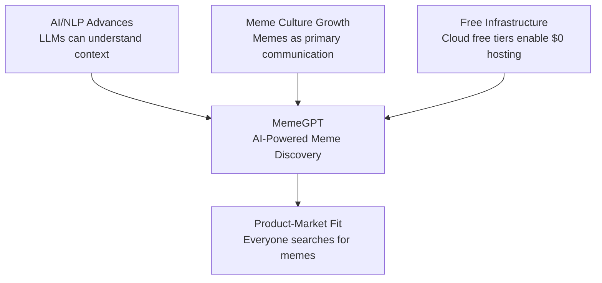

# MemeGPT — Product Vision

> **Document Version:** 1.0  
> **Last Updated:** 2026-08-01  
> **Owner:** Product Lead  
> **Related Documents:** [Goals.md](./Goals.md) · [Business_Problem.md](./Business_Problem.md) · [Business_Solution.md](./Business_Solution.md)

---

## Purpose

This document defines the long-term product vision, mission, and strategic direction for MemeGPT. It serves as the guiding star for all product, engineering, and design decisions.

---

## Vision Statement

> *"Make meme discovery as fast as thinking of one."*

MemeGPT envisions a world where finding the perfect meme is as effortless as the emotion that triggers the search. Whether you're replying to a group chat, crafting a social media post, or reacting to a work email — the right meme should be **one sentence away**.

---

## Mission

Build the world's most accurate AI-powered meme recommendation engine that:

- **Understands context** — not just keywords, but the full meaning behind what you type
- **Matches emotion** — maps your emotional state to memes that express it perfectly
- **Works instantly** — returns results in under 1.5 seconds
- **Stays free** — runs entirely on free-tier infrastructure
- **Respects privacy** — no account required, no personal data stored

---

## Core Promise

**Zero effort. Maximum relatability. Instant meme.**

For every user interaction, MemeGPT promises:

1. **Input anything** — a sentence, a mood, a full WhatsApp conversation, a movie quote, slang, any language
2. **Get the perfect meme** — the one you know exists but can't find
3. **In any format** — GIF, PNG, MP4, WebP, sticker — whatever the platform needs
4. **In under 2 seconds** — because timing is everything in meme culture

---

## Why This Matters

### The Meme Communication Revolution

Memes have evolved from internet humor to a **primary communication language**. According to industry data:

- **55% of 13–35 year olds** send memes weekly (YPulse, 2024)
- **74% of millennials** send memes to make others laugh (Morning Consult)
- The global meme market is valued at **$4.2 billion** and growing at 15% CAGR
- **65% of communication** on platforms like Discord is now image-based

Yet the tools for finding memes haven't evolved. Users still:
- Scroll through Google Images with vague keywords
- Browse Giphy's trending page hoping to get lucky
- Ask friends "do you have that meme where..."
- Save hundreds of memes to their camera roll "just in case"

### The MemeGPT Opportunity

MemeGPT sits at the intersection of three powerful trends:

---

## Long-Term Direction

### Phase 1 — Core Search Engine (Months 1–4)
Build the best text-to-meme search experience on web and mobile.

### Phase 2 — Platform Ecosystem (Months 5–8)
- Discord bot, Telegram bot, Chrome extension
- Developer API with SDKs
- User-generated meme submissions
- Multi-language support (Hindi, Spanish, Portuguese, French)

### Phase 3 — Intelligence Layer (Months 9–12)
- Personalized recommendations based on usage patterns
- Trending meme predictions using social media signals
- Meme template generation (AI creates new memes from templates)
- Real-time meme indexing from Reddit, Twitter, Instagram

### Phase 4 — Enterprise & Monetization (Year 2)
- Team workspaces for marketing teams
- White-label API for enterprise
- Analytics dashboard for content creators
- Meme performance insights (which memes get the most engagement)

---

## Design Philosophy

### 1. Meme-First Design
The meme is always the hero. UI elements step back. No clutter, no distractions — just the search box and the results.

### 2. Dark-Mode Native
Memes live on dark backgrounds (Discord, Reddit, Twitter dark mode). MemeGPT matches that energy. Dark mode is the default, not an option.

### 3. Speed Over Everything
Every millisecond counts in meme communication. Target: search results appear before the user finishes deciding what to type.

### 4. Cross-Platform Parity
The experience should feel native on every platform — web, iOS, Android. Same features, same speed, same design language.

### 5. Privacy by Default
No account required. No tracking. No selling data. Users trust MemeGPT because it asks for nothing.

---

## Success Indicators

MemeGPT has achieved its vision when:

- [ ] A user can describe any situation in natural language and get a relevant meme in under 2 seconds
- [ ] Users prefer MemeGPT over scrolling their camera roll or searching Google
- [ ] The platform achieves a >4.5 App Store rating with >10,000 reviews
- [ ] 50% of searches result in a copy, download, or share action
- [ ] Developers integrate the MemeGPT API into their own products
- [ ] The product runs profitably on $0–$72/month infrastructure costs

---

## Inspirations

| Product | What We Learn |
|---------|--------------|
| **ChatGPT** | Conversational interface, multi-turn interaction, "just type anything" simplicity |
| **Spotify Discover Weekly** | AI-powered recommendations that feel personal and accurate |
| **Shazam** | Instant identification — "hear a song, get the answer" = "feel a vibe, get the meme" |
| **Pinterest** | Visual search, infinite scroll, one-click save |
| **Unsplash** | Beautiful media, free access, instant download, no friction |

---

> **Related Documents:**
> - [Goals.md](./Goals.md) — Measurable goals and KPIs
> - [Business_Problem.md](./Business_Problem.md) — Deep problem analysis
> - [Product_Scope.md](./Product_Scope.md) — What we're building (and not building)
> - [User_Personas.md](./User_Personas.md) — Who we're building for
