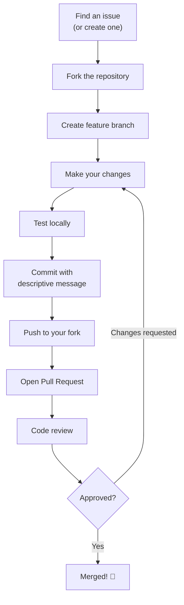

# MemeGPT — First Contribution Guide

> **Document Version:** 1.0  
> **Last Updated:** 2026-08-01  
> **Related Documents:** [Installation.md](./Installation.md) · [09_Development/Contributing.md](../09_Development/Contributing.md)

---

## Purpose

Step-by-step guide for making your first contribution to MemeGPT. Whether you're fixing a bug, adding a feature, or improving documentation — this guide walks you through the entire process.

---

## Before You Start

1. ✅ Complete the [Installation Guide](./Installation.md)
2. ✅ Verify `npm run dev` starts both servers successfully
3. ✅ Read the [Coding Standards](../09_Development/Coding_Standards.md)
4. ✅ Check [GitHub Issues](https://github.com/yourusername/memegpt/issues) for open tasks labeled `good-first-issue`

---

## Contribution Workflow



---

## Step-by-Step

### 1. Fork & Clone

```bash
# Fork via GitHub UI, then:
git clone https://github.com/YOUR_USERNAME/memegpt.git
cd memegpt
git remote add upstream https://github.com/original/memegpt.git
```

### 2. Create a Branch

```bash
git checkout -b feature/your-feature-name
# Examples:
# git checkout -b fix/search-timeout
# git checkout -b feature/dark-mode-toggle
# git checkout -b docs/update-api-reference
```

### 3. Make Changes

Follow the [Coding Standards](../09_Development/Coding_Standards.md):
- Python: PEP 8, type hints, docstrings
- TypeScript: ESLint rules, functional components
- Docs: Follow the existing document template

### 4. Test Your Changes

```bash
# Backend tests
cd backend && python -m pytest tests/ -v

# Frontend build check
cd frontend && npm run build

# Manual testing
npm run dev  # Test end-to-end in browser
```

### 5. Commit

```bash
git add .
git commit -m "feat: add format filter to search results"

# Commit message format:
# feat: new feature
# fix: bug fix
# docs: documentation change
# style: formatting, no logic change
# refactor: code restructure
# test: adding tests
# chore: maintenance tasks
```

### 6. Push & Open PR

```bash
git push origin feature/your-feature-name
```

Then open a Pull Request on GitHub with:
- Clear title describing the change
- Reference to the issue being solved (e.g., "Fixes #42")
- Screenshots for UI changes
- Test results

---

## Good First Issues

Common starter tasks:

| Area | Task | Difficulty |
|---|---|---|
| Frontend | Add loading spinner to search button | Easy |
| Frontend | Improve mobile responsive layout | Easy |
| Backend | Add input validation to search endpoint | Easy |
| Documentation | Fix typos or add examples | Easy |
| Backend | Add new meme category | Medium |
| Frontend | Add keyboard shortcut support | Medium |
| AI/ML | Improve search prompt template | Medium |

---

## Getting Help

- Open a GitHub Issue with your question
- Tag issues with `question` label
- Read existing documentation in `md files/documentation/`

---

> **Welcome to the team! Every contribution matters. 🚀**
