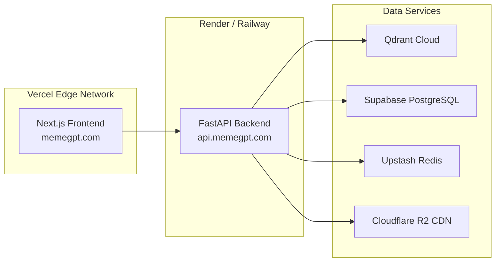

# MemeGPT — Production Setup

> **Document Version:** 1.0  
> **Last Updated:** 2026-08-01  
> **Related Documents:** [12_Deployment/Deployment_Overview.md](../12_Deployment/Deployment_Overview.md)

---

## Purpose

Guide for deploying MemeGPT to production infrastructure with all services configured for reliability and performance.

---

## Production Architecture



---

## Deployment Steps

### 1. Backend → Render.com / Railway

```bash
# Railway
npm install -g @railway/cli
railway login
railway init
railway up

# Set environment variables
railway variables set GROQ_API_KEY=gsk_production_key
railway variables set QDRANT_URL=https://your-cluster.qdrant.io
railway variables set QDRANT_API_KEY=your_key
railway variables set ENVIRONMENT=production
```

### 2. Frontend → Vercel

```bash
npm install -g vercel
cd frontend
vercel --prod
```

### 3. DNS Configuration (Cloudflare)

| Domain | Target | Type |
|---|---|---|
| `memegpt.com` | Vercel CNAME | CNAME |
| `api.memegpt.com` | Railway/Render URL | CNAME |
| `cdn.memegpt.com` | Cloudflare R2 | CNAME |

### 4. Post-Deployment Verification

```bash
# Health check
curl https://api.memegpt.com/health

# Test search
curl -X POST https://api.memegpt.com/search \
  -H "Content-Type: application/json" \
  -d '{"query": "test"}'

# Frontend loads
curl -I https://memegpt.com
```

---

## Monitoring

| Service | Tool | Free Tier |
|---|---|---|
| Uptime monitoring | UptimeRobot | 50 monitors |
| Error tracking | Sentry | 5K events/month |
| Analytics | PostHog | 1M events/month |
| Logs | Render/Railway built-in | Included |

---

## Cost Overview (Monthly)

| Service | Free Tier Limit | Expected Usage | Cost |
|---|---|---|---|
| Vercel | 100GB bandwidth | ~20GB | **$0** |
| Render/Railway | 750 hrs/month | ~720 hrs | **$0** |
| Qdrant Cloud | 1GB | ~200MB | **$0** |
| Supabase | 500MB | ~100MB | **$0** |
| Upstash | 10K cmds/day | ~5K | **$0** |
| Cloudflare R2 | 10GB | ~5GB | **$0** |
| Groq API | 6K req/day | ~2K | **$0** |
| **Total** | | | **$0/month** |

---

> **Related Documents:**
> - [12_Deployment/Backend_Deployment.md](../12_Deployment/Backend_Deployment.md) — Detailed backend deployment
> - [12_Deployment/CI_CD_Pipeline.md](../12_Deployment/CI_CD_Pipeline.md) — Automated deployment
