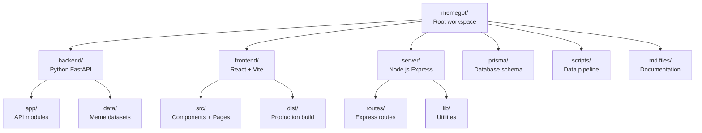

# MemeGPT — Project Setup

> **Document Version:** 1.0  
> **Last Updated:** 2026-08-01  
> **Related Documents:** [Installation.md](./Installation.md) · [02_Project_Architecture/Folder_Structure.md](../02_Project_Architecture/Folder_Structure.md)

---

## Purpose

This document explains the repository structure, workspace configuration, and how all parts of the MemeGPT monorepo connect to each other.

---

## Repository Architecture

MemeGPT uses a **monorepo** pattern — all code for backend, frontend, server, and data pipeline lives in a single Git repository.



---

## Workspace Configuration

The root `package.json` defines npm workspaces:

```json
{
  "name": "memegpt",
  "workspaces": ["frontend"],
  "scripts": {
    "dev": "concurrently \"npm run dev:backend\" \"npm run dev:frontend\"",
    "dev:frontend": "npm run dev -w frontend",
    "dev:backend": "cd backend && python -m uvicorn app.main:app --reload --port 8000",
    "build": "npm run build -w frontend",
    "setup": "cd backend && pip install -r requirements.txt && python seed.py",
    "seed": "cd backend && python seed.py",
    "embeddings": "cd backend && python generate_embeddings.py"
  }
}
```

### Available Scripts

| Script | Command | Description |
|---|---|---|
| `dev` | `npm run dev` | Start both backend and frontend in development mode |
| `dev:frontend` | `npm run dev:frontend` | Start only the Vite frontend dev server |
| `dev:backend` | `npm run dev:backend` | Start only the FastAPI backend with hot reload |
| `build` | `npm run build` | Build the frontend for production |
| `setup` | `npm run setup` | Install backend deps + seed database |
| `seed` | `npm run seed` | Re-seed the database with sample data |
| `embeddings` | `npm run embeddings` | Generate text embeddings for all memes |

---

## Technology Mapping

| Directory | Language | Framework | Port | Purpose |
|---|---|---|---|---|
| `backend/` | Python 3.11 | FastAPI + Uvicorn | 8000 | REST API, ML inference, data pipeline |
| `frontend/` | TypeScript | React + Vite | 5173 | Web application UI |
| `server/` | TypeScript | Express.js | 3001 | Node.js middleware server |
| `prisma/` | Prisma SDL | Prisma ORM | — | Database schema definition |
| `scripts/` | Python | — | — | Data processing scripts |

---

## Database Setup

### Current: SQLite (Development)

The project uses SQLite via Prisma for local development. The database file is created at `backend/memegpt.db`.

```prisma
// prisma/schema.prisma
datasource db {
  provider = "sqlite"
  url      = env("DATABASE_URL")
}
```

### Production: PostgreSQL (Supabase)

For production, the datasource switches to PostgreSQL via Supabase.

### Schema Models

| Model | Purpose | Key Fields |
|---|---|---|
| `Meme` | Core meme data | name, category, dialogue, explanation, keywords, viralScore |
| `MemeVote` | User voting data | memeId, vote (+1/-1), sessionId |
| `MemeUsage` | Search result tracking | memeId, query, score |
| `SearchLog` | Search analytics | query, resultCount, latencyMs |

---

## Git Configuration

### `.gitignore` Essentials

```gitignore
# Dependencies
node_modules/
backend/venv/
__pycache__/

# Environment
.env
.env.local
.env.production

# Database
*.db
*.sqlite

# Build output
frontend/dist/
.next/

# ML models (large files)
*.pt
*.bin
*.onnx

# IDE
.vscode/
.idea/
```

### Branch Strategy

| Branch | Purpose | Deployment |
|---|---|---|
| `main` | Production-ready code | Auto-deploys to production |
| `develop` | Integration branch | Staging environment |
| `feature/*` | Feature development | No deployment |
| `hotfix/*` | Urgent production fixes | Fast-tracked to main |

---

> **Related Documents:**
> - [Development_Setup.md](./Development_Setup.md) — Local dev workflow
> - [02_Project_Architecture/Folder_Structure.md](../02_Project_Architecture/Folder_Structure.md) — Detailed folder explanation
