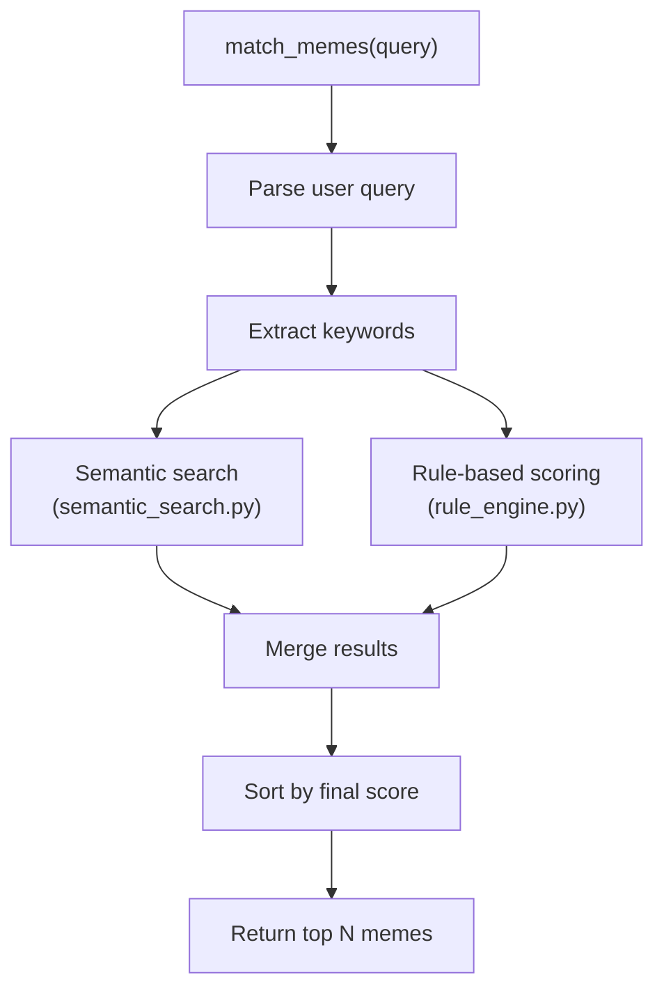
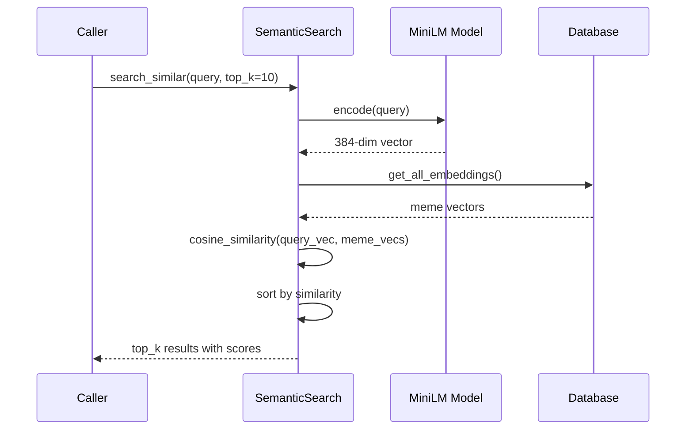

# MemeGPT — Component Architecture

> **Document Version:** 1.0  
> **Last Updated:** 2026-08-01

---

## Purpose

Detailed internal design of each major component in the MemeGPT system.

---

## Backend Components

### Meme Matcher (`meme_matcher.py`)

The central orchestrator that coordinates the full recommendation pipeline.



**Responsibilities:**
- Receive raw user query
- Clean and tokenize input
- Delegate to semantic search for vector-based matching
- Delegate to rule engine for keyword/category matching
- Merge and deduplicate results from both sources
- Sort by composite score and return top results

### Rule Engine (`rule_engine.py`)

Deterministic scoring system that applies business logic rules.

**Scoring Formula:**
```
final_score = (
    keyword_match_score * 0.3 +
    category_match_score * 0.2 +
    viral_score * 0.2 +
    recency_score * 0.1 +
    semantic_score * 0.2
)
```

**Rules Applied:**
| Rule | Weight | Logic |
|---|---|---|
| Keyword Match | 0.3 | How many query keywords appear in meme's keywords/dialogue |
| Category Match | 0.2 | If query maps to a known meme category |
| Viral Score | 0.2 | Normalized upvote/usage count |
| Recency | 0.1 | Newer memes get slight boost |
| Semantic | 0.2 | Cosine similarity from MiniLM embedding |

### Semantic Search (`semantic_search.py`)

Vector-based semantic similarity search using MiniLM-L6-v2.



**Key Design Decision:** In the current MVP, embeddings are stored in SQLite and searched in-memory. At scale, this moves to Qdrant for approximate nearest neighbor (ANN) search.

### Database Layer (`database.py`)

Abstraction layer over the SQLite/PostgreSQL database.

**Functions:**
| Function | Purpose | SQL Equivalent |
|---|---|---|
| `get_all_memes()` | List all memes | `SELECT * FROM memes` |
| `search_memes(query)` | Full-text search | `SELECT ... WHERE LIKE %query%` |
| `get_meme_by_id(id)` | Single meme lookup | `SELECT ... WHERE id = ?` |
| `record_vote(meme_id, vote, session)` | Record user vote | `INSERT INTO meme_votes ...` |
| `record_usage(meme_id, query, score)` | Track meme usage | `INSERT INTO meme_usage ...` |
| `get_trending()` | Get popular memes | `SELECT ... ORDER BY usage_count DESC` |

---

## Frontend Components

### App.tsx (Main Component)

The root component managing application state and routing.

**State:**
```typescript
interface AppState {
  query: string;             // Current search input
  results: Meme[];           // Search results
  isLoading: boolean;        // Loading state
  selectedMeme: Meme | null; // Meme in preview modal
  format: 'gif' | 'png' | 'mp4'; // Preferred format
  view: 'search' | 'trending' | 'library'; // Current view
}
```

### MemeCard Component

Displays a single meme result with actions.

**Props:**
```typescript
interface MemeCardProps {
  meme: Meme;
  score: number;
  onCopy: (meme: Meme) => void;
  onDownload: (meme: Meme, format: string) => void;
  onSave: (meme: Meme) => void;
  onPreview: (meme: Meme) => void;
}
```

**Behavior:**
- Lazy-loads meme image with blur placeholder
- Hover: lifts card with shadow, shows action buttons
- Click: opens full-screen preview
- Long press (mobile): copies to clipboard

### API Client (`api.ts`)

Centralized API communication layer.

**Methods:**
```typescript
// Search for memes
searchMemes(query: string, options?: SearchOptions): Promise<SearchResponse>

// Get single meme
getMeme(id: string): Promise<Meme>

// Record feedback
sendFeedback(memeId: string, action: FeedbackAction): Promise<void>

// Get trending memes
getTrending(category?: string): Promise<Meme[]>

// Health check
healthCheck(): Promise<HealthResponse>
```

---

## Data Pipeline Components

### Embedding Generator (`generate_embeddings.py`)

**Architecture:**
1. Load MiniLM-L6-v2 model (22MB, first run downloads from HuggingFace)
2. Iterate through all memes in database
3. For each meme, concatenate: `name + category + dialogue + explanation + keywords`
4. Generate 384-dim embedding
5. Store embedding as JSON array in database

**Performance:**
- ~50ms per embedding on CPU
- ~1000 memes in ~50 seconds
- Model loaded once, reused for all memes

---

> **Related Documents:**
> - [03_Backend/Services.md](../03_Backend/Services.md) — Backend service layer details
> - [04_Frontend/Components.md](../04_Frontend/Components.md) — Frontend component specs
> - [05_AI_System/Embeddings.md](../05_AI_System/Embeddings.md) — Embedding system design
