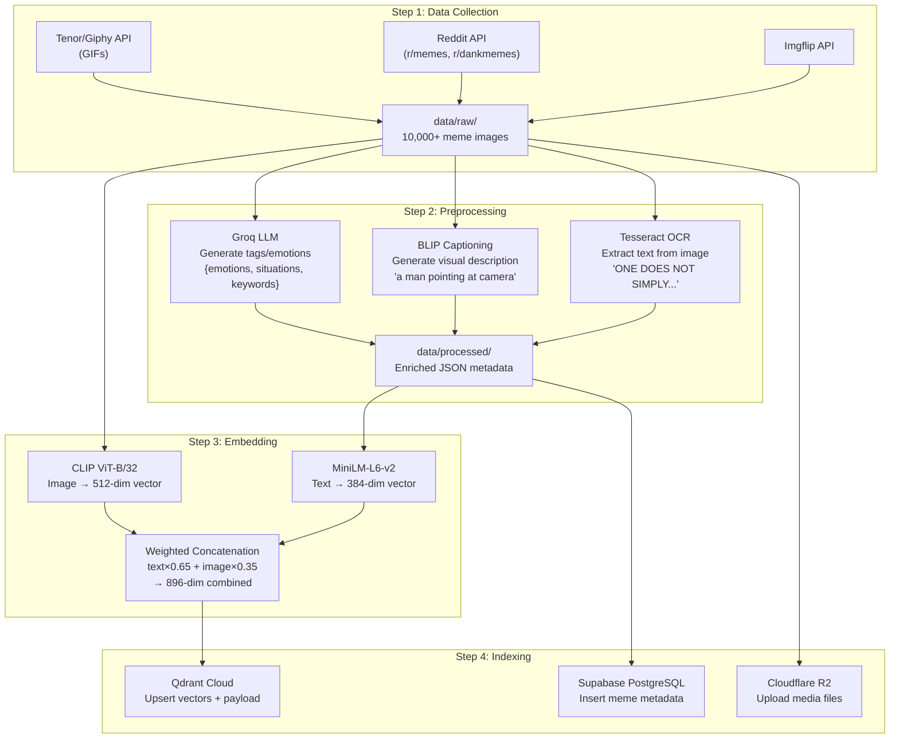
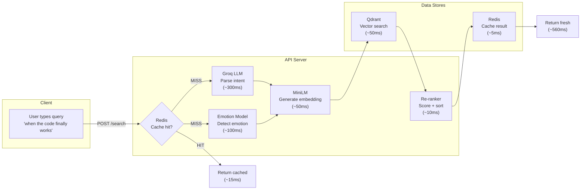

# MemeGPT — Data Flow

> **Document Version:** 2.0 · **Last Updated:** 2026-08-02

---

## Purpose

Complete data flow documentation — how data moves through MemeGPT in both the **offline pipeline** (indexing) and **online pipeline** (search), including transformations at each stage.

---

## Two Pipelines

MemeGPT has two distinct data pipelines that serve different purposes:

| Pipeline | When | Speed | Purpose |
|---|---|---|---|
| **Offline** | Weekly (cron) | ~30 min for 10K memes | Index new memes, generate embeddings |
| **Online** | Every search request | <1.5 seconds | Search, rank, return results |

---

## Offline Data Flow (Indexing Pipeline)

### Offline Pipeline Duration

| Step | Duration (10K memes) | Bottleneck |
|---|---|---|
| Data collection | ~10 min | API rate limits |
| OCR (Tesseract) | ~15 min | CPU-bound |
| Captioning (BLIP) | ~30 min | GPU/CPU-bound |
| Tag generation (Groq) | ~20 min | API rate limits (30/min) |
| Embedding (MiniLM) | ~2 min | Fast on CPU |
| Embedding (CLIP) | ~10 min | CPU-bound (no GPU) |
| Qdrant upsert | ~5 min | Network I/O |
| R2 upload | ~15 min | Network I/O |
| **Total** | **~60-90 min** | |

---

## Online Data Flow (Search Pipeline)

---

## Data Transformations

| Stage | Input | Output | Model/Process |
|---|---|---|---|
| OCR | Meme image (PNG/JPG) | Raw text string | Tesseract |
| Captioning | Meme image | Natural language description | BLIP |
| Tagging | Name + OCR + Caption | JSON {emotions, situations, keywords} | Groq LLM |
| Text Embedding | Composed text (name+ocr+tags) | 384-dim float vector | MiniLM |
| Image Embedding | Meme image | 512-dim float vector | CLIP |
| Combination | 384-dim + 512-dim | 896-dim combined vector | Weighted concat |
| Intent Parsing | User query text | JSON {emotion, situation, tone} | Groq LLM |
| Emotion Detection | User query text | {primary, secondary, confidence} | DistilRoBERTa |
| Query Embedding | Enriched query text | 384-dim float vector | MiniLM |
| Vector Search | 384-dim query vector | Top 10 memes + scores | Qdrant HNSW |
| Re-ranking | 10 candidates + metadata | Top 5 ranked results | Python scoring |

---

## Data Storage Summary

| Data | Size per Meme | Total (10K) | Storage |
|---|---|---|---|
| Image file (original) | ~500KB | ~5GB | R2 / local |
| GIF file | ~1MB | ~10GB | R2 |
| WebP thumbnail | ~50KB | ~500MB | R2 |
| Text embedding (384-dim) | 1.5KB | ~15MB | Qdrant |
| Image embedding (512-dim) | 2KB | ~20MB | Qdrant |
| Combined embedding (896-dim) | 3.5KB | ~35MB | Qdrant |
| Metadata JSON | ~2KB | ~20MB | Supabase |
| **Total per meme** | **~1.5MB** | **~15GB** | |

---

## Best Practices

1. **Run offline pipeline on local machine** — not on the production server (saves RAM/CPU)
2. **Keep `data/processed/` directory** — it's your re-indexing source (skip OCR/BLIP/Groq)
3. **Use batch upserts** — 100 points per batch to Qdrant
4. **Cache online results** — 1-hour TTL, >60% hit rate expected
5. **Parallel I/O in online pipeline** — intent parsing + emotion detection run concurrently

---

> **Related Documents:**
> - [Request_Flow.md](./Request_Flow.md) — Detailed request lifecycle
> - [05_AI_System/AI_Pipeline.md](../05_AI_System/AI_Pipeline.md) — Full pipeline code
> - [Folder_Structure.md](./Folder_Structure.md) — Where data files live
