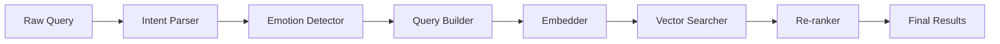

# MemeGPT — Design Patterns

> **Document Version:** 1.0  
> **Last Updated:** 2026-08-01

---

## Purpose

Catalog of design patterns used throughout the MemeGPT codebase with explanations and examples.

---

## Backend Patterns

### 1. Pipeline Pattern (Recommendation Engine)

The recommendation system uses a pipeline pattern where data flows through sequential processing stages.



Each stage has a single responsibility and can be independently tested, mocked, or replaced.

### 2. Repository Pattern (Database Layer)

`database.py` acts as a repository, abstracting all data access behind a clean API. Business logic in `meme_matcher.py` never writes SQL directly.

```python
# Good — uses repository
memes = database.get_all_memes()

# Bad — SQL in business logic
cursor.execute("SELECT * FROM memes")
```

### 3. Strategy Pattern (Scoring)

`rule_engine.py` implements multiple scoring strategies that are composed together:

- Keyword match scoring
- Category match scoring
- Viral/popularity scoring
- Semantic similarity scoring

Each strategy can be weighted differently without changing the others.

### 4. Cache-Aside Pattern (Redis)

```python
def get_results(query):
    # 1. Check cache
    cached = redis.get(cache_key(query))
    if cached:
        return json.loads(cached)
    
    # 2. Compute
    results = compute_results(query)
    
    # 3. Store in cache
    redis.setex(cache_key(query), 3600, json.dumps(results))
    
    return results
```

---

## Frontend Patterns

### 1. Container/Presentational Pattern

**Container components** handle data fetching and state, **presentational components** handle rendering.

```
App.tsx (container) → manages state, API calls
  └── MemeCard.tsx (presentational) → receives props, renders UI
```

### 2. Custom Hooks Pattern

Business logic extracted into reusable hooks:

```typescript
function useMemeSearch() {
  const [results, setResults] = useState([]);
  const [loading, setLoading] = useState(false);
  
  const search = async (query: string) => {
    setLoading(true);
    const data = await api.searchMemes(query);
    setResults(data.results);
    setLoading(false);
  };
  
  return { results, loading, search };
}
```

### 3. Optimistic UI Pattern

UI updates immediately before server confirms the action:

```typescript
// User clicks "Save to Favorites"
// 1. UI immediately shows ★ filled (optimistic)
// 2. API call fires in background
// 3. If API fails, revert UI and show error toast
```

---

## Data Pipeline Patterns

### 1. ETL Pattern (Extract, Transform, Load)

The offline pipeline follows classic ETL:
- **Extract:** Download from Imgflip, Reddit, Tenor
- **Transform:** OCR, BLIP, LLM tags, embedding generation
- **Load:** Insert into Qdrant + Supabase

### 2. Batch Processing Pattern

Embeddings and indexing process memes in batches for efficiency:

```python
for batch_start in range(0, len(memes), BATCH_SIZE):
    batch = memes[batch_start:batch_start + BATCH_SIZE]
    process_batch(batch)
```

---

> **Related Documents:**
> - [Design_Principles.md](./Design_Principles.md) — Why these patterns were chosen
> - [Architecture_Decisions.md](./Architecture_Decisions.md) — Decision records
