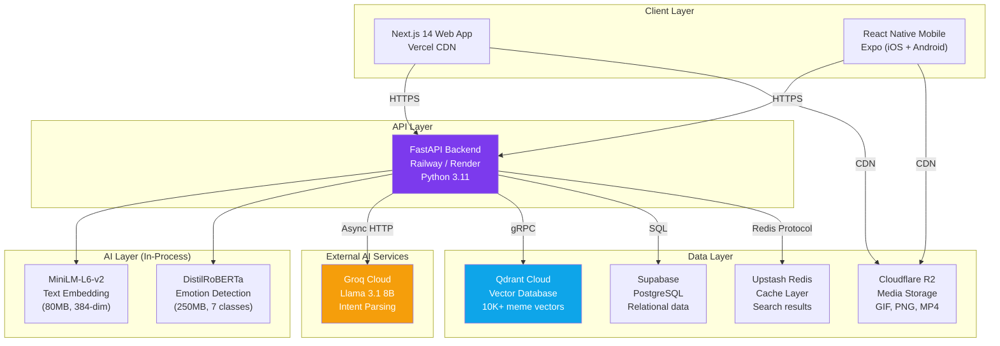
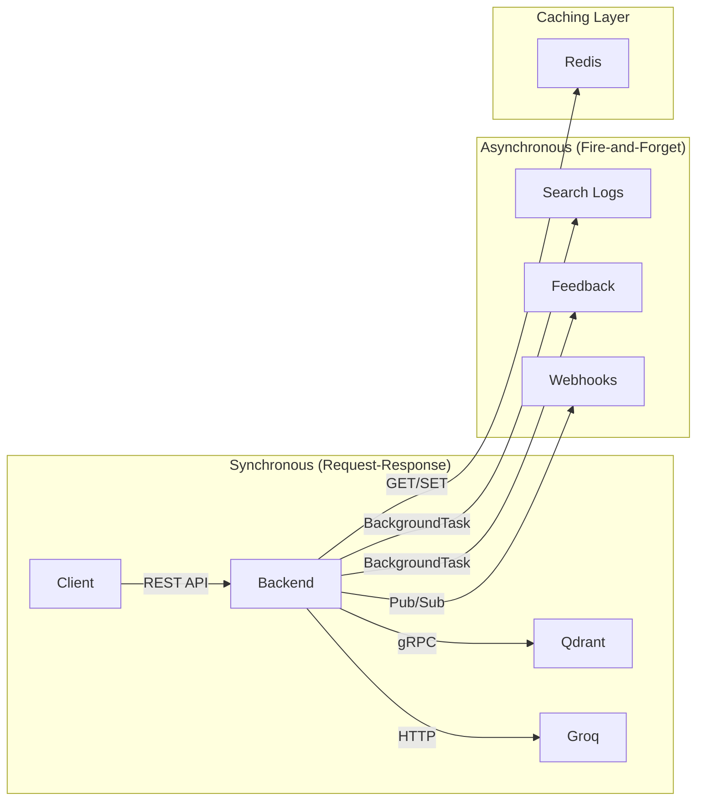
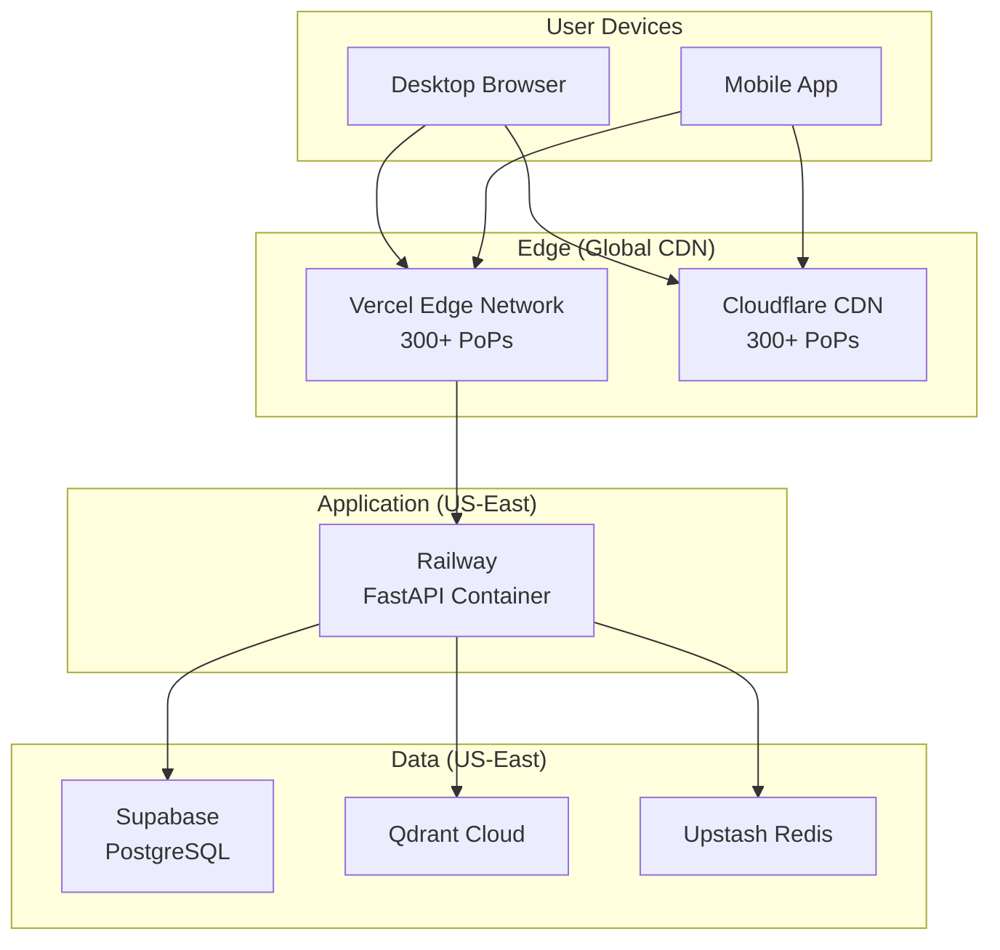

# MemeGPT — High Level Architecture

> **Document Version:** 2.0 · **Last Updated:** 2026-08-02

---

## Purpose

Complete system architecture overview — all services, their connections, data flow, and technology choices visualized in a single document.

---

## Background

MemeGPT is a **three-tier architecture** with a clear separation: frontend (presentation), backend (logic + ML), and data layer (storage). The system is designed to run entirely on free-tier infrastructure for MVP, scaling to paid tiers only when traffic demands it.

---

## System Architecture Diagram

---

## Service Catalog

| Service | Technology | Purpose | Free Tier | Cost at 10K DAU |
|---|---|---|---|---|
| **Web Frontend** | Next.js 14 | Landing + web app | Vercel (100GB bw) | $0 |
| **Mobile App** | React Native Expo | iOS + Android | Expo EAS (30 builds) | $0 |
| **Backend API** | FastAPI (Python 3.11) | ML pipeline + REST API | Railway ($5 credit) | $7 |
| **Vector DB** | Qdrant Cloud | Meme embedding search | 1GB free | $0 |
| **Relational DB** | Supabase PostgreSQL | Metadata, logs, feedback | 500MB free | $25 |
| **Cache** | Upstash Redis | Search result caching | 10K cmd/day | $10 |
| **Object Storage** | Cloudflare R2 | Media files (GIF/PNG/MP4) | 10GB free | $0 |
| **LLM Inference** | Groq (Llama 3.1 8B) | Intent parsing | 6K req/day | $0 |
| **Text Embedding** | MiniLM-L6-v2 (local) | Query → vector | In-process | $0 |
| **Emotion Model** | DistilRoBERTa (local) | Emotion detection | In-process | $0 |
| **Monitoring** | Sentry + UptimeRobot | Error tracking + uptime | Free tiers | $0 |
| **CI/CD** | GitHub Actions | Build, test, deploy | 2K min/month | $0 |

---

## Communication Patterns

| Pattern | Used For | Protocol |
|---|---|---|
| **REST (JSON)** | Client ↔ Backend | HTTPS |
| **gRPC** | Backend → Qdrant | HTTP/2 |
| **Async HTTP** | Backend → Groq | HTTPS |
| **Redis Protocol** | Backend → Cache | TCP |
| **SQL** | Backend → Supabase | PostgreSQL wire protocol |
| **S3 API** | Backend → R2 | HTTPS (boto3) |
| **BackgroundTasks** | Analytics logging | In-process |

---

## Data Residency

| Data Type | Storage | Region | Backup |
|---|---|---|---|
| Meme metadata | Supabase PostgreSQL | US-East-1 | Daily (auto) |
| Meme vectors | Qdrant Cloud | US-East | Re-indexable |
| Media files | Cloudflare R2 | Global CDN | Source files in `data/raw/` |
| Search cache | Upstash Redis | US-East | None (ephemeral) |
| Search logs | Supabase PostgreSQL | US-East-1 | Daily (auto) |
| User feedback | Supabase PostgreSQL | US-East-1 | Daily (auto) |

---

## Network Topology

---

## Technology Selection Criteria

Every technology was chosen against these criteria:

| Criterion | Weight | Description |
|---|---|---|
| **Free tier available** | 🔴 Critical | Must have a generous free tier |
| **Python ecosystem** | 🔴 Critical | ML models run in Python |
| **Latency** | 🟡 Important | Sub-1.5s end-to-end |
| **Community** | 🟡 Important | Good docs, active community |
| **Scalability** | 🟢 Nice-to-have | Can handle 100K DAU |
| **Vendor lock-in** | 🟢 Nice-to-have | Easy to migrate |

---

## Best Practices

1. **Co-locate services in same region** — API, DB, Vector DB, Cache all in US-East
2. **Use CDN for all static assets** — thumbnails, media files, fonts
3. **Keep ML models in-process** — don't call external APIs for embedding generation
4. **Cache at the API layer** — one Redis key covers the entire pipeline result
5. **Use async I/O everywhere** — FastAPI + httpx + async Redis

---

> **Related Documents:**
> - [System_Architecture.md](./System_Architecture.md) — Deployment topology
> - [Component_Architecture.md](./Component_Architecture.md) — Module interactions
> - [Architecture_Decisions.md](./Architecture_Decisions.md) — ADRs
> - [Data_Flow.md](./Data_Flow.md) — Data movement
