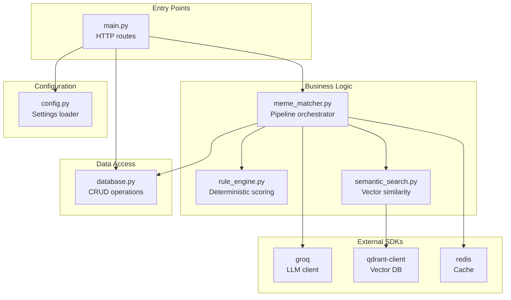
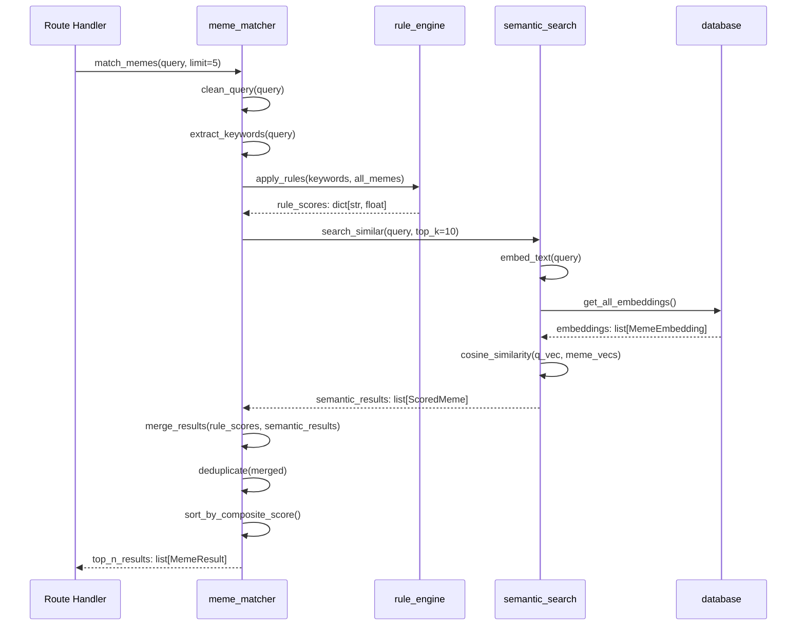
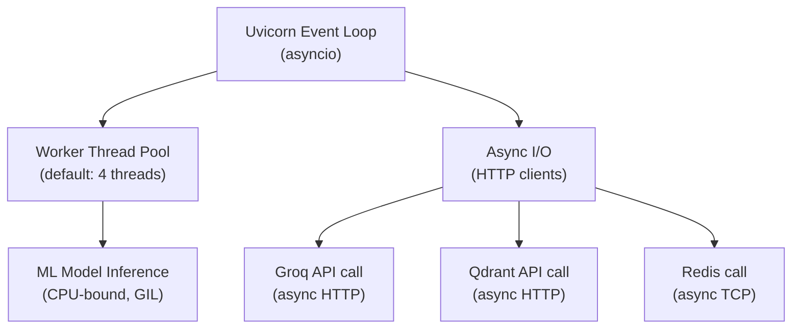
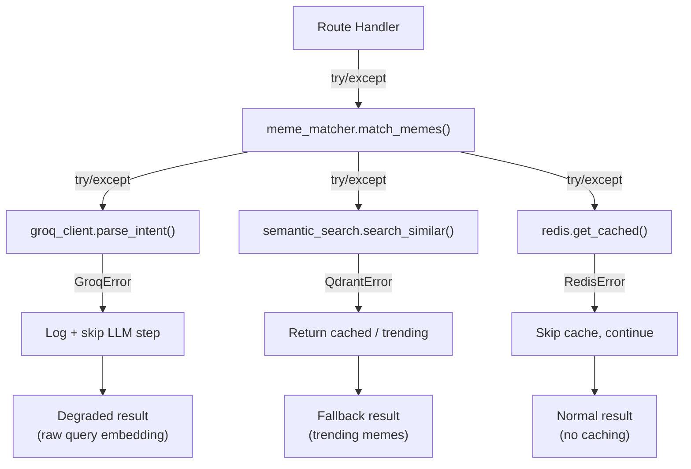

# MemeGPT — Low-Level Architecture

> **Document Version:** 1.0 · **Last Updated:** 2026-08-02

---

## Purpose

This document provides the low-level implementation architecture of MemeGPT, covering internal module interactions, class-level design, function signatures, and data transformation details that complement the [High_Level_Architecture.md](./High_Level_Architecture.md).

---

## Module Dependency Graph



---

## Internal Function Call Chain (Search Request)



---

## Data Types (Internal)

```python
# Internal data types used across modules

class MemeRecord:
    """Raw meme data from database"""
    id: str
    name: str
    category: str
    dialogue: str
    explanation: str
    keywords: list[str]    # Parsed from JSON string
    viral_score: float
    usage_count: int
    upvotes: int
    downvotes: int

class ScoredMeme:
    """Meme with computed relevance score"""
    meme: MemeRecord
    keyword_score: float     # 0.0 – 1.0
    semantic_score: float    # 0.0 – 1.0
    emotion_score: float     # 0.0 – 1.0
    popularity_score: float  # 0.0 – 1.0
    composite_score: float   # Weighted combination

class MemeEmbedding:
    """Stored embedding for a meme"""
    meme_id: str
    text_vector: list[float]   # 384-dim
    image_vector: list[float]  # 512-dim (optional)
    combined_vector: list[float]  # 896-dim

class IntentResult:
    """LLM intent parsing output"""
    situation: str
    emotion_hint: str
    tone: str
    keywords: list[str]
    meme_format: str
    intensity: float

class EmotionResult:
    """Emotion classifier output"""
    primary: str      # joy, anger, surprise, etc.
    secondary: str
    confidence: float  # 0.0 – 1.0
```

---

## Composite Score Calculation (Detailed)

```python
def calculate_composite_score(
    keyword_score: float,
    semantic_score: float,
    emotion_match: bool,
    emotion_secondary: bool,
    popularity_score: float,
    format_match: bool,
    recency_days: int
) -> float:
    """
    Weighted scoring formula used by the re-ranking step.
    
    Weights:
        keyword_score:    0.30 (30%)
        semantic_score:   0.20 (20%)
        emotion match:    +0.15 primary, +0.08 secondary
        popularity:       0.20 (20%)
        format boost:     +0.05
        recency bonus:    0.10 (10%) decayed by age
    """
    score = (
        keyword_score * 0.30 +
        semantic_score * 0.20 +
        popularity_score * 0.20 +
        max(0, (30 - recency_days) / 30) * 0.10  # Newer = higher
    )
    
    if emotion_match:
        score += 0.15
    if emotion_secondary:
        score += 0.08
    if format_match:
        score += 0.05
    
    return min(score, 1.0)
```

---

## Memory Layout

```
Process Memory (~460MB)
├── Python Runtime (50MB)
├── FastAPI + Uvicorn (30MB)
├── MiniLM Model (80MB)
│   ├── Weights: 22MB
│   ├── Tokenizer: 3MB
│   └── Runtime buffers: 55MB
├── Emotion Model (250MB)
│   ├── Weights: 82MB
│   ├── Tokenizer: 5MB
│   └── Runtime buffers: 163MB
├── Application Data (50MB)
│   ├── Meme records cache: 10MB
│   ├── Embedding vectors: 30MB (for 5K memes)
│   └── Config + misc: 10MB
```

---

## Thread / Async Model



- **Async routes:** All FastAPI route handlers are `async def`
- **ML inference:** Runs in thread pool (CPU-bound, blocked by GIL)
- **External I/O:** True async via `httpx.AsyncClient`
- **Concurrency:** ~50 concurrent requests on single-core free tier

---

## Error Propagation



---

## Best Practices

1. **Never block the event loop** — use `run_in_executor()` for CPU-bound work
2. **Pre-load models** at startup, not per-request
3. **Use connection pools** for Redis and Qdrant
4. **Validate early** — Pydantic catches bad input before business logic
5. **Log at boundaries** — entry/exit of each service function

---

## Common Mistakes

| Mistake | Consequence | Fix |
|---|---|---|
| Loading model per request | 2–5s added per request | Load once at startup |
| Sync HTTP calls in async routes | Blocks event loop | Use `httpx.AsyncClient` |
| No timeout on Groq API | Request hangs forever | Set `timeout=5.0` |
| Storing embeddings as strings | Slow parsing | Store as binary numpy arrays |
| Not normalizing vectors | Wrong cosine similarity | Always L2-normalize |

---

## Edge Cases

| Input | Expected Behavior | Why |
|---|---|---|
| Empty string `""` | 422 Validation Error | Pydantic `min_length=1` |
| 2001+ characters | 422 Validation Error | Pydantic `max_length=2000` |
| Unicode emoji only `"😂😂😂"` | Valid search (low quality) | Embedding handles any text |
| SQL injection `"'; DROP TABLE"` | Safe (parameterized queries) | Prisma ORM prevents injection |
| Prompt injection | Safe (structured JSON output) | LLM output is JSON-parsed only |
| Very long conversation paste | Truncated at 2000 chars | Input validation |
| No memes match (score < 0.3) | Empty state + trending fallback | Score threshold filter |

---

## Future Improvements

1. **Replace in-memory search** with Qdrant for all environments
2. **Add request tracing** with OpenTelemetry spans
3. **Implement circuit breaker** for Groq API
4. **Add batch embedding** for query variants
5. **Profile GIL contention** and consider multiprocessing for ML

---

> **Related Documents:**
> - [High_Level_Architecture.md](./High_Level_Architecture.md) — Bird's-eye view
> - [System_Architecture.md](./System_Architecture.md) — Component specifications
> - [Component_Architecture.md](./Component_Architecture.md) — Module internals
> - [03_Backend/Services.md](../03_Backend/Services.md) — Service layer detail
