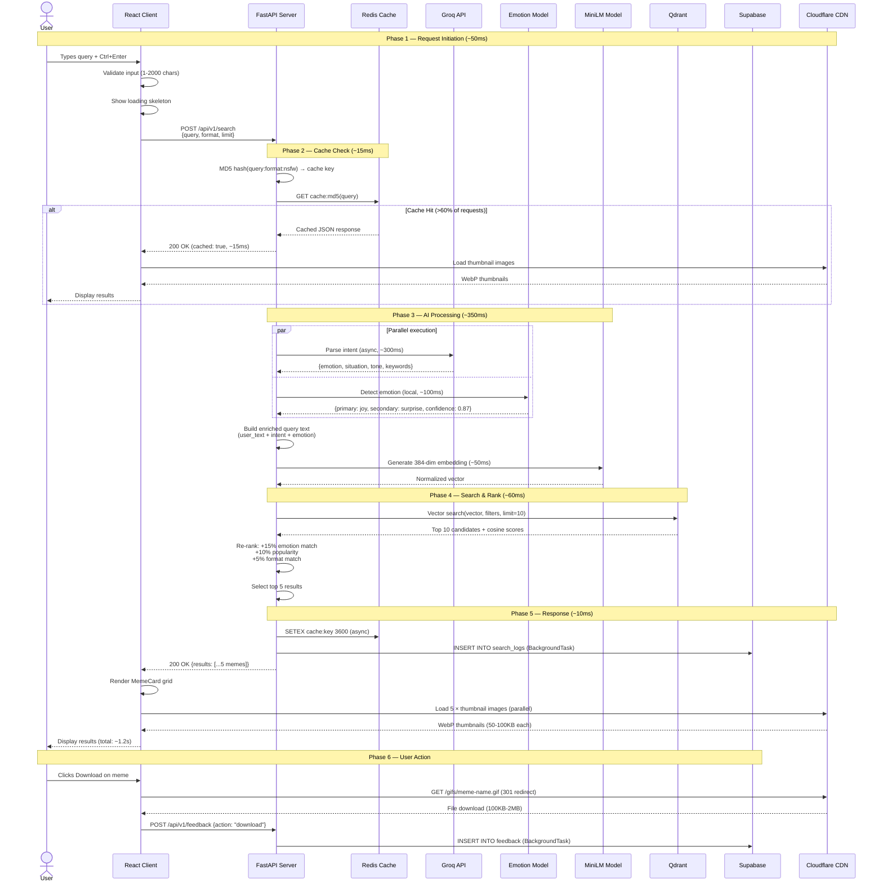
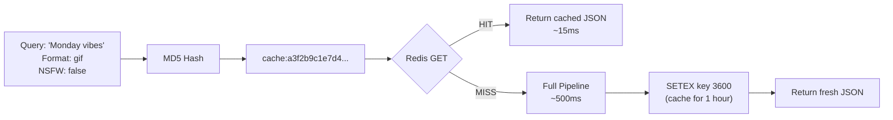
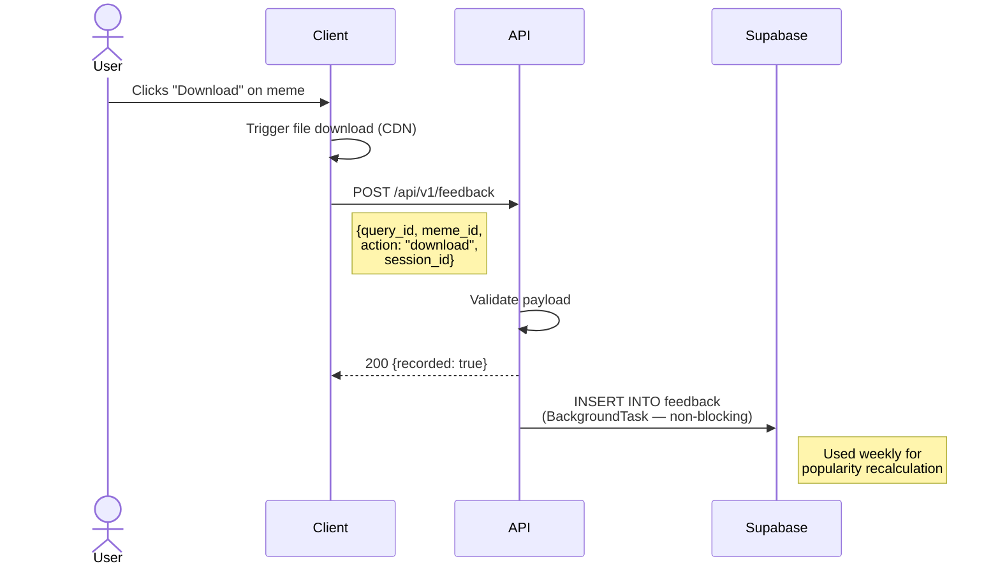

# MemeGPT — Request Flow (Complete Lifecycle)

> **Document Version:** 2.0 · **Last Updated:** 2026-08-02

---

## Purpose

Traces the complete lifecycle of a user search request — from keystroke in the browser to meme displayed on screen — with exact timing, HTTP headers, and every service call documented.

---

## Background

A single MemeGPT search request touches **8 distinct services** across 6 phases. Understanding this flow is critical for debugging latency issues and optimizing the pipeline.

---

## Search Request Lifecycle



---

## Latency Budget (Detailed)

```mermaid
gantt
    title Search Request Latency Budget
    dateFormat X
    axisFormat %L ms

    section Client
    Validate + show skeleton        :c1, 0, 50

    section Server
    CORS + Rate Limit + Validation  :s1, 50, 55
    Cache check (Redis GET)         :s2, 55, 70

    section AI Processing
    Intent Parsing (Groq)           :a1, 70, 370
    Emotion Detection (local)       :a2, 70, 170
    Build enriched query            :a3, 370, 375
    Generate embedding (MiniLM)     :a4, 375, 425

    section Search
    Qdrant vector search            :q1, 425, 475
    Re-ranking (Python)             :q2, 475, 485

    section Response
    Cache write + serialize         :r1, 485, 495
    HTTP response                   :r2, 495, 500

    section Client Render
    Parse JSON + render cards       :c2, 500, 530
    Load 5 thumbnails (parallel)    :c3, 530, 700
```



| Phase | Duration | % of Total |
|---|---|---|
| Client-side initiation | ~50ms | 7% |
| Middleware pipeline | ~5ms | <1% |
| Cache check (Redis) | ~15ms | 2% |
| Intent parsing (Groq) | ~300ms | **43%** |
| Emotion detection | ~100ms | 14% |
| Embedding generation | ~50ms | 7% |
| Vector search (Qdrant) | ~50ms | 7% |
| Re-ranking | ~10ms | 1% |
| Response serialization | ~10ms | 1% |
| Thumbnail loading (CDN) | ~170ms | 24% |
| **Total (wall clock)** | **~700ms** | |

> **Note:** Groq + Emotion run in **parallel** via `asyncio.gather()`, so the real wall-clock for AI processing is ~300ms (not 400ms).

---

## HTTP Request/Response (Complete)

### Request

```http
POST /api/v1/search HTTP/1.1
Host: api.memegpt.com
Content-Type: application/json
Origin: https://memegpt.com
User-Agent: MemeGPT-Web/1.0

{
  "query": "when your code works but you don't know why",
  "format_preference": "gif",
  "nsfw": false,
  "limit": 5,
  "session_id": "sess_abc123"
}
```

### Response

```http
HTTP/1.1 200 OK
Content-Type: application/json
X-Response-Time: 487ms
X-RateLimit-Limit: 30
X-RateLimit-Remaining: 27
X-RateLimit-Reset: 1706745600
X-Cache: MISS
Access-Control-Allow-Origin: https://memegpt.com

{
  "success": true,
  "query_id": "q_xyz789",
  "results": [
    {
      "id": "meme_042",
      "name": "This Is Fine",
      "slug": "this-is-fine",
      "relevance_score": 0.94,
      "emotion_match": ["surprise", "confusion"],
      "preview_url": "https://cdn.memegpt.com/thumbs/this-is-fine.webp",
      "formats": {
        "gif": "https://cdn.memegpt.com/gifs/this-is-fine.gif",
        "image": "https://cdn.memegpt.com/images/this-is-fine.jpg",
        "video": null,
        "webp": "https://cdn.memegpt.com/webp/this-is-fine.webp"
      },
      "share_url": "https://memegpt.com/meme/this-is-fine?ref=q_xyz789",
      "meme_type": "reaction",
      "categories": ["programming", "stress"]
    }
  ],
  "intent_parsed": {
    "emotion": "surprise",
    "situation": "code working unexpectedly",
    "tone": "confused"
  },
  "response_time_ms": 487,
  "cached": false
}
```

---

## Cache Flow



**Cache key format:** `search:{md5(query:format:nsfw)}`  
**TTL:** 3600 seconds (1 hour)  
**Expected hit rate:** >60% (popular queries repeat frequently)

---

## Feedback Flow (Post-Search)



---

## Error Scenarios in Flow

| Scenario | Detection Point | User Experience | Recovery |
|---|---|---|---|
| Network timeout | Client (5s timeout) | "Connection error. Retry?" | Auto-retry once |
| Rate limited (429) | Middleware | "Too many requests. Wait 23s" | Show countdown timer |
| Groq API down | Service layer | Degraded results (no LLM) | Skip intent parsing |
| Qdrant down | Service layer | Return cached/trending | Fallback to trending |
| Invalid query (422) | Pydantic validation | "Please enter a valid query" | Show error inline |

---

## Best Practices

1. **Parallel I/O** — intent parsing + emotion detection run concurrently via `asyncio.gather()`
2. **Background logging** — search_logs and feedback use `BackgroundTasks` to avoid blocking responses
3. **Cache first** — always check cache before starting the AI pipeline
4. **Lazy image loading** — thumbnails load after JSON response renders
5. **Optimistic UI** — show skeleton immediately, don't wait for API response to render layout

---

> **Related Documents:**
> - [07_APIs/Search_API.md](../07_APIs/Search_API.md) — Full API specification
> - [Data_Flow.md](./Data_Flow.md) — Data movement details
> - [03_Backend/API_Architecture.md](../03_Backend/API_Architecture.md) — Backend architecture
> - [03_Backend/Services.md](../03_Backend/Services.md) — Service layer
