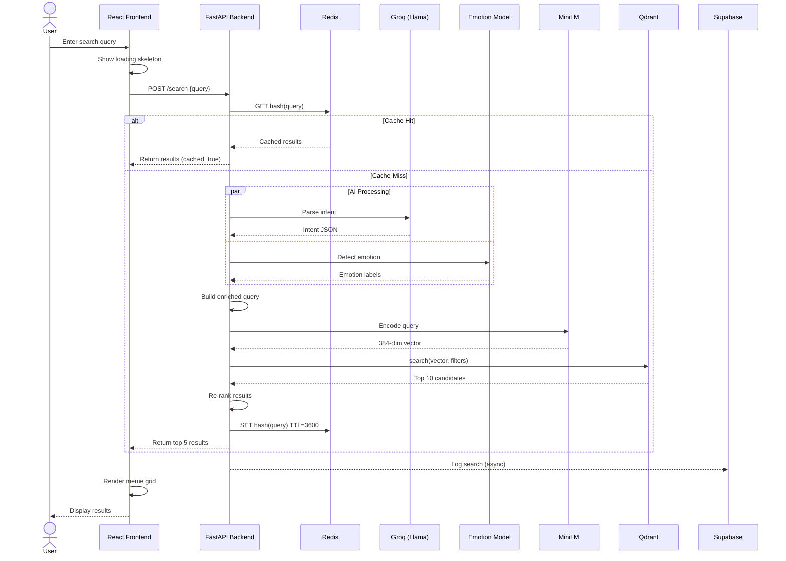
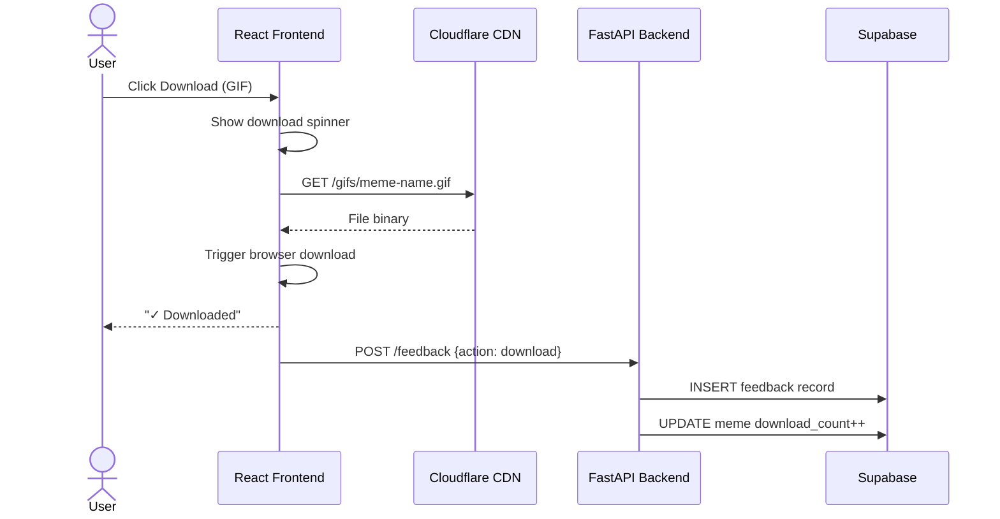
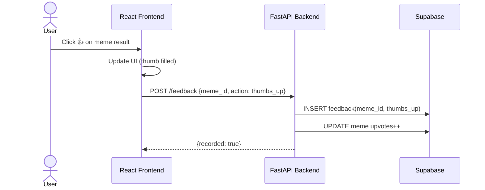
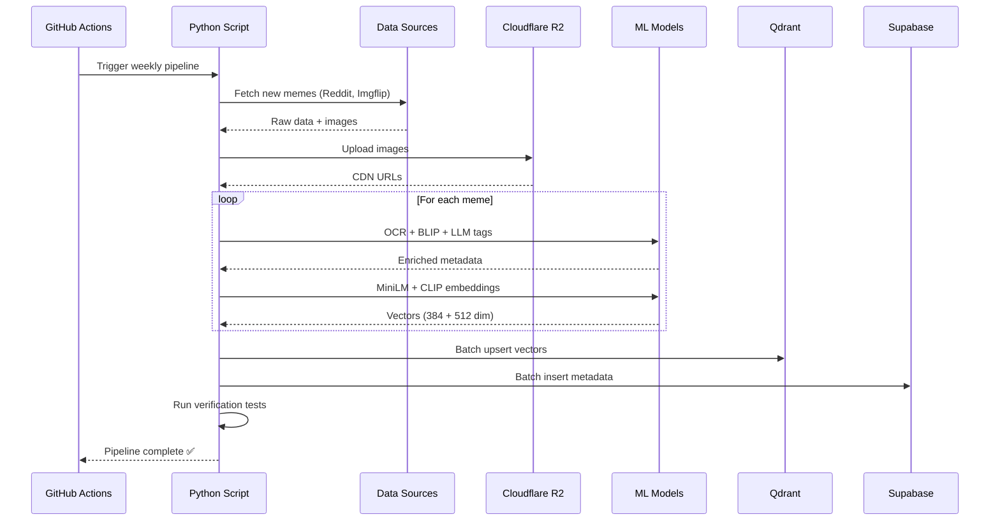
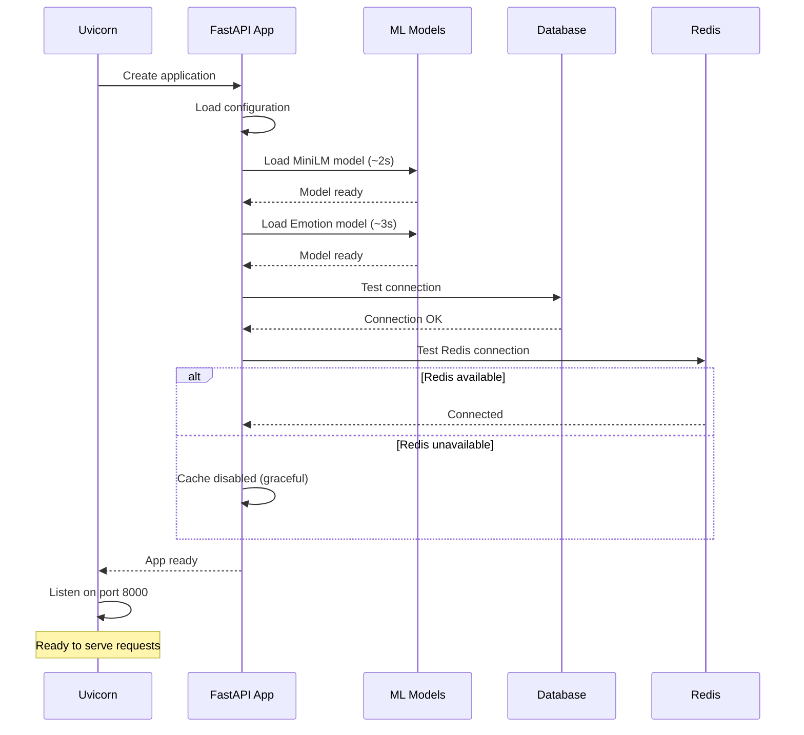

# MemeGPT — Sequence Diagrams

> **Document Version:** 1.0  
> **Last Updated:** 2026-08-01

---

## Purpose

UML sequence diagrams for all major user flows and system interactions.

---

## 1. Meme Search Flow

---

## 2. Meme Download Flow

---

## 3. User Feedback Flow

---

## 4. Offline Indexing Pipeline

---

## 5. App Startup Sequence

---

> **Related Documents:**
> - [Request_Flow.md](./Request_Flow.md) — Detailed request lifecycle
> - [Data_Flow.md](./Data_Flow.md) — Data movement patterns
