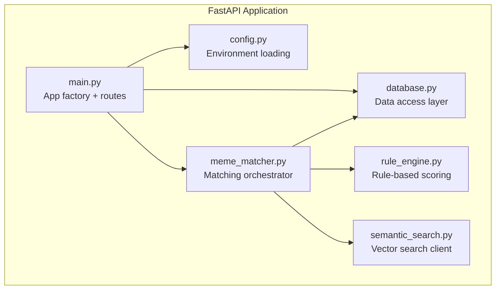
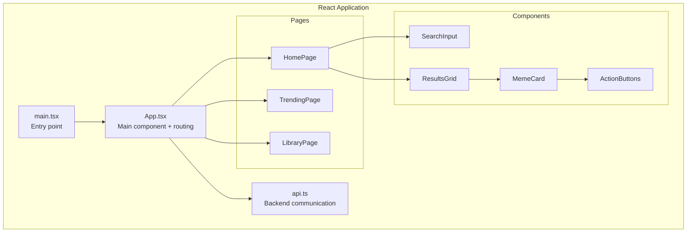
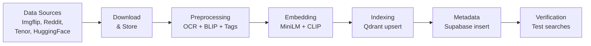
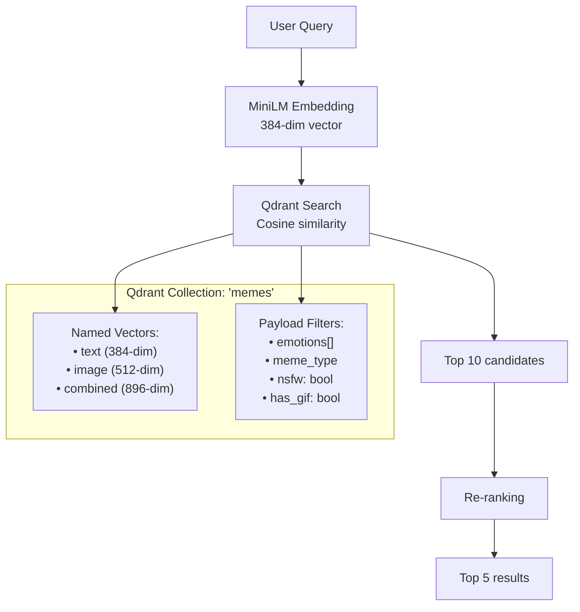
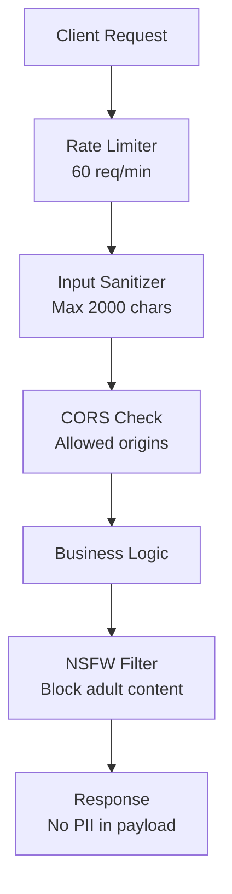

# MemeGPT — System Architecture (Detailed)

> **Document Version:** 1.0  
> **Last Updated:** 2026-08-01  
> **Related Documents:** [High_Level_Architecture.md](./High_Level_Architecture.md) · [Component_Architecture.md](./Component_Architecture.md)

---

## Purpose

Deep technical specification of every system component, their internal structure, responsibilities, interfaces, and failure modes.

---

## Component Specifications

### 1. FastAPI Backend Server

**Location:** `backend/app/`

| Module | Responsibility | Key Functions |
|---|---|---|
| `main.py` | Application factory, route definitions, startup/shutdown events | `create_app()`, route handlers |
| `config.py` | Load environment variables, validate configuration | `Settings` dataclass |
| `database.py` | CRUD operations, connection management | `get_all_memes()`, `search_memes()`, `record_feedback()` |
| `meme_matcher.py` | Orchestrate the full recommendation pipeline | `match_memes()`, `build_query()` |
| `rule_engine.py` | Apply business rules for scoring/re-ranking | `apply_rules()`, `calculate_score()` |
| `semantic_search.py` | Text embedding + vector similarity search | `embed_text()`, `search_similar()` |

### 2. React Frontend Application

**Location:** `frontend/src/`

### 3. Offline Indexing Pipeline

| Step | Script | Input | Output | Duration |
|---|---|---|---|---|
| Download | `download_datasets.py` | API endpoints | Raw images + metadata | 5–30 min |
| Preprocess | `preprocess_memes.py` | Raw images | OCR text + BLIP captions + LLM tags | 15–60 min |
| Embed | `generate_embeddings.py` | Processed text + images | 384-dim text + 512-dim image vectors | 5–20 min |
| Index | `index_qdrant.py` | Vectors + metadata | Qdrant collection with searchable points | 2–5 min |
| Verify | `verify_index.py` | Test queries | Search quality report | 1 min |

### 4. Vector Search System

---

## Inter-Component Communication

| From | To | Method | Format | Auth |
|---|---|---|---|---|
| Frontend → Backend | HTTP REST | JSON | API key (future) |
| Backend → Qdrant | HTTP/gRPC | qdrant-client SDK | API key |
| Backend → Supabase | HTTP | supabase-py SDK | Service key |
| Backend → Groq | HTTP | groq SDK | API key |
| Backend → Redis | TCP/TLS | redis-py | URL token |
| Frontend → CDN | HTTP | Direct URL | None |

---

## Failure Modes & Recovery

| Component | Failure Mode | Impact | Recovery Strategy |
|---|---|---|---|
| Groq API | Rate limit / downtime | No intent parsing | Skip LLM step, use raw query for embedding |
| Qdrant | Connection timeout | No search results | Return cached results from Redis, show trending |
| Supabase | Connection failure | No metadata/analytics | Log to local file, batch insert later |
| Redis | Connection failure | No caching | App works, just slower (bypass cache) |
| CDN | File missing | Broken image | Fallback thumbnail, show placeholder |
| ML Model | OOM / crash | No embeddings | Restart server, models reload on startup |

---

## Security Architecture

---

> **Related Documents:**
> - [Component_Architecture.md](./Component_Architecture.md) — Individual component internals
> - [Data_Flow.md](./Data_Flow.md) — Data pipeline details
> - [Request_Flow.md](./Request_Flow.md) — Request lifecycle
