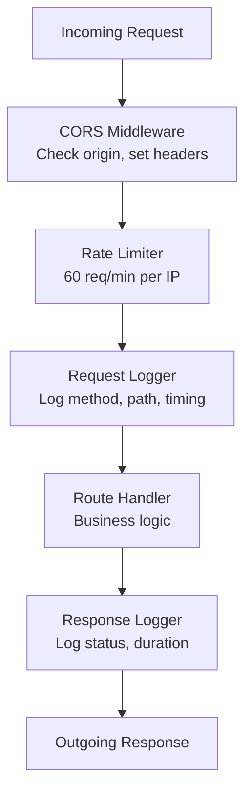

# MemeGPT — API Architecture

> **Document Version:** 1.0  
> **Last Updated:** 2026-08-01

---

## Purpose

Detailed documentation of the FastAPI application architecture, including app factory pattern, middleware stack, dependency injection, and configuration management.

---

## Application Factory

The FastAPI application is created in `main.py` using an app factory pattern:

```python
# Simplified structure of main.py
from fastapi import FastAPI
from fastapi.middleware.cors import CORSMiddleware

app = FastAPI(
    title="MemeGPT API",
    description="AI-powered meme recommendation engine",
    version="1.0.0",
    docs_url="/docs",
    redoc_url="/redoc"
)

# CORS Middleware
app.add_middleware(
    CORSMiddleware,
    allow_origins=["*"],  # Restricted in production
    allow_credentials=True,
    allow_methods=["*"],
    allow_headers=["*"],
)

# Startup Event — Load ML models
@app.on_event("startup")
async def startup():
    # Load MiniLM, Emotion model into memory
    # Initialize database connection
    pass

# Shutdown Event — Clean up
@app.on_event("shutdown")
async def shutdown():
    # Close DB connections
    pass
```

---

## Middleware Stack

Requests pass through middleware in order:



| Middleware | Purpose | Order | Failure Behavior |
|---|---|---|---|
| CORS | Cross-origin access control | 1st | Block request if origin not allowed |
| Rate Limiter | Prevent abuse | 2nd | Return 429 Too Many Requests |
| Request Logger | Audit trail | 3rd | Log and continue (never blocks) |
| Error Handler | Catch unhandled exceptions | Global | Return 500 with safe error message |

---

## Route Organization

### Current Structure (MVP)

All routes are defined directly in `main.py` for simplicity:

```python
@app.get("/health")
async def health_check():
    return {"status": "ok", "version": "1.0.0"}

@app.post("/search")
async def search_memes(request: SearchRequest):
    results = meme_matcher.match_memes(request.query, request.limit)
    return {"results": results}

@app.get("/memes/{meme_id}")
async def get_meme(meme_id: str):
    meme = database.get_meme_by_id(meme_id)
    if not meme:
        raise HTTPException(status_code=404, detail="Meme not found")
    return meme
```

### Production Structure (Scaled)

For production, routes are organized into versioned routers:

```
app/
├── api/
│   └── v1/
│       ├── search.py      # POST /api/v1/search
│       ├── memes.py       # GET /api/v1/memes/{id}
│       ├── trending.py    # GET /api/v1/trending
│       ├── feedback.py    # POST /api/v1/feedback
│       └── health.py      # GET /api/v1/health
```

---

## Request Validation (Pydantic Models)

### Search Request

```python
from pydantic import BaseModel, Field

class SearchRequest(BaseModel):
    query: str = Field(..., min_length=1, max_length=2000, 
                       description="Natural language search query")
    format_preference: str = Field("gif", pattern="^(gif|png|mp4|any)$")
    nsfw: bool = Field(False, description="Include NSFW results")
    limit: int = Field(5, ge=1, le=20, description="Number of results")
    session_id: str | None = Field(None, description="Session tracking ID")

class SearchResponse(BaseModel):
    success: bool
    query_id: str
    results: list[MemeResult]
    intent_parsed: dict
    response_time_ms: int
    cached: bool
```

### Feedback Request

```python
class FeedbackRequest(BaseModel):
    query_id: str
    meme_id: str
    action: str = Field(..., pattern="^(view|click|copy|download|share|thumbs_up|thumbs_down|skip)$")
    session_id: str | None = None
```

---

## Dependency Injection

FastAPI's dependency injection is used for shared resources:

```python
from fastapi import Depends

# Database dependency
async def get_db():
    db = DatabaseConnection()
    try:
        yield db
    finally:
        db.close()

# Rate limiter dependency  
async def check_rate_limit(request: Request):
    ip = request.client.host
    if is_rate_limited(ip):
        raise HTTPException(status_code=429, detail="Rate limit exceeded")

# Use in routes
@app.post("/search")
async def search(
    request: SearchRequest,
    db = Depends(get_db),
    _ = Depends(check_rate_limit)
):
    pass
```

---

## Auto-Generated API Documentation

FastAPI automatically generates two documentation UIs:

| URL | Format | Best For |
|---|---|---|
| `/docs` | Swagger UI | Interactive testing, trying endpoints |
| `/redoc` | ReDoc | Reading API documentation |
| `/openapi.json` | OpenAPI 3.0 spec | Code generation, SDK building |

---

## Error Response Format

All errors follow a consistent JSON format:

```json
{
  "success": false,
  "error": "error_code",
  "message": "Human-readable error description",
  "detail": "Additional context for debugging (dev only)"
}
```

| Status Code | Error Code | Meaning |
|---|---|---|
| 400 | `invalid_request` | Malformed request body |
| 404 | `not_found` | Meme/resource not found |
| 429 | `rate_limit_exceeded` | Too many requests |
| 500 | `internal_error` | Server-side error |
| 503 | `service_unavailable` | Dependency (Qdrant, Groq) is down |

---

> **Related Documents:**
> - [Backend_Overview.md](./Backend_Overview.md) — Module overview
> - [Middleware.md](./Middleware.md) — Middleware details
> - [07_APIs/Search_API.md](../07_APIs/Search_API.md) — Full API reference
