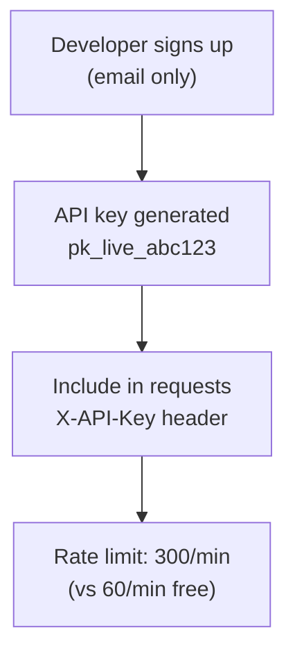
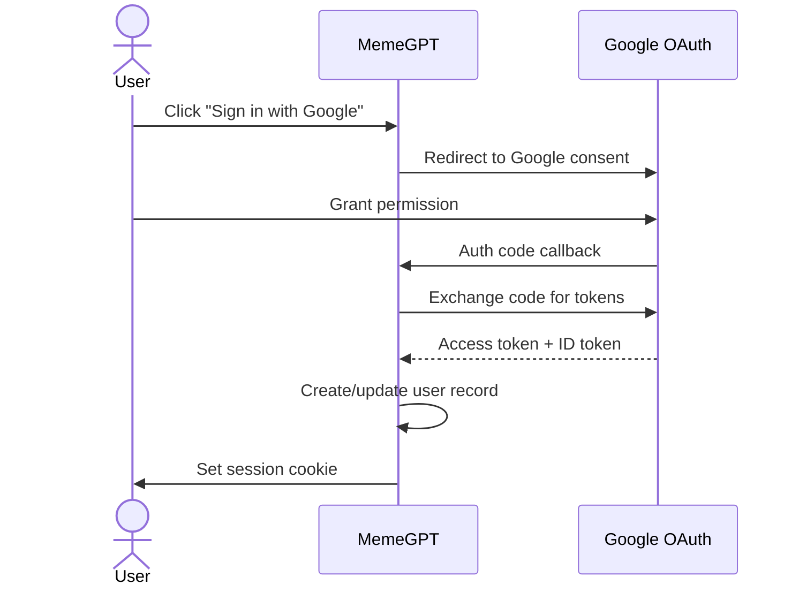

# MemeGPT — Authentication & Authorization

> **Document Version:** 1.0 · **Last Updated:** 2026-08-02

---

## Purpose

Documentation of MemeGPT's authentication and authorization system across all phases.

---

## Phase 1 — MVP (No Authentication)

MemeGPT MVP is **fully anonymous**. No user accounts, no login, no API keys.

| Feature | Auth Required? | Reason |
|---|---|---|
| Search memes | ❌ No | Core value — zero friction |
| Copy/Download | ❌ No | Core value — instant access |
| Give feedback (vote) | ❌ No | Session-based, anonymous |
| View trending | ❌ No | Public content |
| Save favorites | ❌ No | localStorage (client-side) |

**Why no auth at MVP?** Friction kills adoption. Adding a login wall to a meme search tool would reduce usage by 70%+. Every successful meme platform (Giphy, Tenor) allows anonymous access.

---

## Phase 2 — API Keys (Developer Access)



| Feature | Free (No Key) | Developer (API Key) |
|---|---|---|
| Rate limit | 60/min | 300/min |
| Search | ✅ | ✅ |
| Bulk download | ❌ | ✅ |
| Usage analytics | ❌ | ✅ |
| Priority support | ❌ | ✅ |

### API Key Implementation

```python
from fastapi import Header, HTTPException

async def verify_api_key(x_api_key: str | None = Header(None)):
    if x_api_key is None:
        return {"tier": "free", "rate_limit": 60}
    
    key_data = await db.get_api_key(x_api_key)
    if not key_data:
        raise HTTPException(status_code=401, detail="Invalid API key")
    
    return {"tier": key_data.tier, "rate_limit": 300}
```

---

## Phase 3 — User Accounts (Optional)

For synced favorites, saved collections, and personalized recommendations.

### OAuth Flow (Google)



### Session Management

| Property | Value |
|---|---|
| Session storage | HTTP-only cookie + Redis |
| Session TTL | 30 days |
| Refresh mechanism | Sliding window (reset on activity) |
| Logout | Delete cookie + Redis entry |

---

## Authorization Model

### Role-Based Access Control (RBAC) — Phase 3+

| Role | Permissions |
|---|---|
| Anonymous | Search, copy, download, view trending |
| Free User | Above + save favorites, sync across devices |
| Pro User | Above + higher rate limits, priority search |
| Developer | API access + usage dashboard |
| Admin | All + content moderation + analytics |

---

## Security Best Practices

1. **Never store passwords** — use OAuth only (Google, GitHub)
2. **HTTP-only cookies** — prevent XSS token theft
3. **CSRF protection** — SameSite=Strict cookies
4. **API keys are secrets** — never expose in frontend code
5. **Rate limit by both** IP and API key (defense in depth)
6. **Rotate API keys** — support key rotation without downtime

---

> **Related Documents:**
> - [Middleware.md](./Middleware.md) · [11_Security/Security_Overview.md](../11_Security/Security_Overview.md)
