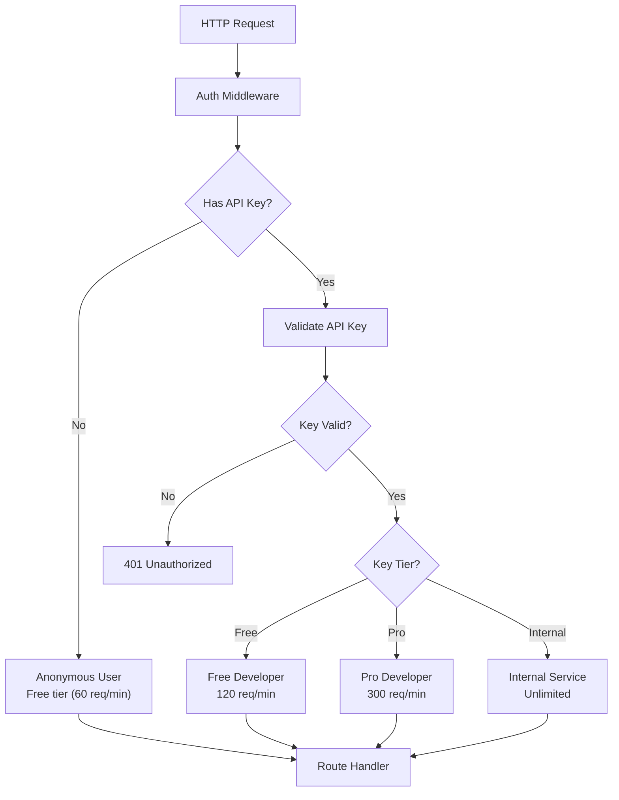

# MemeGPT — Authorization

> **Document Version:** 2.0 · **Last Updated:** 2026-08-02

---

## Purpose

Complete authorization model for MemeGPT — role-based access control (RBAC), permission system, endpoint-level authorization, and API key tiers.

---

## Background

MemeGPT's authorization is intentionally **minimal for MVP** — most features are public and anonymous. Authorization becomes important in Phase 2 when developer API keys, user accounts, and team workspaces are introduced.

---

## Authorization Architecture



---

## Access Tiers

### Phase 1 (MVP) — Anonymous Access

| Resource | Access | Auth Required |
|---|---|---|
| `POST /api/v1/search` | ✅ Public | None |
| `GET /api/v1/memes/{slug}` | ✅ Public | None |
| `GET /api/v1/trending` | ✅ Public | None |
| `POST /api/v1/feedback` | ✅ Public | None |
| `GET /health` | ✅ Public | None |
| `GET /docs` | ✅ Public (dev only) | None |

> **MVP Strategy:** All endpoints are public. Rate limiting by IP address is the only access control. This maximizes adoption with zero friction.

### Phase 2 — API Key Tiers

| Tier | Rate Limit | Features | Cost |
|---|---|---|---|
| **Anonymous** | 60 req/min (IP) | Search, trending, download | Free |
| **Free Developer** | 120 req/min (API key) | + Batch search, webhooks | Free (requires signup) |
| **Pro Developer** | 300 req/min (API key) | + Priority queue, SLA, analytics | $9/month |
| **Internal** | Unlimited | + Admin endpoints, model management | Service token |

### Phase 3 — User Authentication + RBAC

| Role | Permissions |
|---|---|
| **Guest** | Search, view, download |
| **User** | + Save favorites, create collections, history |
| **Premium** | + Unlimited searches, no rate limit, early features |
| **Admin** | + Manage memes, view analytics, moderate content |

---

## API Key Implementation

```python
# app/core/auth.py
from fastapi import Header, HTTPException, Depends
from typing import Optional

async def get_api_tier(
    x_api_key: Optional[str] = Header(None, alias="X-API-Key")
) -> dict:
    """
    Extract and validate API key. Returns tier info.
    Anonymous users (no key) get free tier.
    """
    if not x_api_key:
        return {"tier": "anonymous", "rate_limit": 60, "user_id": None}
    
    # Look up key in database
    key_record = await db.api_keys.find_unique(
        where={"key_hash": hash_api_key(x_api_key)}
    )
    
    if not key_record:
        raise HTTPException(status_code=401, detail="Invalid API key")
    
    if key_record.revoked:
        raise HTTPException(status_code=403, detail="API key has been revoked")
    
    return {
        "tier": key_record.tier,        # "free" | "pro" | "internal"
        "rate_limit": key_record.rate_limit,
        "user_id": key_record.user_id,
    }

# Usage in route handlers:
@router.post("/search")
async def search(
    request: SearchRequest,
    auth: dict = Depends(get_api_tier)
):
    # auth["tier"] contains the user's tier
    # auth["rate_limit"] contains their rate limit
    pass
```

---

## Endpoint Authorization Matrix (Phase 3)

| Endpoint | Guest | User | Premium | Admin |
|---|---|---|---|---|
| Search memes | ✅ | ✅ | ✅ | ✅ |
| View meme detail | ✅ | ✅ | ✅ | ✅ |
| Download meme | ✅ | ✅ | ✅ | ✅ |
| View trending | ✅ | ✅ | ✅ | ✅ |
| Save to favorites | ❌ | ✅ | ✅ | ✅ |
| Create collection | ❌ | ✅ | ✅ | ✅ |
| View search history | ❌ | ✅ | ✅ | ✅ |
| Batch search API | ❌ | ❌ | ✅ | ✅ |
| View analytics | ❌ | ❌ | ❌ | ✅ |
| Manage memes | ❌ | ❌ | ❌ | ✅ |
| Manage users | ❌ | ❌ | ❌ | ✅ |

---

## Best Practices

1. **Default to open** — don't require auth unless there's a specific security reason
2. **API keys are secrets** — hash them before storing (SHA-256)
3. **Include tier in rate limit headers** — users know their limits
4. **Revocation is instant** — revoked keys fail immediately, not after TTL
5. **Log access by tier** — monitor usage patterns per tier
6. **Never return raw API keys** — show only the last 4 characters in dashboards

---

## Security Considerations

- **API keys are NOT passwords** — they identify the caller, not authenticate a user
- **Always use HTTPS** — API keys in headers are visible over HTTP
- **Rotate keys periodically** — allow users to regenerate keys
- **Separate keys per environment** — dev key ≠ production key
- **IP allowlisting (Phase 3)** — enterprise customers can restrict key usage to specific IPs

---

> **Related Documents:**
> - [Authentication.md](./Authentication.md) — Login, OAuth, session management
> - [11_Security/API_Security.md](../11_Security/API_Security.md) — API security overview
> - [07_APIs/Rate_Limiting.md](../07_APIs/Rate_Limiting.md) — Rate limit policies
