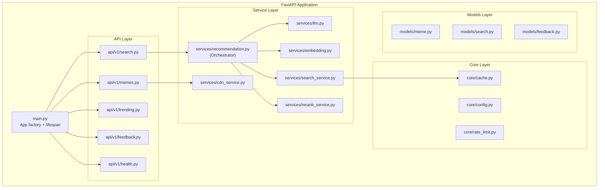
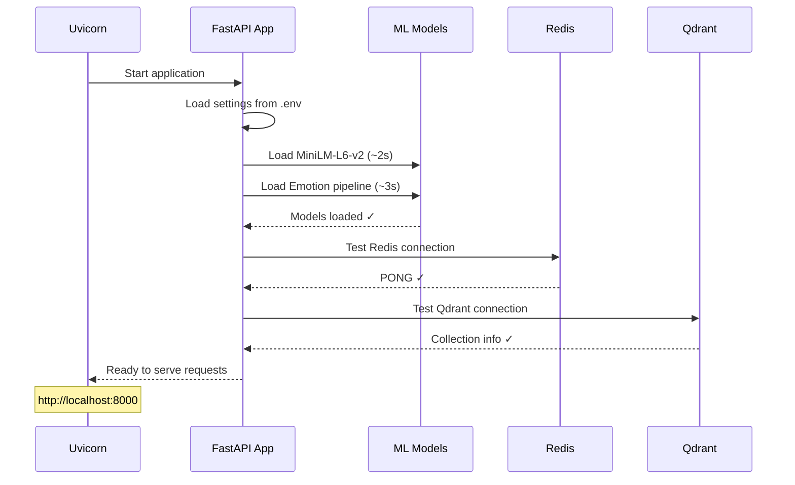

# MemeGPT — Backend Overview

> **Document Version:** 2.0 · **Last Updated:** 2026-08-02

---

## Purpose

Complete overview of MemeGPT's FastAPI backend — architecture, module responsibilities, startup flow, and how all components fit together.

---

## Background

The backend is a **single FastAPI application** that serves as both the REST API gateway and the ML inference engine. ML models (MiniLM, Emotion) run **in-process** — not as separate microservices. This simplifies deployment and eliminates inter-service latency.

---

## Architecture



---

## Module Responsibilities

| Module | File | Responsibility |
|---|---|---|
| **App Factory** | `main.py` | Create FastAPI app, load ML models, register routes |
| **Search Route** | `api/v1/search.py` | Validate input, call recommendation service, return results |
| **Meme Route** | `api/v1/memes.py` | Meme detail, download redirect |
| **Trending Route** | `api/v1/trending.py` | Return cached trending memes |
| **Feedback Route** | `api/v1/feedback.py` | Record user interactions |
| **Health Route** | `api/v1/health.py` | Service health check |
| **Recommendation** | `services/recommendation.py` | Orchestrate the full AI pipeline |
| **LLM Service** | `services/llm.py` | Call Groq API for intent parsing |
| **Embedding Service** | `services/embedding.py` | Run MiniLM + Emotion models |
| **Search Service** | `services/search_service.py` | Query Qdrant for vector search |
| **Rerank Service** | `services/rerank_service.py` | Score and sort results |
| **CDN Service** | `services/cdn_service.py` | Build Cloudflare R2 URLs |
| **Config** | `core/config.py` | Load environment variables |
| **Cache** | `core/cache.py` | Redis GET/SET operations |
| **Rate Limiter** | `core/rate_limit.py` | Token bucket rate limiting |

---

## Startup Flow



```python
# main.py — Startup sequence
@asynccontextmanager
async def lifespan(app: FastAPI):
    # 1. Load ML models into memory
    app.state.text_model = SentenceTransformer('all-MiniLM-L6-v2')
    app.state.emotion_pipeline = pipeline(
        "text-classification",
        model="j-hartmann/emotion-english-distilroberta-base",
        return_all_scores=True
    )
    logger.info("✓ ML models loaded")
    
    # 2. Verify external services
    assert cache.ping(), "Redis not reachable"
    assert qdrant.get_collection("memes"), "Qdrant collection not found"
    logger.info("✓ External services verified")
    
    yield  # Application runs
    
    logger.info("✓ Shutting down")
```

---

## RAM Budget

| Component | RAM Usage |
|---|---|
| Python runtime | ~50 MB |
| FastAPI + Uvicorn | ~30 MB |
| MiniLM-L6-v2 | ~80 MB |
| DistilRoBERTa (Emotion) | ~250 MB |
| Redis client | ~5 MB |
| Qdrant client | ~5 MB |
| Request overhead | ~80 MB |
| **Total** | **~500 MB** |

> **Note:** Fits within Railway/Render free tier (512MB). Single worker only — no room for multiple workers at this tier.

---

## Key Design Decisions

1. **Monolith, not microservices** — single process simplifies deployment and eliminates network hops
2. **ML models in-process** — no gRPC calls, no serialization overhead, ~50ms vs ~200ms
3. **Thin route handlers** — routes validate + delegate, never contain business logic
4. **Service layer pattern** — each service handles one concern (LLM, embedding, search, etc.)
5. **Pydantic everywhere** — request validation, response serialization, config loading

---

## Best Practices

1. **Never import ML models in route files** — access via `request.app.state`
2. **Use `Depends()` for shared resources** — database, auth, rate limiter
3. **Background tasks for analytics** — `BackgroundTasks` for search_logs and feedback
4. **Set `--workers 1`** in free tier — each worker duplicates ML models in RAM
5. **Test with `httpx.AsyncClient`** — FastAPI's recommended test client

---

> **Related Documents:**
> - [API_Architecture.md](./API_Architecture.md) — Full API spec
> - [Services.md](./Services.md) — Service layer detail
> - [Controllers.md](./Controllers.md) — Route handlers
> - [Error_Handling.md](./Error_Handling.md) — Error patterns
