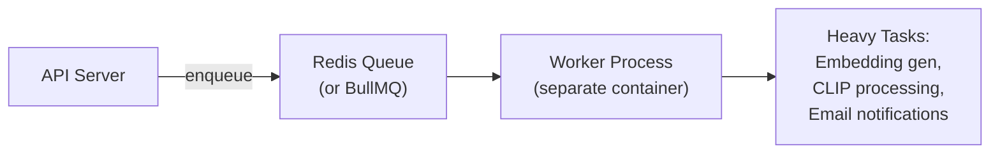

# MemeGPT — Background Jobs & Logging

> **Document Version:** 1.0 · **Last Updated:** 2026-08-02

---

## Background Jobs

### FastAPI BackgroundTasks

Non-critical work runs after the response is sent:

```python
from fastapi import BackgroundTasks

@app.post("/search")
async def search(request: SearchRequest, bg: BackgroundTasks):
    results = meme_matcher.match_memes(request.query)
    
    # These run AFTER the response is sent
    bg.add_task(log_search, request.query, len(results), time_ms)
    bg.add_task(update_usage_counts, [r.id for r in results])
    
    return {"results": results}
```

### Scheduled Jobs (GitHub Actions Cron)

| Job | Schedule | Duration | Purpose |
|---|---|---|---|
| Weekly indexing | Sun 2:00 UTC | ~30 min | Index new memes from Reddit/Imgflip |
| Popularity update | Daily 4:00 UTC | ~5 min | Recalculate popularity_scores |
| Analytics aggregation | Daily 3:00 UTC | ~2 min | Aggregate search logs |
| Cache warm-up | Daily 5:00 UTC | ~5 min | Pre-cache top 100 queries |

### Future: Task Queue (Phase 3+)

For heavier background work, migrate to a task queue:



---

## Logging

### Log Format

```
[2026-01-15 14:30:22] INFO  search: query_hash=abc123 results=5 latency=847ms cached=false
[2026-01-15 14:30:25] WARN  groq: timeout after 5000ms, falling back to raw embedding
[2026-01-15 14:30:30] ERROR qdrant: connection refused, returning cached results
```

### Log Levels

| Level | When Used | Example |
|---|---|---|
| **DEBUG** | Development only | Model loading details, full query text |
| **INFO** | Normal operations | Search request, result count, latency |
| **WARNING** | Degraded behavior | Groq timeout, cache miss on warm query |
| **ERROR** | Failure requiring attention | DB connection lost, model crash |
| **CRITICAL** | System-down events | All external services unreachable |

### Structured Logging

```python
import structlog

logger = structlog.get_logger()

logger.info("search_completed",
    query_hash="abc123",
    result_count=5,
    latency_ms=847,
    cached=False,
    emotion="joy",
    cache_status="miss"
)
```

### What NOT to Log

> [!CAUTION]
> - ❌ Raw search queries (PII risk) — log hash only
> - ❌ API keys
> - ❌ User emails
> - ❌ IP addresses (mask in production)
> - ❌ Stack traces in API responses (internal only)

---

> **Related Documents:**
> - [Performance.md](./Performance.md) · [12_Deployment/Deployment_Overview.md](../12_Deployment/Deployment_Overview.md)
