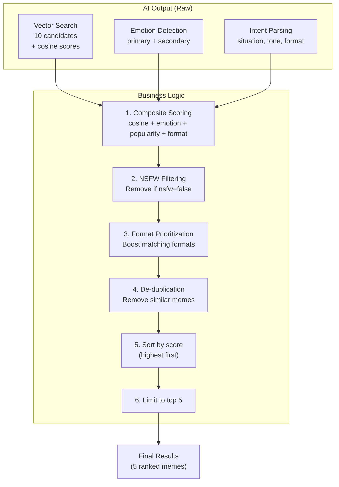

# MemeGPT — Business Logic

> **Document Version:** 2.0 · **Last Updated:** 2026-08-02

---

## Purpose

Complete documentation of MemeGPT's core business logic — the recommendation orchestrator, scoring formula, cache strategy, format prioritization, and the search result lifecycle.

---

## What Is "Business Logic" in MemeGPT?

Business logic is the decision-making code that sits between raw AI outputs and the final user-facing results. It answers: "Given 10 AI-suggested memes, which 5 should we show and in what order?"

---

## Business Logic Components



---

## 1. Composite Scoring

```python
def score_candidate(candidate, user_emotion, format_pref):
    score = candidate.cosine_similarity
    
    # Emotion match boost
    if user_emotion["primary"] in candidate.payload["emotions"]:
        score += 0.15
    if user_emotion.get("secondary") in candidate.payload["emotions"]:
        score += 0.08
    
    # Popularity boost (0–10%)
    score += candidate.payload.get("popularity_score", 0) * 0.10
    
    # Format preference boost
    if format_pref == "gif" and candidate.payload.get("has_gif"):
        score += 0.05
    elif format_pref == "video" and candidate.payload.get("has_video"):
        score += 0.05
    
    return min(score, 1.0)
```

---

## 2. NSFW Filtering

```python
# Done at Qdrant level (server-side filtering — fastest)
query_filter = Filter(must=[
    FieldCondition(key="nsfw", match=MatchValue(value=nsfw_allowed))
])
```

---

## 3. Format Prioritization

| User Preference | Has GIF | Has Video | Priority |
|---|---|---|---|
| `gif` | ✅ | ✅ | GIF > Video > Image |
| `gif` | ✅ | ❌ | GIF > Image |
| `gif` | ❌ | ✅ | Video > Image |
| `video` | ✅ | ✅ | Video > GIF > Image |
| `image` | ✅ | ✅ | Image > GIF > Video |
| `any` | ✅ | ✅ | GIF > Video > Image |

---

## 4. De-duplication

```python
def deduplicate(results: list, threshold: float = 0.90) -> list:
    """Remove memes that are too similar to each other."""
    seen_names = set()
    deduplicated = []
    
    for result in results:
        name_normalized = result["name"].lower().strip()
        if name_normalized not in seen_names:
            seen_names.add(name_normalized)
            deduplicated.append(result)
    
    return deduplicated
```

---

## Cache Strategy

```python
import hashlib, json

def get_cache_key(query: str, format_pref: str, nsfw: bool) -> str:
    """Deterministic cache key from search parameters."""
    raw = f"{query.lower().strip()}:{format_pref}:{nsfw}"
    return f"search:{hashlib.md5(raw.encode()).hexdigest()}"

# Cache TTL: 1 hour (3600 seconds)
# Cache hit rate target: >60%
```

### Cache Invalidation

| Event | Action |
|---|---|
| New meme indexed | Flush all search caches |
| Popularity recalculated (weekly) | Flush all search caches |
| Manual admin action | Selective key deletion |

---

## Result Lifecycle

```
1. Qdrant returns 10 candidates with cosine scores
2. Business logic adds emotion, popularity, format bonuses
3. NSFW filter removes prohibited content
4. De-duplication removes near-duplicates
5. Sort by composite score (descending)
6. Take top 5
7. Build CDN URLs for each format
8. Store in Redis cache (1 hour TTL)
9. Return to client with query_id for feedback tracking
```

---

## Best Practices

1. **Filter at the data layer** — NSFW filtering in Qdrant, not in Python
2. **Score everything** — never show un-scored results to users
3. **Cache the final result** — after all business logic, not before
4. **Log degradation** — if emotion boost skipped, log it
5. **Cap scores at 1.0** — prevents confusing >100% in UI

---

> **Related Documents:**
> - [Services.md](./Services.md) — Service implementations
> - [05_AI_System/Scoring_Logic.md](../05_AI_System/Scoring_Logic.md) — Full scoring formula
> - [Controllers.md](./Controllers.md) — Route handlers
