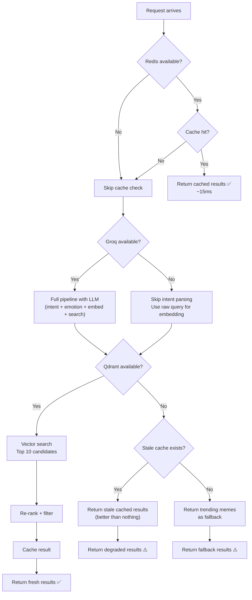

# MemeGPT — Error Handling (Complete Guide)

> **Document Version:** 2.0 · **Last Updated:** 2026-08-02

---

## Purpose

Complete error handling patterns — response formats, error taxonomy, graceful degradation strategy, retry logic, and implementation code for the MemeGPT backend.

---

## Background

MemeGPT's error philosophy: **Partial results are always better than no results**. When any external service fails, the system degrades gracefully rather than returning an error. Users may get slightly lower-quality results, but they always get *something*.

---

## Error Response Format

All error responses follow a consistent JSON structure:

```json
{
  "success": false,
  "error": "error_code_snake_case",
  "message": "Human-readable error message for the UI",
  "details": {},
  "retry_after": 23
}
```

| Field | Type | Required | Description |
|---|---|---|---|
| `success` | boolean | ✅ | Always `false` for errors |
| `error` | string | ✅ | Machine-readable error code (snake_case) |
| `message` | string | ✅ | Human-readable message (safe to display in UI) |
| `details` | object | ❌ | Additional context (e.g., invalid fields) |
| `retry_after` | integer | ❌ | Seconds to wait before retrying (rate limits only) |

---

## Error Taxonomy

### Client Errors (4xx)

| HTTP | Error Code | When | Example | Client Action |
|---|---|---|---|---|
| 400 | `invalid_request` | Malformed request body | Missing required `query` field | Show validation error |
| 400 | `query_too_long` | Query exceeds 2000 chars | User pastes very long text | Truncate input |
| 400 | `invalid_format` | Invalid `format_preference` | `format_preference: "bmp"` | Reset to default "gif" |
| 404 | `meme_not_found` | Meme slug doesn't exist | `/meme/nonexistent-slug` | Show "Meme not found" |
| 422 | `validation_error` | Pydantic validation failed | `limit: -1` | Show field-level errors |
| 429 | `rate_limit_exceeded` | Too many requests | Rapid-fire search | Show countdown timer |

### Server Errors (5xx)

| HTTP | Error Code | When | Example | Client Action |
|---|---|---|---|---|
| 500 | `internal_error` | Unhandled exception | Null pointer in re-ranking | Show generic error + retry |
| 502 | `upstream_error` | External service returned error | Groq 500 response | Retry once, then fallback |
| 503 | `service_unavailable` | External service unreachable | Qdrant DNS failure | Show "Temporary issue" |
| 504 | `gateway_timeout` | External service timeout | Groq >5s response | Return cached/trending |

---

## Error Handler Implementation

```python
from fastapi import Request, HTTPException
from fastapi.responses import JSONResponse
import traceback, logging

logger = logging.getLogger(__name__)

@app.exception_handler(HTTPException)
async def http_exception_handler(request: Request, exc: HTTPException):
    """Handle known HTTP exceptions with consistent format."""
    return JSONResponse(
        status_code=exc.status_code,
        content={
            "success": False,
            "error": getattr(exc, 'detail_code', 'http_error'),
            "message": exc.detail,
        },
        headers=getattr(exc, 'headers', None)
    )

@app.exception_handler(Exception)
async def global_exception_handler(request: Request, exc: Exception):
    """Catch-all for unhandled exceptions. NEVER expose stack traces."""
    logger.error(
        f"Unhandled error: {type(exc).__name__}: {exc}",
        extra={"path": request.url.path, "method": request.method},
        exc_info=True  # Full traceback in server logs only
    )
    return JSONResponse(
        status_code=500,
        content={
            "success": False,
            "error": "internal_error",
            "message": "Something went wrong. Please try again.",
        }
    )
```

---

## Graceful Degradation



### Fallback Hierarchy

| Priority | Strategy | Services Required | Quality | Latency |
|---|---|---|---|---|
| 1 | Full pipeline | All 4 services | **Best** | ~560ms |
| 2 | Skip LLM | Qdrant + Redis + Emotion | **Good** (no intent enrichment) | ~260ms |
| 3 | Skip LLM + Emotion | Qdrant + Redis | **Fair** (raw query only) | ~160ms |
| 4 | Stale cache | Redis only | **Varies** (potentially outdated) | ~15ms |
| 5 | Trending fallback | Supabase only | **Basic** (not personalized) | ~100ms |

### Degradation Implementation

```python
async def recommend_with_fallback(user_text: str, format_pref: str, nsfw: bool):
    """Always returns results — degrades gracefully on service failures."""
    
    # Priority 1: Full pipeline
    try:
        intent = await parse_intent(user_text)        # Groq
    except Exception:
        intent = {"situation": user_text, "emotion_hint": "neutral",
                  "tone": "neutral", "keywords": user_text.split()[:5]}
    
    # Priority 2: Emotion detection (local — rarely fails)
    try:
        emotion = detect_emotion(user_text)
    except Exception:
        emotion = {"primary": "neutral", "secondary": None, "confidence": 0.5}
    
    # Build query and embed (local — almost never fails)
    query_text = build_query_text(user_text, intent, emotion)
    query_vector = text_model.encode(query_text, normalize_embeddings=True).tolist()
    
    # Priority 3: Vector search
    try:
        results = vector_search(query_vector, emotion["primary"], format_pref, nsfw)
    except Exception:
        # Priority 4: Stale cache
        cached = cache.get(f"search:{hashlib.md5(user_text.encode()).hexdigest()}")
        if cached:
            return json.loads(cached)
        # Priority 5: Trending fallback
        return get_trending_memes(limit=5)
    
    return rerank(results, intent, emotion, format_pref)
```

---

## Rate Limiting Error Response

```json
{
  "success": false,
  "error": "rate_limit_exceeded",
  "message": "60 requests per minute allowed. Retry after 23 seconds.",
  "retry_after": 23
}
```

### Response Headers

```http
HTTP/1.1 429 Too Many Requests
X-RateLimit-Limit: 30
X-RateLimit-Remaining: 0
X-RateLimit-Reset: 1706745623
Retry-After: 23
```

---

## Validation Error Response (422)

```json
{
  "success": false,
  "error": "validation_error",
  "message": "Request validation failed",
  "details": [
    {
      "field": "query",
      "message": "String should have at most 2000 characters",
      "type": "string_too_long"
    },
    {
      "field": "limit",
      "message": "Input should be greater than or equal to 1",
      "type": "greater_than_equal"
    }
  ]
}
```

---

## Timeout Configuration

| Service | Timeout | Retry | Fallback |
|---|---|---|---|
| Groq API | **5 seconds** | 0 (skip) | Use raw query |
| Qdrant | **3 seconds** | 1 | Return cached/trending |
| Redis | **2 seconds** | 0 | Skip caching |
| Supabase | **3 seconds** | 1 | Skip analytics logging |
| CDN (client) | **10 seconds** | 1 | Show placeholder image |

---

## Logging Strategy

| Level | When | Example |
|---|---|---|
| **DEBUG** | All requests in dev | `DEBUG: Query embedding generated in 48ms` |
| **INFO** | Successful requests | `INFO: Search completed in 487ms (cache: miss)` |
| **WARNING** | Degraded responses | `WARNING: Groq timeout — skipped intent parsing` |
| **ERROR** | Service failures | `ERROR: Qdrant unreachable — returned trending fallback` |
| **CRITICAL** | All services down | `CRITICAL: All fallbacks exhausted — returning 503` |

```python
# Never log raw user queries (PII)
logger.info(f"Search completed", extra={
    "query_hash": hashlib.md5(query.encode()).hexdigest(),  # Hash only
    "latency_ms": elapsed_ms,
    "cache_hit": cached,
    "result_count": len(results),
    "degraded": groq_failed or qdrant_failed,
})
```

---

## Best Practices

1. **Never expose stack traces** to clients — log internally, return sanitized message
2. **Always return `success: false`** for errors — clients check this field first
3. **Use HTTP status codes correctly** — don't return 200 for errors
4. **Include `retry_after`** for rate limit errors — clients need to know when to retry
5. **Validate early** — reject bad input at the Pydantic layer before hitting services
6. **Fail fast** — set timeouts on all external calls (5s max for any single call)
7. **Degrade gracefully** — partial results > no results > error page

---

## Common Mistakes

| Mistake | Consequence | Fix |
|---|---|---|
| Returning 200 for errors | Client treats error as success | Use proper HTTP status codes |
| Stack trace in response | Security leak (file paths, versions) | Catch-all handler with sanitized message |
| No timeout on external calls | Request hangs indefinitely | `timeout=5.0` on all HTTP clients |
| Logging raw user queries | PII violation | Log MD5 hash only |
| Same error message for all 5xx | Hard to debug | Use specific error codes |
| No fallback when Qdrant is down | Service outage = total failure | Trending meme fallback |

---

> **Related Documents:**
> - [Middleware.md](./Middleware.md) — Error handling middleware details
> - [14_Troubleshooting/Common_Issues.md](../14_Troubleshooting/Common_Issues.md) — Debugging guide
> - [API_Architecture.md](./API_Architecture.md) — Backend architecture
