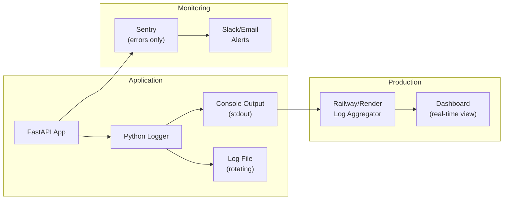

# MemeGPT — Logging

> **Document Version:** 2.0 · **Last Updated:** 2026-08-02

---

## Purpose

Complete logging strategy — log levels, structured logging format, what to log (and what NOT to log), log storage, and debugging patterns.

---

## Background

Proper logging is critical for debugging production issues without exposing user data. MemeGPT follows a **privacy-first logging** approach: never log raw user queries (PII), always log performance metrics and service health.

---

## Logging Architecture



---

## Log Levels

| Level | When to Use | Example | Production |
|---|---|---|---|
| **DEBUG** | Verbose development info | `Embedding generated in 48ms` | ❌ Disabled |
| **INFO** | Normal operations | `Search completed in 487ms (cache: miss)` | ✅ Enabled |
| **WARNING** | Degraded but functional | `Groq timeout — skipped intent parsing` | ✅ Enabled |
| **ERROR** | Service failure | `Qdrant unreachable — returned fallback` | ✅ Enabled |
| **CRITICAL** | System-level failure | `All services down — returning 503` | ✅ Enabled |

---

## Structured Log Format

```python
import logging
import json
import hashlib
from datetime import datetime

class StructuredFormatter(logging.Formatter):
    def format(self, record):
        log_entry = {
            "timestamp": datetime.utcnow().isoformat() + "Z",
            "level": record.levelname,
            "logger": record.name,
            "message": record.getMessage(),
            "module": record.module,
            "function": record.funcName,
            "line": record.lineno,
        }
        # Add extra fields if present
        if hasattr(record, 'extra_data'):
            log_entry.update(record.extra_data)
        return json.dumps(log_entry)
```

### Example Log Output

```json
{
  "timestamp": "2026-08-02T04:30:00Z",
  "level": "INFO",
  "logger": "memegpt.search",
  "message": "Search completed",
  "module": "recommendation",
  "function": "recommend_memes",
  "line": 42,
  "query_hash": "a3f2b9c1e7d4...",
  "latency_ms": 487,
  "cache_hit": false,
  "result_count": 5,
  "groq_ok": true,
  "qdrant_ok": true,
  "emotion_detected": "joy"
}
```

---

## What to Log ✅ vs What NOT to Log ❌

### ✅ Always Log

| Data | Why | Example |
|---|---|---|
| Request latency | Performance monitoring | `latency_ms: 487` |
| Cache hit/miss | Cache effectiveness | `cache_hit: true` |
| Query hash (MD5) | Query deduplication | `query_hash: "a3f2..."` |
| Result count | Search quality | `result_count: 5` |
| Service health | Debugging outages | `groq_ok: true` |
| Error details | Debugging failures | `error: "Qdrant timeout"` |
| HTTP status code | API monitoring | `status: 200` |
| Request path | Traffic analysis | `path: "/api/v1/search"` |
| Response time | SLA compliance | `response_time_ms: 487` |

### ❌ Never Log

| Data | Why | Risk |
|---|---|---|
| Raw user queries | PII / privacy | GDPR violation |
| IP addresses (full) | PII | Privacy law violation |
| API keys | Security | Key compromise |
| User emails | PII | Data breach exposure |
| Session tokens | Security | Session hijacking |
| Stack traces (to client) | Security | Code structure leak |
| Database credentials | Security | Full DB access |

---

## Request Logging Middleware

```python
import time
import hashlib

@app.middleware("http")
async def log_requests(request: Request, call_next):
    start = time.time()
    
    response = await call_next(request)
    
    elapsed_ms = int((time.time() - start) * 1000)
    
    logger.info("Request completed", extra={
        "extra_data": {
            "method": request.method,
            "path": request.url.path,
            "status": response.status_code,
            "latency_ms": elapsed_ms,
            "client_ip_hash": hashlib.md5(
                request.client.host.encode()
            ).hexdigest()[:8],  # Hash IP, don't store raw
        }
    })
    
    response.headers["X-Response-Time"] = f"{elapsed_ms}ms"
    return response
```

---

## Search-Specific Logging

```python
async def recommend_memes(user_text: str, **kwargs):
    start = time.time()
    
    # ... pipeline code ...
    
    elapsed = time.time() - start
    logger.info("Search completed", extra={
        "extra_data": {
            "query_hash": hashlib.md5(user_text.encode()).hexdigest(),
            "query_length": len(user_text),
            "latency_ms": int(elapsed * 1000),
            "cache_hit": cached,
            "result_count": len(results),
            "top_score": results[0]["score"] if results else 0,
            "emotion_detected": emotion["primary"],
            "groq_ok": not groq_failed,
            "degraded": groq_failed or qdrant_failed,
        }
    })
```

---

## Error Logging with Sentry

```python
import sentry_sdk

sentry_sdk.init(
    dsn=os.environ.get("SENTRY_DSN", ""),
    environment=os.environ.get("APP_ENV", "development"),
    traces_sample_rate=0.1,  # 10% of transactions
    profiles_sample_rate=0.1,
)

# Errors are auto-captured. For manual breadcrumbs:
sentry_sdk.add_breadcrumb(
    category="search",
    message=f"Groq intent parsing failed",
    level="warning",
)
```

---

## Log Rotation (File-based)

```python
from logging.handlers import RotatingFileHandler

file_handler = RotatingFileHandler(
    "logs/memegpt.log",
    maxBytes=10 * 1024 * 1024,  # 10 MB per file
    backupCount=5,               # Keep 5 rotated files
)
file_handler.setFormatter(StructuredFormatter())
logger.addHandler(file_handler)
```

---

## Monitoring Dashboard Queries

| Question | Log Query |
|---|---|
| Average search latency? | `level:INFO AND message:"Search completed" | avg(latency_ms)` |
| Cache hit rate? | `cache_hit:true / total * 100` |
| Error rate? | `level:ERROR / total * 100` |
| Groq failures? | `groq_ok:false | count()` |
| Degraded searches? | `degraded:true | count()` |
| Zero-result queries? | `result_count:0 | count()` |

---

## Best Practices

1. **Use structured JSON logging** — parseable by log aggregators
2. **Hash PII before logging** — MD5 of query/IP, never raw values
3. **Set log level via environment** — `LOG_LEVEL=WARNING` in production
4. **Include correlation IDs** — trace requests across services
5. **Log at service boundaries** — entry/exit of each service call
6. **Don't log success responses body** — too verbose, wastes storage
7. **Alert on ERROR rate spikes** — >5% error rate triggers Slack notification

---

> **Related Documents:**
> - [Error_Handling.md](./Error_Handling.md) — Error handling patterns
> - [12_Deployment/Monitoring.md](../12_Deployment/Monitoring.md) — Production monitoring
> - [11_Security/Data_Privacy.md](../11_Security/Data_Privacy.md) — Privacy compliance
