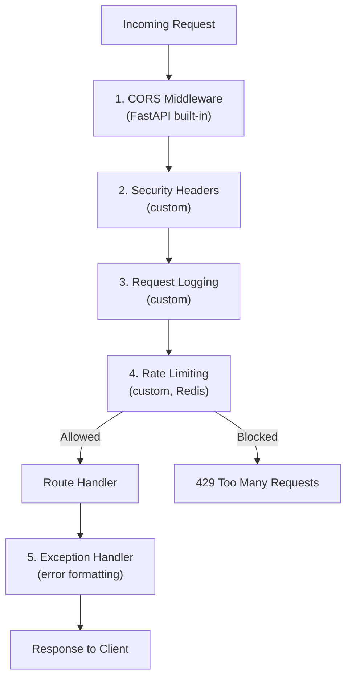

# MemeGPT — Middleware

> **Document Version:** 2.0 · **Last Updated:** 2026-08-02

---

## Purpose

Complete middleware pipeline — CORS configuration, rate limiting middleware, request logging, error handling, and security headers.

---

## Middleware Stack (Execution Order)



> **Execution order matters.** CORS runs first (preflight OPTIONS must always succeed). Rate limiting runs last before the route handler (expensive ops should be blocked before hitting the ML pipeline).

---

## CORS Middleware

```python
from fastapi.middleware.cors import CORSMiddleware

ALLOWED_ORIGINS = [
    "https://memegpt.com",
    "https://app.memegpt.com",
]

if settings.is_development:
    ALLOWED_ORIGINS.extend([
        "http://localhost:3000",
        "http://localhost:5173",
    ])

app.add_middleware(
    CORSMiddleware,
    allow_origins=ALLOWED_ORIGINS,  # NEVER use "*" in production
    allow_credentials=True,
    allow_methods=["GET", "POST"],   # Only methods we actually use
    allow_headers=["Content-Type", "X-API-Key"],
    max_age=3600,                    # Cache preflight for 1 hour
)
```

---

## Security Headers Middleware

```python
@app.middleware("http")
async def add_security_headers(request: Request, call_next):
    response = await call_next(request)
    response.headers["X-Content-Type-Options"] = "nosniff"
    response.headers["X-Frame-Options"] = "DENY"
    response.headers["X-XSS-Protection"] = "1; mode=block"
    response.headers["Referrer-Policy"] = "strict-origin-when-cross-origin"
    if settings.is_production:
        response.headers["Strict-Transport-Security"] = (
            "max-age=31536000; includeSubDomains"
        )
    return response
```

---

## Request Logging Middleware

```python
import time, hashlib

@app.middleware("http")
async def log_requests(request: Request, call_next):
    start = time.time()
    
    response = await call_next(request)
    
    elapsed_ms = int((time.time() - start) * 1000)
    
    logger.info("Request", extra={"extra_data": {
        "method": request.method,
        "path": request.url.path,
        "status": response.status_code,
        "latency_ms": elapsed_ms,
        "ip_hash": hashlib.md5(
            (request.client.host or "unknown").encode()
        ).hexdigest()[:8],
    }})
    
    response.headers["X-Response-Time"] = f"{elapsed_ms}ms"
    return response
```

---

## Rate Limiting Middleware

```python
@app.middleware("http")
async def rate_limit_middleware(request: Request, call_next):
    # Skip rate limiting for health checks
    if request.url.path == "/health":
        return await call_next(request)
    
    # Skip rate limiting in development
    if not settings.RATE_LIMIT_ENABLED:
        return await call_next(request)
    
    client_ip = request.client.host
    endpoint = "search" if "/search" in request.url.path else "general"
    
    allowed, remaining = await rate_limiter.check(
        key=f"rl:{endpoint}:{client_ip}",
        limit=30 if endpoint == "search" else 60
    )
    
    if not allowed:
        return JSONResponse(
            status_code=429,
            content={
                "success": False,
                "error": "rate_limit_exceeded",
                "message": f"Rate limit exceeded. Try again later.",
            },
            headers={"Retry-After": "60"}
        )
    
    response = await call_next(request)
    response.headers["X-RateLimit-Remaining"] = str(remaining)
    return response
```

---

## Middleware Testing

```python
@pytest.mark.asyncio
async def test_cors_allows_configured_origin():
    async with AsyncClient(app=app, base_url="http://test") as client:
        response = await client.options(
            "/api/v1/search",
            headers={"Origin": "https://memegpt.com"}
        )
    assert response.headers.get("access-control-allow-origin") == "https://memegpt.com"

@pytest.mark.asyncio
async def test_cors_blocks_unknown_origin():
    async with AsyncClient(app=app, base_url="http://test") as client:
        response = await client.options(
            "/api/v1/search",
            headers={"Origin": "https://evil.com"}
        )
    assert "access-control-allow-origin" not in response.headers
```

---

## Best Practices

1. **Register CORS first** — preflight OPTIONS must always succeed
2. **Never use `allow_origins=["*"]`** — allows any website to call your API
3. **Only allow methods you use** — `GET, POST` (no PUT, DELETE in Phase 1)
4. **Log request latency** — every response gets `X-Response-Time` header
5. **Hash IPs before logging** — privacy compliance
6. **Skip rate limiting on `/health`** — monitoring must always work

---

> **Related Documents:**
> - [API_Architecture.md](./API_Architecture.md) — Full backend architecture
> - [03_Backend/Logging.md](./Logging.md) — Logging strategy
> - [11_Security/API_Security.md](../11_Security/API_Security.md) — Security headers
