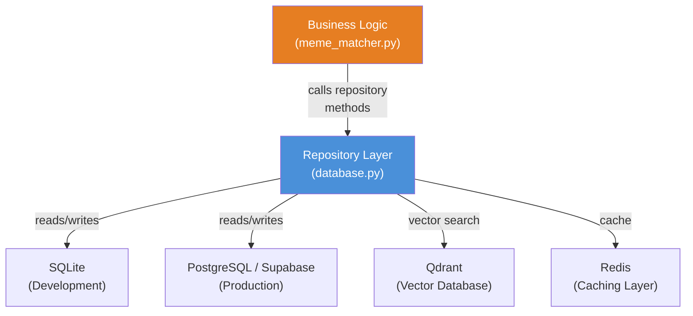

# MemeGPT — Repository Pattern

> **Document Version:** 2.0 · **Last Updated:** 2026-08-02

---

## Purpose

Documentation of the Repository pattern used in `database.py` — abstracts data access behind a consistent interface, enabling seamless swapping between SQLite (development) and PostgreSQL (production) without changing business logic.

---

## Pattern Overview



---

## Why Use the Repository Pattern?

| Benefit | How It Applies to MemeGPT |
|---|---|
| **Separation of concerns** | Scoring, ranking, and business logic in services never write raw SQL |
| **Testability** | Swap real DB for in-memory SQLite in tests — no mocking framework needed |
| **Swappable backends** | SQLite in dev, PostgreSQL in prod — zero code changes in business logic |
| **Consistent access** | Every data operation goes through one layer; logging, metrics, error handling are centralized |
| **Migration safety** | Schema changes are isolated to repository methods; callers are unaffected |

---

## Repository Interface

```python
# conceptual/contract.py — the implicit interface all repositories implement
# Python uses duck typing, so no formal ABC is required, but the contract is:

class MemeRepository:
    """Contract for meme data access. All implementations must satisfy these signatures."""

    def get_all_memes(self) -> list[dict]:
        """Return all memes with their metadata."""
        ...

    def search_memes(self, query_embedding: list[float], filters: dict) -> list[dict]:
        """Search memes by vector similarity + metadata filters."""
        ...

    def get_meme_by_id(self, meme_id: str) -> dict | None:
        """Get single meme by UUID. Returns None if not found."""
        ...

    def get_meme_by_slug(self, slug: str) -> dict | None:
        """Get single meme by URL-friendly slug."""
        ...

    def record_feedback(self, meme_id: str, action: str, session_id: str) -> bool:
        """Record a user interaction (download, copy, share, skip)."""
        ...

    def log_search(self, query: str, result_count: int, latency_ms: int) -> bool:
        """Log a search query for analytics and trending."""
        ...

    def get_trending(self, category: str, limit: int, period: str) -> list[dict]:
        """Return trending memes based on recent engagement."""
        ...

    def save_meme(self, meme_id: str, session_id: str) -> bool:
        """Save a meme to user's collection (Phase 2 feature)."""
        ...
```

---

## Implementation Details

### Database Selection (Factory Pattern)

```python
# database.py — Repository factory
import os
from .repository_sqlite import SQLiteMemeRepository
from .repository_postgres import PostgresMemeRepository

def create_repository() -> MemeRepository:
    env = os.getenv("APP_ENV", "development")

    if env == "production":
        return PostgresMemeRepository()
    return SQLiteMemeRepository()  # Also used in tests
```

### Example: SQLite Implementation

```python
# repository_sqlite.py
import sqlite3
from typing import Optional

class SQLiteMemeRepository:
    def __init__(self, db_path: str = "data/memegpt.db"):
        self.conn = sqlite3.connect(db_path, check_same_thread=False)
        self.conn.row_factory = sqlite3.Row

    def get_meme_by_slug(self, slug: str) -> Optional[dict]:
        cursor = self.conn.execute(
            "SELECT * FROM memes WHERE slug = ?", (slug,)
        )
        row = cursor.fetchone()
        if row is None:
            return None
        return dict(row)

    def record_feedback(self, meme_id: str, action: str, session_id: str) -> bool:
        try:
            self.conn.execute(
                """INSERT INTO feedback (meme_id, action, session_id, created_at)
                   VALUES (?, ?, ?, datetime('now'))""",
                (meme_id, action, session_id),
            )
            self.conn.commit()
            return True
        except sqlite3.Error:
            return False
```

### Example: PostgreSQL Implementation

```python
# repository_postgres.py
import asyncpg
from typing import Optional

class PostgresMemeRepository:
    def __init__(self, pool: asyncpg.Pool):
        self.pool = pool

    async def get_meme_by_slug(self, slug: str) -> Optional[dict]:
        async with self.pool.acquire() as conn:
            row = await conn.fetchrow(
                "SELECT * FROM memes WHERE slug = $1", slug
            )
            if row is None:
                return None
            return dict(row)

    async def record_feedback(self, meme_id: str, action: str, session_id: str) -> bool:
        try:
            async with self.pool.acquire() as conn:
                await conn.execute(
                    """INSERT INTO feedback (meme_id, action, session_id, created_at)
                       VALUES ($1, $2, $3, NOW())""",
                    meme_id, action, session_id,
                )
            return True
        except asyncpg.PostgresError:
            return False
```

---

## Common Mistakes

| Mistake | Why It's Bad | Correct Approach |
|---|---|---|
| Writing SQL in business logic | Couples services to a specific database | Always call repository methods |
| Concatenating query parameters | SQL injection vulnerability | Use parameterized queries (`?` or `$1`) |
| Returning ORM/connection objects | Caller depends on internal DB types | Return plain dicts |
| Not handling connection errors | Crash instead of graceful degradation | Wrap in try/except, return None or False |
| Leaking connection pools | Resource exhaustion | Use context managers or dependency injection |
| Mixing repository with caching logic | Violates single responsibility | Separate cache layer (Redis) from repository |
| Ignoring async/sync mismatch | Blocking event loop in FastAPI | Match async/await pattern of the framework |

---

## Testing with Repository Pattern

```python
# test_meme_matcher.py — inject SQLite repo for tests
from database import SQLiteMemeRepository

def test_search_returns_results():
    # Arrange: in-memory SQLite for fast tests
    repo = SQLiteMemeRepository(":memory:")
    repo.conn.execute("CREATE TABLE memes (...)")

    # Act: business logic uses repo
    results = meme_matcher.search("funny cat", repo=repo)

    # Assert
    assert len(results) > 0
```

No mocking framework needed — just swap the database URL. Tests run in milliseconds.

---

## Related Documents

- [Backend_Overview.md](./Backend_Overview.md) — Backend architecture
- [02_Project_Architecture/Design_Patterns.md](../02_Project_Architecture/Design_Patterns.md) — All design patterns used
- [06_Database/Database_Overview.md](../06_Database/Database_Overview.md) — Database architecture
- [Services.md](./Services.md) — Service layer above repository