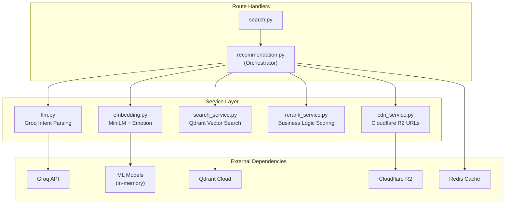

# MemeGPT — Backend Services (Complete Implementation)

> **Document Version:** 2.0 · **Last Updated:** 2026-08-02

---

## Purpose

Complete documentation of every backend service module — the Recommendation Service (core orchestrator), Embedding Service, LLM Service, Search Service, Re-rank Service, and CDN Service. Includes full implementation code from the engineering specification.

---

## Service Architecture



---

## Service 1: Recommendation Service (Orchestrator)

**File:** `app/services/recommendation.py`

The core pipeline orchestrator — called for every user request. Coordinates all other services.

```python
"""
Core recommendation engine — called for every user request.
Target latency: < 1.5 seconds total.
"""
import json, hashlib, time
from groq import Groq
from sentence_transformers import SentenceTransformer
from transformers import pipeline
from qdrant_client import QdrantClient
import redis

# Models loaded once at startup (via lifespan hook in main.py)
text_model = SentenceTransformer('all-MiniLM-L6-v2')

emotion_pipeline = pipeline(
    "text-classification",
    model="j-hartmann/emotion-english-distilroberta-base",
    return_all_scores=True
)

groq_client = Groq(api_key=os.environ["GROQ_API_KEY"])
qdrant = QdrantClient(url=os.environ["QDRANT_URL"], api_key=os.environ["QDRANT_API_KEY"])
cache = redis.from_url(os.environ["UPSTASH_REDIS_URL"])

async def recommend_memes(
    user_text: str,
    format_pref: str = "gif",
    nsfw: bool = False,
    session_id: str = None
) -> list[dict]:
    """
    Full recommendation pipeline. Returns top 5 meme recommendations.
    """
    start = time.time()

    # Cache check
    cache_key = f"search:{hashlib.md5(f'{user_text}:{format_pref}:{nsfw}'.encode()).hexdigest()}"
    cached = cache.get(cache_key)
    if cached:
        return json.loads(cached)

    # A: Parse intent (LLM) ─────────── ~300ms
    intent = await parse_intent(user_text)

    # B: Detect emotion (local) ─────── ~100ms
    emotion = detect_emotion(user_text)

    # C: Build rich query text
    query_text = build_query_text(user_text, intent, emotion)

    # D: Generate query embedding ───── ~50ms
    query_vector = text_model.encode(query_text, normalize_embeddings=True).tolist()

    # E: Vector search ──────────────── ~50ms
    results = vector_search(query_vector, emotion["primary"], format_pref, nsfw)

    # F: Re-rank ────────────────────── ~10ms
    final_results = rerank(results, intent, emotion, format_pref)

    # Cache for 1 hour
    cache.setex(cache_key, 3600, json.dumps(final_results))

    elapsed = time.time() - start
    print(f"Recommendation completed in {elapsed:.2f}s")
    return final_results
```

---

## Service 2: LLM Service (Intent Parsing)

**File:** `app/services/llm.py`

```python
"""Groq API integration for intent parsing. ~200-400ms per call."""

async def parse_intent(user_text: str) -> dict:
    """
    Uses Groq Llama 3.1 8B to extract structured intent from user input.
    Returns JSON with: emotion_hint, situation, tone, keywords, meme_format, intensity
    """
    prompt = f"""Analyze this text for meme recommendation. Return ONLY JSON:
"{user_text}"

{{
  "situation": "concise one-sentence situation description",
  "emotion_hint": "joy|sadness|anger|surprise|fear|disgust|neutral",
  "tone": "sarcastic|sincere|humorous|frustrated|excited|proud|anxious|relatable",
  "keywords": ["word1", "word2"],
  "meme_format": "reaction|comparison|advice|relatable|wholesome|achievement|failure",
  "intensity": 0.7
}}"""

    response = groq_client.chat.completions.create(
        model="llama-3.1-8b-instant",
        messages=[{"role": "user", "content": prompt}],
        temperature=0.1,
        max_tokens=200
    )
    return json.loads(response.choices[0].message.content)
```

### Fallback Strategy (Priority Order)

| # | Service | Model | Free Limit | Speed |
|---|---|---|---|---|
| 1 | **Groq** (primary) | llama-3.1-8b-instant | 6K req/day | Ultra fast (500+ tok/s) |
| 2 | Google Gemini AI | gemini-1.5-flash | 1M tokens/day | Fast |
| 3 | Cohere | command-r | 1K req/month | Medium |
| 4 | Together AI | meta-llama/Llama-3-8b | $25 free credits | Fast |
| 5 | **Ollama** (offline) | llama3.2:3b | Unlimited (local) | CPU speed |

---

## Service 3: Embedding Service

**File:** `app/services/embedding.py`

```python
"""Local ML model inference for text embedding and emotion detection."""

def detect_emotion(text: str) -> dict:
    """
    Local model inference: ~100ms.
    Returns primary emotion, secondary emotion, and confidence.
    """
    results = emotion_pipeline(text[:512])[0]  # Truncate for speed
    sorted_emotions = sorted(results, key=lambda x: x['score'], reverse=True)
    return {
        "primary": sorted_emotions[0]["label"],
        "secondary": sorted_emotions[1]["label"] if len(sorted_emotions) > 1 else None,
        "confidence": sorted_emotions[0]["score"]
    }

def build_query_text(user_text: str, intent: dict, emotion: dict) -> str:
    """
    Combine original input + LLM intent + detected emotion
    into rich text for embedding. Richer text = better search.
    """
    return f"""
User said: {user_text}
Situation: {intent.get('situation', '')}
Emotion: {emotion['primary']}, {emotion.get('secondary', '')}
Tone: {intent.get('tone', '')}
Keywords: {', '.join(intent.get('keywords', []))}
Meme type needed: {intent.get('meme_format', 'reaction')}
""".strip()
```

---

## Service 4: Vector Search Service

**File:** `app/services/search_service.py`

```python
"""Qdrant vector search with payload filters."""
from qdrant_client.models import Filter, FieldCondition, MatchValue

def vector_search(
    query_vector: list[float],
    emotion: str,
    format_pref: str = "any",
    nsfw: bool = False,
    top_k: int = 10
) -> list:
    """Qdrant search with filters: ~30-60ms"""

    conditions = [
        FieldCondition(key="nsfw", match=MatchValue(value=nsfw))
    ]
    if format_pref == "gif":
        conditions.append(FieldCondition(key="has_gif", match=MatchValue(value=True)))
    elif format_pref == "video":
        conditions.append(FieldCondition(key="has_video", match=MatchValue(value=True)))

    search_filter = Filter(must=conditions)

    results = qdrant.search(
        collection_name="memes",
        query_vector=("text", query_vector),  # Use text vector space
        query_filter=search_filter,
        limit=top_k,
        with_payload=True,
        score_threshold=0.45  # Min similarity — below this is noise
    )
    return results
```

---

## Service 5: Re-ranking Service

**File:** `app/services/rerank_service.py`

```python
"""
Business logic re-ranking on top of vector similarity scores.
Small adjustments that make a big difference in result quality.
"""

def rerank(
    results: list,
    intent: dict,
    emotion: dict,
    format_pref: str = "any"
) -> list:
    scored = []
    for r in results:
        payload = r.payload
        score = r.score  # Cosine similarity (0.0 – 1.0)

        # +15% if detected emotion matches meme's emotion tags
        if emotion["primary"] in payload.get("emotions", []):
            score += 0.15

        # +8% for secondary emotion match
        if emotion.get("secondary") in payload.get("emotions", []):
            score += 0.08

        # +10% popularity boost (weighted by actual usage)
        popularity = payload.get("popularity_score", 0)
        score += popularity * 0.10

        # +5% if user prefers GIF and meme has GIF
        if format_pref == "gif" and payload.get("has_gif"):
            score += 0.05

        scored.append({
            "meme": payload,
            "score": min(score, 1.0),  # Cap at 1.0
            "vector_score": r.score
        })

    scored.sort(key=lambda x: x["score"], reverse=True)
    return scored[:5]  # Return top 5
```

### Scoring Breakdown

| Component | Weight | Source | Impact |
|---|---|---|---|
| Vector cosine similarity | Base (0.0–1.0) | Qdrant | Core relevance |
| Primary emotion match | +15% | DistilRoBERTa | Emotional accuracy |
| Secondary emotion match | +8% | DistilRoBERTa | Nuance |
| Popularity boost | +0%–10% | Usage data | Surface well-known memes |
| Format preference match | +5% | User setting | Convenience |

---

## Service 6: CDN Service

**File:** `app/services/cdn_service.py`

```python
"""Cloudflare R2 URL builder for meme media files."""

CDN_BASE = "https://cdn.memegpt.com"

def build_meme_urls(meme_id: str, slug: str) -> dict:
    """Build CDN URLs for all available formats."""
    return {
        "image": f"{CDN_BASE}/images/{slug}.jpg",
        "gif": f"{CDN_BASE}/gifs/{slug}.gif",
        "video": f"{CDN_BASE}/videos/{slug}.mp4",
        "webp": f"{CDN_BASE}/webp/{slug}.webp",
        "thumb": f"{CDN_BASE}/thumbs/{slug}.webp",  # 200x200px thumbnail
    }
```

### R2 Bucket Structure

```
memegpt-memes/
├── images/          # PNG/JPG originals
│   ├── drake-pointing.jpg
│   └── ...
├── gifs/            # Animated GIFs (max 2MB)
│   ├── drake-pointing.gif
│   └── ...
├── videos/          # MP4 clips (max 5MB)
│   └── ...
├── webp/            # WebP optimized (max 100KB)
│   └── ...
└── thumbs/          # 200×200 WebP thumbnails
    └── ...
```

---

## Best Practices

1. **Initialize models in lifespan hook** — never per-request (saves 2–5s)
2. **Keep services stateless** — makes horizontal scaling trivial
3. **Set timeouts on all external calls** — 5s for Groq, 3s for Qdrant, 2s for Redis
4. **Always L2-normalize embeddings** — cosine similarity requires it
5. **Cache at the orchestrator level** — one cache key covers the entire pipeline result
6. **Log MD5 of queries, not raw text** — privacy compliance
7. **Use asyncio.gather()** — run intent parsing and emotion detection in parallel

---

## Edge Cases

| Scenario | Handling |
|---|---|
| Groq API down | Fallback to Ollama (local) or return "service temporarily unavailable" |
| Qdrant returns 0 results | Lower `score_threshold` to 0.3 and retry, or return trending memes |
| Redis cache down | Skip cache, proceed without (slightly slower) |
| User sends only emoji | MiniLM still generates embedding, but results may be low-quality — show disclaimer |
| Very long query (2000 chars) | Truncate to 512 chars for emotion model, use full text for LLM |

---

> **Related Documents:**
> - [API_Architecture.md](./API_Architecture.md) — FastAPI setup
> - [Controllers.md](./Controllers.md) — Route handlers
> - [Business_Logic.md](./Business_Logic.md) — Scoring rules
> - [05_AI_System/AI_Pipeline.md](../05_AI_System/AI_Pipeline.md) — Full pipeline docs
