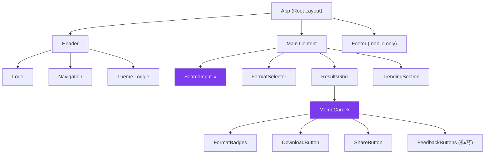

# MemeGPT — Frontend Components (Complete Specification)

> **Document Version:** 2.0 · **Last Updated:** 2026-08-02

---

## Purpose

Complete component specification for MemeGPT's frontend — wireframes, props, states, interactions, and implementation details for every component.

---

## Design Philosophy

- **Dark-first** — memes live on dark Discord/Reddit backgrounds; match that energy
- **Minimal chrome** — the meme is the hero; UI steps back
- **Instant feedback** — loading skeletons, not spinners; optimistic UI
- **Mobile-native feel** — even on desktop, interactions feel touch-friendly

---

## Component Hierarchy



---

## SearchInput Component ⭐ (Core)

### Wireframe

```
┌──────────────────────────────────────────────────┐
│  🤔 What's happening? Type anything...            │
│                                                  │
│  [paste your WhatsApp chat, describe a feeling,  │
│   quote a movie, explain a situation...]         │
│                                                  │
│                          [⌘+Enter to Search →]  │
└──────────────────────────────────────────────────┘
```

### States

| State | Visual | Behavior |
|---|---|---|
| **Empty** | Placeholder text with examples | Cursor blinking |
| **Typing** | Character count `11/2000` in bottom-right | Input enabled |
| **Loading** | Animated gradient border + "Finding your meme..." | Input disabled |
| **Error** | Red border + error message | Input enabled |
| **Success** | Border resets | Results appear below |

### Props

```typescript
interface SearchInputProps {
  onSearch: (query: string) => void;
  loading: boolean;
  maxLength?: number;  // Default: 2000
  placeholder?: string;
  initialValue?: string;
}
```

### Implementation

```typescript
// components/search/SearchInput.tsx
'use client'
import { useState, useCallback } from 'react'

export function SearchInput({ onSearch, loading, maxLength = 2000 }: SearchInputProps) {
  const [value, setValue] = useState('')
  
  const handleKeyDown = useCallback((e: React.KeyboardEvent) => {
    if ((e.ctrlKey || e.metaKey) && e.key === 'Enter' && value.trim()) {
      onSearch(value.trim())
    }
  }, [value, onSearch])

  return (
    <div className="search-input-wrapper">
      <textarea
        value={value}
        onChange={(e) => setValue(e.target.value.slice(0, maxLength))}
        onKeyDown={handleKeyDown}
        placeholder="What's happening? 🤔 Type anything..."
        disabled={loading}
        rows={3}
        aria-label="Meme search input"
      />
      <div className="search-input-footer">
        <span className="char-count">{value.length}/{maxLength}</span>
        <button
          onClick={() => value.trim() && onSearch(value.trim())}
          disabled={loading || !value.trim()}
        >
          {loading ? 'Finding your meme...' : '⌘+Enter to Search →'}
        </button>
      </div>
    </div>
  )
}
```

---

## MemeCard Component ⭐ (Core)

### Wireframe

```
┌──────────────────────────┐
│                          │
│   [MEME IMAGE / GIF]     │  ← lazy-loaded, progressive
│   (aspect-ratio: auto)   │
│                          │
├──────────────────────────┤
│ 🎯 94% match             │
│ "This Is Fine"           │
│ 😤 Frustration · 😮 Denial │
├──────────────────────────┤
│ [GIF] [PNG] [MP4]        │
│ [📋 Copy] [⬇ Download]  │
│ [👍] [👎]                │
└──────────────────────────┘
```

### States

| State | Visual |
|---|---|
| **Default** | Card with image, metadata, action buttons |
| **Hover** | Card lifts (`translateY(-4px)`), shadow deepens, download pulses |
| **Loading image** | Skeleton shimmer placeholder |
| **Downloading** | Button shows spinner → checkmark for 2s |
| **Copied** | Toast: "✓ Copied to clipboard!" |
| **Error** | Fallback placeholder image |

### Props

```typescript
interface MemeCardProps {
  meme: {
    id: string;
    name: string;
    slug: string;
    relevance_score: number;
    emotion_match: string[];
    preview_url: string;
    formats: {
      gif: string | null;
      image: string | null;
      video: string | null;
      webp: string | null;
    };
    share_url: string;
    meme_type: string;
    categories: string[];
  };
  formatPreference: 'gif' | 'image' | 'video' | 'any';
  onFeedback: (memeId: string, action: string) => void;
}
```

### Hover Interaction CSS

```css
.meme-card {
  background: var(--bg-surface);    /* #141414 */
  border: 1px solid var(--border-subtle);  /* #2A2A2A */
  border-radius: 12px;
  overflow: hidden;
  transition: transform 0.2s ease, box-shadow 0.2s ease;
}

.meme-card:hover {
  transform: translateY(-4px);
  box-shadow: 0 12px 40px rgba(124, 58, 237, 0.15);  /* Purple glow */
  border-color: var(--brand-purple);
}

.meme-card__image {
  aspect-ratio: auto;
  object-fit: contain;
  background: #0A0A0A;
}

.meme-card__score {
  color: var(--brand-amber);   /* #F59E0B */
  font-weight: 700;
}
```

---

## FormatSelector Component

### Wireframe

```
Prefer:  [GIF ✓] [Image] [Video]
```

### Behavior

- Sticks to top when scrolling (sticky)
- Selection persists in `localStorage`
- GIF selected by default
- Active format: filled purple
- Unavailable format: greyed out with tooltip

```typescript
interface FormatSelectorProps {
  value: 'gif' | 'image' | 'video';
  onChange: (format: 'gif' | 'image' | 'video') => void;
}
```

---

## Web App Layout

```
╔════════════════════════════════════════════════════╗
║ HEADER: MemeGPT logo | Search | Trending | Library ║
╠════════════════╦═══════════════════════════════════╣
║                ║                                   ║
║  SIDEBAR       ║  MAIN AREA                        ║
║  (hidden on    ║                                   ║
║   mobile)      ║  [Search Input — full width]      ║
║                ║                                   ║
║  Recent:       ║  [Format Selector: GIF PNG MP4]  ║
║  • "when bug   ║                                   ║
║    finally..." ║  ─── Results ───                  ║
║  • "monday     ║                                   ║
║    morning"    ║  [MemeCard] [MemeCard] [MemeCard]  ║
║                ║  [MemeCard] [MemeCard]            ║
║  Saved:        ║                                   ║
║  • My Favorites║  [More results ↓]                 ║
║  • Work Memes  ║                                   ║
║                ║                                   ║
╚════════════════╩═══════════════════════════════════╝
```

---

## Color System (CSS Custom Properties)

```css
:root {
  /* Brand */
  --brand-purple:       #7C3AED;   /* Primary — playful but premium */
  --brand-purple-light: #A78BFA;   /* Hover states */
  --brand-amber:        #F59E0B;   /* Accent — meme energy */
  --brand-amber-light:  #FCD34D;

  /* Backgrounds */
  --bg-base:            #0A0A0A;   /* Page background */
  --bg-surface:         #141414;   /* Card backgrounds */
  --bg-elevated:        #1E1E1E;   /* Modals, dropdowns */
  --bg-hover:           #252525;   /* Hover states */

  /* Text */
  --text-primary:       #F5F5F5;   /* Main text */
  --text-secondary:     #A3A3A3;   /* Subtitles, labels */
  --text-muted:         #525252;   /* Placeholder, disabled */

  /* Borders */
  --border-subtle:      #2A2A2A;   /* Card borders */
  --border-default:     #3F3F3F;   /* Input borders */
  --border-strong:      #525252;   /* Focus rings */

  /* Status */
  --success:            #22C55E;
  --error:              #EF4444;
  --warning:            #F59E0B;
}
```

---

## Typography System

```css
/* Fonts — loaded via next/font (zero CLS) */
--font-sans: 'Inter', system-ui;            /* Body text */
--font-display: 'Space Grotesk', sans;     /* Headings */
--font-mono: 'JetBrains Mono', monospace;  /* Code */

/* Scale */
--text-xs:   0.75rem;   /* 12px — badges, captions */
--text-sm:   0.875rem;  /* 14px — secondary text */
--text-base: 1rem;      /* 16px — body text */
--text-lg:   1.125rem;  /* 18px — card titles */
--text-xl:   1.25rem;   /* 20px */
--text-2xl:  1.5rem;    /* 24px — section headers */
--text-4xl:  2.25rem;   /* 36px — hero headline */
--text-6xl:  3.75rem;   /* 60px — mega headline */
```

---

## Mobile Screens (React Native)

### Screen 1: Home / Search

```
─────────────────────────
[MemeGPT logo]   [☰ Menu]
─────────────────────────
┌───────────────────────┐
│ What's happening? 🤔  │
│ ____________________  │
│             [Search]  │
└───────────────────────┘

[Suggestion chips]
[ 🤦 Monday vibe ] [ 😤 Frustration ] [ 🎉 Win ]

─ Recent Searches ─
• "my code worked first try"
• "boss called at midnight"
```

### Screen 2: Results

```
← Back   "my code worked..."   [⚙]

[Format: GIF ✓ | PNG | MP4]

┌───────────────────┐
│  [Meme Image/GIF] │
│  94% | This Is Fine│
│  😤 😮             │
│  [Copy] [Download] [Share]│
└───────────────────┘
```

### Screen 3: Trending

```
─ Trending Today ─────────
[ All ] [ Work ] [ Gaming ] [ ❤️ ] [ Tech ]

[Meme] [Meme] [Meme]
[Meme] [Meme] [Meme]

─ Trending Keywords ──────
#Monday  #ProgrammerHumor  #Exam
```

---

## Component Testing

```typescript
// SearchInput.test.tsx
import { render, screen, fireEvent } from '@testing-library/react'

test('renders placeholder text', () => {
  render(<SearchInput onSearch={vi.fn()} loading={false} />)
  expect(screen.getByPlaceholderText(/What's happening/i)).toBeInTheDocument()
})

test('calls onSearch when Ctrl+Enter pressed', () => {
  const onSearch = vi.fn()
  render(<SearchInput onSearch={onSearch} loading={false} />)
  fireEvent.change(screen.getByRole('textbox'), { target: { value: 'test query' } })
  fireEvent.keyDown(screen.getByRole('textbox'), { key: 'Enter', ctrlKey: true })
  expect(onSearch).toHaveBeenCalledWith('test query')
})

test('disables input when loading', () => {
  render(<SearchInput onSearch={vi.fn()} loading={true} />)
  expect(screen.getByRole('textbox')).toBeDisabled()
})
```

---

## Best Practices

1. **Lazy-load all meme images** — only load above-the-fold images eagerly
2. **Use skeleton loaders, not spinners** — feels faster and more polished
3. **Persist format preference in localStorage** — don't make users re-select
4. **Use `aspect-ratio: auto`** — prevents Cumulative Layout Shift
5. **Provide AI-generated alt text** — accessibility + SEO
6. **Debounce search input** — 300ms delay to avoid excessive API calls
7. **Use `React.memo` on MemeCard** — prevent unnecessary re-renders in grid

---

## Accessibility

| Feature | Implementation |
|---|---|
| Keyboard navigation | `Tab` through cards, `Enter` to download |
| Screen reader | ARIA labels on all interactive elements |
| Alt text | AI-generated for every meme image |
| Color contrast | >4.5:1 ratio on all text |
| Font size | Minimum 14px on mobile |
| Focus indicators | Visible purple focus ring on all elements |

---

> **Related Documents:**
> - [Styling_System.md](./Styling_System.md) — Design tokens
> - [State_Management.md](./State_Management.md) — Hooks and state
> - [API_Integration.md](./API_Integration.md) — Backend communication
> - [Performance.md](./Performance.md) — Core Web Vitals
> - [10_Testing/Frontend_Tests.md](../10_Testing/Frontend_Tests.md) — Component tests
