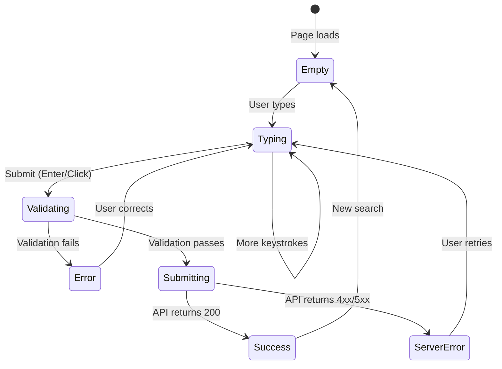

# MemeGPT — Forms

> **Document Version:** 2.0 · **Last Updated:** 2026-08-02

---

## Purpose

Complete guide to form handling in MemeGPT — the search input form, feedback forms, filter forms, and their validation, submission, and error handling patterns.

---

## Background

MemeGPT has a minimal form surface area compared to typical web apps — no user registration, no payment forms, no profile editing. The primary "form" is the **search input**, which is the core interaction. Additional forms handle format selection, feedback, and filters.

---

## Form Inventory

| Form | Location | Fields | Submission |
|---|---|---|---|
| **Search Input** | Homepage, App page | `query` (textarea), `format_preference` (radio) | `POST /api/v1/search` |
| **Format Selector** | Results area | `format` (radio group) | Client-side only (localStorage) |
| **Feedback Buttons** | MemeCard | `action` (button click) | `POST /api/v1/feedback` |
| **Download Picker** | Meme detail | `format` (select) | `GET /api/v1/memes/{slug}/download` |

---

## Search Form (Core)

```typescript
// components/search/SearchForm.tsx
'use client'
import { useState, useCallback, FormEvent } from 'react'

interface SearchFormProps {
  onSubmit: (query: string, format: string) => void;
  loading: boolean;
}

export function SearchForm({ onSubmit, loading }: SearchFormProps) {
  const [query, setQuery] = useState('')
  const [format, setFormat] = useState('gif')
  const [error, setError] = useState<string | null>(null)

  const handleSubmit = useCallback((e: FormEvent) => {
    e.preventDefault()
    
    // Client-side validation
    const trimmed = query.trim()
    if (!trimmed) {
      setError('Please enter something to search for')
      return
    }
    if (trimmed.length > 2000) {
      setError('Query must be under 2000 characters')
      return
    }
    
    setError(null)
    onSubmit(trimmed, format)
  }, [query, format, onSubmit])

  const handleKeyDown = useCallback((e: React.KeyboardEvent) => {
    if ((e.ctrlKey || e.metaKey) && e.key === 'Enter') {
      handleSubmit(e as any)
    }
  }, [handleSubmit])

  return (
    <form onSubmit={handleSubmit} className="search-form" role="search">
      <div className="search-form__input-group">
        <textarea
          value={query}
          onChange={(e) => setQuery(e.target.value)}
          onKeyDown={handleKeyDown}
          placeholder="What's happening? 🤔 Type anything..."
          disabled={loading}
          rows={3}
          maxLength={2000}
          aria-label="Meme search query"
          aria-invalid={!!error}
          aria-describedby={error ? 'search-error' : undefined}
        />
        <span className="char-count">{query.length}/2000</span>
      </div>
      
      {error && (
        <p id="search-error" className="form-error" role="alert">
          {error}
        </p>
      )}
      
      <div className="search-form__actions">
        <fieldset className="format-selector" aria-label="Format preference">
          {['gif', 'image', 'video'].map(f => (
            <label key={f} className={format === f ? 'active' : ''}>
              <input
                type="radio"
                name="format"
                value={f}
                checked={format === f}
                onChange={(e) => setFormat(e.target.value)}
              />
              {f.toUpperCase()}
            </label>
          ))}
        </fieldset>
        
        <button type="submit" disabled={loading || !query.trim()}>
          {loading ? 'Finding your meme...' : 'Search →'}
        </button>
      </div>
    </form>
  )
}
```

---

## Form States



| State | UI Behavior |
|---|---|
| **Empty** | Placeholder text visible, submit button disabled |
| **Typing** | Character count updates, submit button enabled |
| **Validating** | Client-side checks run synchronously |
| **Error** | Red border on input, error message shown, input stays enabled |
| **Submitting** | Input disabled, button shows spinner, loading skeleton below |
| **Success** | Input re-enabled, results render below |
| **ServerError** | Error toast appears, input re-enabled |

---

## Accessibility Requirements

| Feature | Implementation |
|---|---|
| Label every input | `aria-label` or `<label>` element |
| Error announcements | `role="alert"` on error messages |
| Invalid state | `aria-invalid="true"` on errored inputs |
| Error description | `aria-describedby` linking to error |
| Keyboard submit | `Ctrl+Enter` for search, `Enter` for single-line |
| Focus management | Focus returns to input after error |
| Disabled state | `disabled` attribute + visual style change |

---

## Best Practices

1. **Validate client-side first** — instant feedback without API roundtrip
2. **Show character count** — users see how much space they have
3. **Debounce API calls** — 300ms delay for typeahead/autocomplete
4. **Persist format preference** — save to `localStorage`, restore on page load
5. **Use `<form>` element** — enables native browser validation + Enter key
6. **Disable submit during loading** — prevent duplicate requests
7. **Use `aria-*` attributes** — screen reader users need form context

---

> **Related Documents:**
> - [Validation.md](./Validation.md) — Validation rules and patterns
> - [Components.md](./Components.md) — SearchInput component spec
> - [API_Integration.md](./API_Integration.md) — API call patterns
