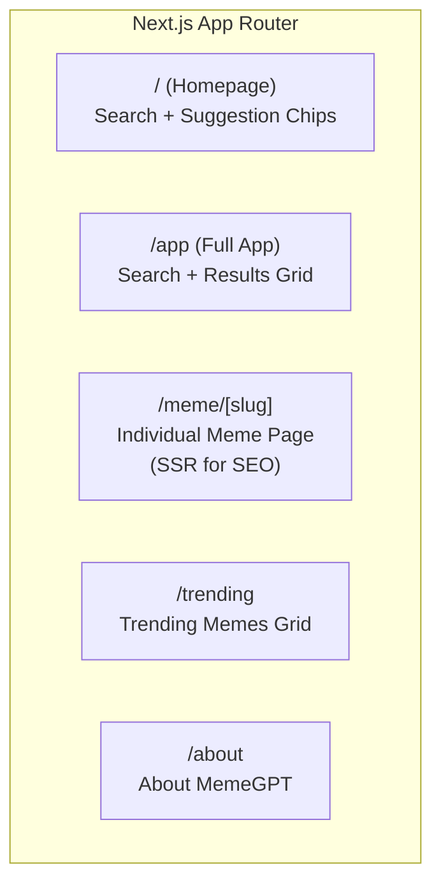

# MemeGPT — Frontend Overview

> **Document Version:** 2.0 · **Last Updated:** 2026-08-02

---

## Purpose

Complete overview of MemeGPT's frontend architecture — Next.js 14 web app + React Native mobile app, page structure, component hierarchy, and design system.

---

## Technology Stack

| Technology | Purpose | Why Chosen |
|---|---|---|
| **Next.js 14** | Web framework | SSR for SEO meme pages, App Router for modern patterns |
| **React 18** | UI library | Component-based, hooks ecosystem |
| **TypeScript** | Type safety | Catch errors at compile time |
| **React Native + Expo** | Mobile apps | Share logic with web, single codebase |
| **CSS Modules** | Styling | Scoped CSS, no runtime overhead |
| **React Query (TanStack)** | Data fetching | Caching, retries, optimistic updates |

---

## Web App Pages



| Route | Rendering | Purpose | SEO |
|---|---|---|---|
| `/` | SSR | Landing page with search | Meta tags, OG image |
| `/app` | CSR | Full search experience | `noindex` (app behavior) |
| `/meme/[slug]` | SSR | Individual meme detail | Critical (10K+ pages) |
| `/trending` | ISR (1 hour) | Trending memes grid | Indexed |
| `/about` | SSR | About page | Indexed |

---

## Component Hierarchy

```
App Layout
├── Header (logo, nav, theme toggle)
├── Page Content
│   ├── SearchInput (textarea + format selector)
│   ├── SuggestionChips (quick search tags)
│   ├── ResultsGrid
│   │   ├── MemeCard (×5)
│   │   │   ├── MemeImage (thumbnail + format badges)
│   │   │   ├── MemeInfo (name, score, emotions)
│   │   │   └── ActionButtons (copy, download, share, 👍/👎)
│   │   └── LoadingSkeleton (while searching)
│   └── EmptyState (before first search)
├── Toast (success/error notifications)
└── Footer (links, credits)
```

---

## Design System Summary

| Token | Value | Usage |
|---|---|---|
| `--brand-purple` | `#7C3AED` | Primary brand color |
| `--brand-purple-dark` | `#6D28D9` | Hover/active states |
| `--bg-dark` | `#0F0F23` | Page background |
| `--bg-surface` | `#1A1A2E` | Card backgrounds |
| `--text-primary` | `#F1F5F9` | Body text |
| `--text-secondary` | `#94A3B8` | Secondary text |
| `--border-subtle` | `#334155` | Card borders |
| `--success` | `#22C55E` | Success toasts |
| `--error` | `#EF4444` | Error messages |
| `--radius-lg` | `12px` | Card corners |
| `--radius-xl` | `16px` | Modal corners |

---

## Key Frontend Patterns

### 1. Data Fetching (React Query)

```typescript
const { data, isLoading, error } = useMutation({
  mutationFn: (query: string) =>
    fetch('/api/v1/search', {
      method: 'POST',
      headers: { 'Content-Type': 'application/json' },
      body: JSON.stringify({ query, format_preference: 'gif' }),
    }).then(res => res.json()),
})
```

### 2. Optimistic UI

```typescript
// Show loading skeleton immediately
// Fade in results when API responds
// Toast on copy/download actions
```

### 3. Responsive Breakpoints

| Breakpoint | Width | Layout | Columns |
|---|---|---|---|
| Mobile | <640px | Stack | 1 |
| Tablet | 640–1024px | Grid | 2 |
| Desktop | >1024px | Grid | 3 |

---

## Performance Targets

| Metric | Target | How |
|---|---|---|
| LCP (Largest Contentful Paint) | <2.5s | SSR + CDN thumbnails |
| FID (First Input Delay) | <100ms | Minimal JS bundle |
| CLS (Cumulative Layout Shift) | <0.1 | Fixed dimensions for images |
| JS Bundle Size | <100KB | Tree-shaking, dynamic imports |
| First Load | <1.5s | Vercel Edge CDN |

---

## Best Practices

1. **Use `Image` component from Next.js** — automatic WebP, lazy loading, sizing
2. **Server-render meme pages** — critical for SEO (10K+ meme detail pages)
3. **Client-render search results** — dynamic, no SEO value
4. **Use CSS Modules** — no runtime CSS-in-JS overhead
5. **Lazy-load MemeCard images** — only load visible cards
6. **Dark mode by default** — meme culture prefers dark themes

---

> **Related Documents:**
> - [Components.md](./Components.md) — Full component specs
> - [UI_Architecture.md](./UI_Architecture.md) — Layout wireframes
> - [Styling_System.md](./Styling_System.md) — Design tokens
> - [State_Management.md](./State_Management.md) — Hooks + state
