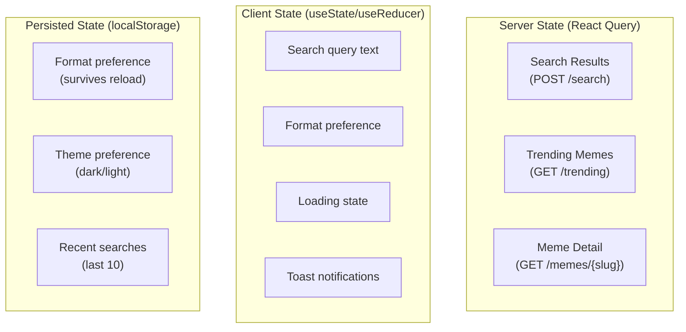

# MemeGPT — State Management

> **Document Version:** 2.0 · **Last Updated:** 2026-08-02

---

## Purpose

Complete state management architecture — what state lives where, React hooks, React Query integration, and localStorage persistence.

---

## State Architecture

MemeGPT uses a **hooks-first** approach — no Redux, no Zustand. All state is managed through React hooks, React Query, and browser APIs.



---

## State Categories

| State | Type | Managed By | Persistence |
|---|---|---|---|
| Search results | Server | React Query | Cache (5 min) |
| Trending memes | Server | React Query | Cache (1 hour) |
| Meme detail | Server | React Query | Cache (1 hour) |
| Search query text | Client | `useState` | None |
| Format preference | Client | `useState` + localStorage | localStorage |
| Loading/error | Client | React Query | None |
| Toast queue | Client | `useState` | None |
| Theme (dark/light) | Client | `useState` + localStorage | localStorage |
| Recent searches | Client | localStorage | localStorage |
| Session ID | Client | `useState` | sessionStorage |

---

## Custom Hooks

### `useSearch` — Core search hook

```typescript
import { useMutation } from '@tanstack/react-query'

interface SearchResult {
  results: MemeResult[];
  intent_parsed: Intent;
  query_id: string;
  response_time_ms: number;
  cached: boolean;
}

export function useSearch() {
  return useMutation<SearchResult, Error, { query: string; format: string }>({
    mutationFn: async ({ query, format }) => {
      const res = await fetch('/api/v1/search', {
        method: 'POST',
        headers: { 'Content-Type': 'application/json' },
        body: JSON.stringify({
          query,
          format_preference: format,
          limit: 5,
        }),
      })
      if (!res.ok) throw new Error(`Search failed: ${res.status}`)
      return res.json()
    },
  })
}
```

### `useTrending` — Trending memes hook

```typescript
import { useQuery } from '@tanstack/react-query'

export function useTrending(category: string = 'all') {
  return useQuery({
    queryKey: ['trending', category],
    queryFn: async () => {
      const res = await fetch(`/api/v1/trending?category=${category}&limit=20`)
      return res.json()
    },
    staleTime: 5 * 60 * 1000,  // 5 minutes
    refetchOnWindowFocus: false,
  })
}
```

### `useFormatPreference` — Persisted format selection

```typescript
export function useFormatPreference() {
  const [format, setFormatState] = useState(() => {
    if (typeof window !== 'undefined') {
      return localStorage.getItem('format_preference') || 'gif'
    }
    return 'gif'
  })

  const setFormat = (newFormat: string) => {
    setFormatState(newFormat)
    localStorage.setItem('format_preference', newFormat)
  }

  return [format, setFormat] as const
}
```

### `useToast` — Toast notification system

```typescript
export function useToast() {
  const [toasts, setToasts] = useState<Toast[]>([])

  const show = (message: string, type: 'success' | 'error' = 'success') => {
    const id = Date.now()
    setToasts(prev => [...prev, { id, message, type }])
    setTimeout(() => {
      setToasts(prev => prev.filter(t => t.id !== id))
    }, 3000)  // Auto-dismiss after 3s
  }

  return { toasts, show }
}
```

---

## Why No Redux/Zustand?

| Concern | Solution | Why Not Redux |
|---|---|---|
| Server state caching | React Query | Built-in cache, retries, deduplication |
| Form state | `useState` | Single component, no sharing needed |
| Preferences | localStorage | Survives page reload, no reactivity needed |
| Global notifications | Context + `useState` | Lightweight, <10 lines |

> MemeGPT has **no complex client-side state**. There's no shopping cart, no multi-step wizard, no real-time collaboration. The complexity lives server-side in the ML pipeline. A state management library would be over-engineering.

---

## Best Practices

1. **Server state → React Query** — handles caching, loading, error states automatically
2. **Form state → `useState`** — no need to over-architect a single search input
3. **Persistent preferences → localStorage** — simple, reliable, synchronous
4. **Don't prop-drill more than 2 levels** — use Context or restructure components
5. **Avoid premature optimization** — add Zustand only if you actually need global state

---

> **Related Documents:**
> - [Components.md](./Components.md) — Component specifications
> - [API_Integration.md](./API_Integration.md) — Fetch patterns
> - [Frontend_Overview.md](./Frontend_Overview.md) — Architecture overview
