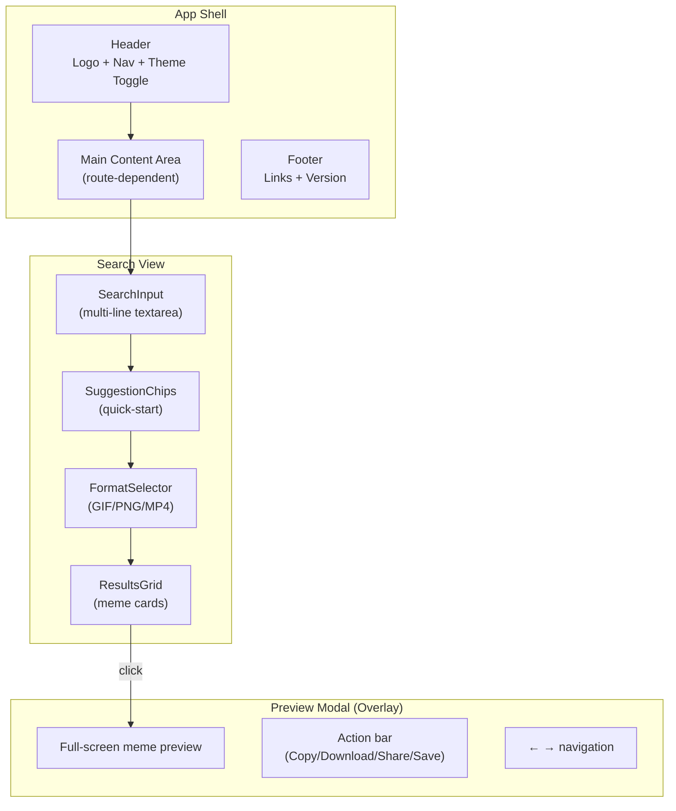

# MemeGPT — UI Architecture

> **Document Version:** 1.0 · **Last Updated:** 2026-08-02

---

## Purpose

Documentation of the frontend UI architecture including layout system, navigation, responsive design, and accessibility.

---

## Layout Architecture



---

## Navigation Architecture

| Navigation | Web | Mobile |
|---|---|---|
| Primary nav | Top header tabs | Bottom tab bar |
| Tabs | Search · Trending · Library | Search · Trending · Library · Settings |
| Modal navigation | Escape to close | Swipe down to close |
| Result navigation | Click card → modal | Tap card → modal, swipe left/right |

---

## Responsive Breakpoints

```css
/* Mobile first approach */
.results-grid {
  display: grid;
  gap: 16px;
  grid-template-columns: 1fr;           /* Mobile: 1 column */
}

@media (min-width: 640px) {
  .results-grid {
    grid-template-columns: repeat(2, 1fr); /* Tablet: 2 columns */
    gap: 20px;
  }
}

@media (min-width: 1024px) {
  .results-grid {
    grid-template-columns: repeat(3, 1fr); /* Desktop: 3 columns */
    gap: 24px;
  }
}

@media (min-width: 1280px) {
  .results-grid {
    grid-template-columns: repeat(4, 1fr); /* Large: 4 columns */
  }
}
```

---

## Accessibility (a11y)

| Feature | Implementation |
|---|---|
| Keyboard navigation | All interactive elements focusable via Tab |
| Screen reader | ARIA labels on buttons, `alt` text on all images |
| Color contrast | 4.5:1 minimum ratio (WCAG AA) |
| Focus indicators | Visible focus ring (purple outline) |
| Motion reduction | `prefers-reduced-motion` disables animations |
| Font size | Minimum 14px on mobile, 16px on desktop |

---

> **Related Documents:**
> - [Frontend_Overview.md](./Frontend_Overview.md) · [Components.md](./Components.md) · [Styling_System.md](./Styling_System.md)
