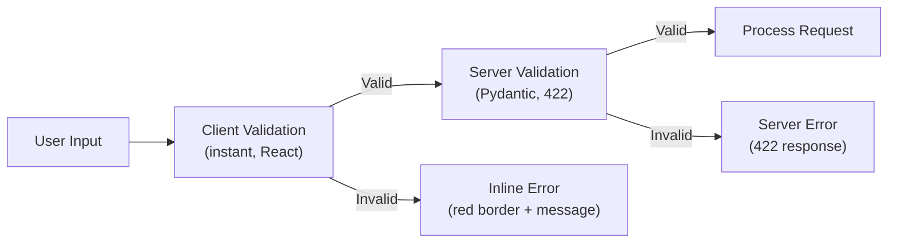

# MemeGPT — Frontend Validation

> **Document Version:** 2.0 · **Last Updated:** 2026-08-02

---

## Purpose

Complete validation strategy for MemeGPT's frontend — client-side validation rules, error display patterns, and integration with server-side Pydantic validation.

---

## Validation Layers



**Two-layer validation:** Client-side catches obvious mistakes instantly (empty input, too long). Server-side catches everything else (malformed JSON, invalid enums).

---

## Validation Rules

### Search Query

| Rule | Client-Side | Server-Side (Pydantic) | Error Message |
|---|---|---|---|
| Required | ✅ `if (!query.trim())` | ✅ `min_length=1` | "Please enter something to search for" |
| Max length | ✅ `maxLength={2000}` | ✅ `max_length=2000` | "Query must be under 2000 characters" |
| Min length | ✅ `if (query.trim().length < 1)` | ✅ `min_length=1` | "Query is too short" |
| No script tags | ❌ (server handles) | ✅ HTML stripped | "Invalid characters detected" |

### Format Preference

| Rule | Client-Side | Server-Side | Error Message |
|---|---|---|---|
| Valid enum | ✅ Radio buttons (forced) | ✅ `pattern="^(gif\|image\|video\|any)$"` | "Invalid format" |

### Limit

| Rule | Client-Side | Server-Side | Error Message |
|---|---|---|---|
| Min value | ❌ (hidden field) | ✅ `ge=1` | "Limit must be at least 1" |
| Max value | ❌ (hidden field) | ✅ `le=20` | "Limit must be at most 20" |

---

## Validation Hook

```typescript
// lib/hooks/useValidation.ts
import { useState, useCallback } from 'react'

interface ValidationError {
  field: string;
  message: string;
}

export function useSearchValidation() {
  const [errors, setErrors] = useState<ValidationError[]>([])

  const validate = useCallback((query: string): boolean => {
    const newErrors: ValidationError[] = []
    
    if (!query.trim()) {
      newErrors.push({ field: 'query', message: 'Please enter something to search for' })
    }
    if (query.length > 2000) {
      newErrors.push({ field: 'query', message: 'Query must be under 2000 characters' })
    }
    
    setErrors(newErrors)
    return newErrors.length === 0
  }, [])

  const clearErrors = useCallback(() => setErrors([]), [])
  
  const getFieldError = useCallback((field: string) => {
    return errors.find(e => e.field === field)?.message
  }, [errors])

  return { errors, validate, clearErrors, getFieldError }
}
```

---

## Server Error Handling (422 Responses)

```typescript
// lib/api.ts
async function handleSearchResponse(response: Response) {
  if (response.status === 422) {
    const data = await response.json()
    // Transform Pydantic errors to display format
    const errors = data.details.map((d: any) => ({
      field: d.field,
      message: d.message,
    }))
    throw new ValidationError(errors)
  }
  if (!response.ok) {
    throw new ApiError(response.status, await response.json())
  }
  return response.json()
}
```

---

## Error Display Patterns

```css
/* Inline error styling */
.form-error {
  color: var(--error);           /* #EF4444 */
  font-size: var(--text-sm);     /* 14px */
  margin-top: 4px;
  animation: slideDown 0.2s ease;
}

textarea[aria-invalid="true"] {
  border-color: var(--error);
  box-shadow: 0 0 0 2px rgba(239, 68, 68, 0.2);
}

@keyframes slideDown {
  from { opacity: 0; transform: translateY(-4px); }
  to { opacity: 1; transform: translateY(0); }
}
```

---

## Best Practices

1. **Validate on submit, not on every keystroke** — avoids annoying early errors
2. **Show errors inline** — next to the field, not in a separate area
3. **Clear errors when user starts typing** — don't leave stale errors
4. **Match client and server rules** — same limits (2000 chars) on both sides
5. **Use `aria-invalid` + `aria-describedby`** — accessibility for screen readers
6. **Animate error appearance** — smooth slide-down, not jarring pop-in

---

> **Related Documents:**
> - [Forms.md](./Forms.md) — Form implementation
> - [Components.md](./Components.md) — SearchInput component
> - [07_APIs/Search_API.md](../07_APIs/Search_API.md) — Server validation
