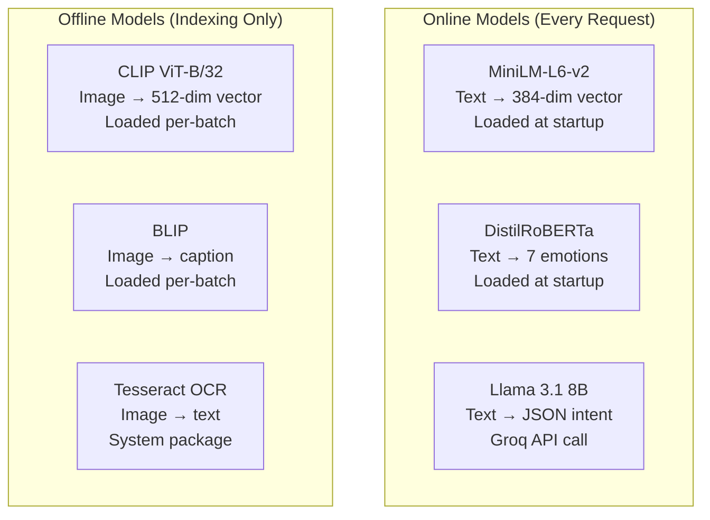

# MemeGPT — AI Overview

> **Document Version:** 2.0 · **Last Updated:** 2026-08-02

---

## Purpose

Complete overview of MemeGPT's AI system — model catalog, architecture decisions, inference strategy, and the role of each model in the pipeline.

---

## AI Model Catalog

| Model | Task | Source | Size | Inference | Latency |
|---|---|---|---|---|---|
| **MiniLM-L6-v2** | Text embedding | sentence-transformers | 80 MB | Local (in-process) | ~50ms |
| **DistilRoBERTa** | Emotion detection | HuggingFace | 250 MB | Local (in-process) | ~100ms |
| **Llama 3.1 8B** | Intent parsing | Groq Cloud | Remote | API call | ~300ms |
| **CLIP ViT-B/32** | Image embedding | OpenAI (open) | 350 MB | Local (offline only) | ~200ms |
| **BLIP** | Image captioning | Salesforce | 900 MB | Local (offline only) | ~500ms |
| **Tesseract** | OCR (text from image) | Google (open) | ~30 MB | Local (offline only) | ~100ms |

---

## Model Architecture



### Online vs Offline Strategy

| Aspect | Online (per request) | Offline (indexing) |
|---|---|---|
| **When** | Every search query | Weekly batch job |
| **Speed** | <1.5s total | ~90 min for 10K memes |
| **RAM needed** | ~500 MB | ~2 GB |
| **Models loaded** | MiniLM + Emotion | All 6 models |
| **Runs on** | Production server | Local machine |

---

## Why These Models?

| Model | Alternative Considered | Why MemeGPT's Choice Wins |
|---|---|---|
| MiniLM-L6-v2 | all-mpnet-base-v2 | 5× faster, 80MB vs 420MB, similar quality |
| DistilRoBERTa | Local LLM emotion | Runs in 100ms, no API call needed |
| Groq (Llama 3.1) | OpenAI GPT-4 | Free tier: 6K req/day, <500ms latency |
| CLIP ViT-B/32 | CLIP ViT-L/14 | 350MB vs 1.7GB, sufficient for meme matching |
| BLIP | GPT-4 Vision | Free (open source), runs locally |
| Tesseract | GPT-4 OCR | Free, fast, accurate for meme text |

---

## RAM Budget

```
Production Server (512 MB free tier):
  Python runtime       ~50 MB
  FastAPI + Uvicorn    ~30 MB
  MiniLM-L6-v2        ~80 MB
  DistilRoBERTa        ~250 MB
  Clients (Redis/QD)   ~10 MB
  Request overhead     ~80 MB
  ─────────────────────────────
  Total:               ~500 MB ✅ (fits 512 MB)

Local Machine (Indexing):
  + CLIP ViT-B/32     ~350 MB
  + BLIP              ~900 MB
  + Tesseract          ~30 MB
  ─────────────────────────────
  Total:              ~1,780 MB (needs 2 GB+ RAM)
```

---

## Inference Optimization

| Optimization | Effect | Implementation |
|---|---|---|
| Load models once at startup | Avoid per-request loading | `lifespan` hook in FastAPI |
| Normalize embeddings | Faster cosine similarity | `normalize_embeddings=True` |
| Batch process offline | Maximize throughput | 100 memes per batch |
| Use `float16` for CLIP | 2× less RAM | `model.half()` |
| Skip LLM on fallback | Reduce latency when Groq slow | Use raw query embedding |

---

## Best Practices

1. **Never load ML models per-request** — always at startup via `lifespan`
2. **Local models for speed** — embedding + emotion run in <150ms combined
3. **Remote models for intelligence** — Groq LLM handles complex intent parsing
4. **Separate online/offline** — heavy models (BLIP, CLIP) only run during indexing
5. **Normalize all vectors** — required for cosine similarity to work correctly
6. **Monitor model RAM** — a single extra model can OOM the 512MB free tier

---

> **Related Documents:**
> - [AI_Pipeline.md](./AI_Pipeline.md) — Full pipeline implementation
> - [Embeddings.md](./Embeddings.md) — Embedding model details
> - [LLM_Workflow.md](./LLM_Workflow.md) — Groq integration
> - [Image_Analysis.md](./Image_Analysis.md) — OCR + BLIP + CLIP
