# MemeGPT — AI Pipeline (Complete Implementation)

> **Document Version:** 2.0 · **Last Updated:** 2026-08-02

---

## Purpose

Complete documentation of MemeGPT's dual AI pipeline — the **Offline Pipeline** (data ingestion, embedding, indexing) and the **Online Pipeline** (real-time recommendation per user request). This document includes full implementation code from the source engineering specs.

---

## Background

MemeGPT's AI system is split into two distinct pipelines to optimize for both quality and latency:

| Pipeline | When It Runs | Models Used | Target Latency |
|---|---|---|---|
| **Offline** | Once + weekly cron | All 6 models (~4GB RAM) | ~30 minutes |
| **Online** | Per user request | 2 local + 1 cloud (~700MB RAM) | <1.5 seconds |

---

## Pipeline Architecture

```
┌─────────────────────────────────────────────────────────────────────┐
│                   OFFLINE PIPELINE (Run Once / Weekly)               │
│                                                                     │
│  DATA SOURCES                                                       │
│  Imgflip API + Reddit Dataset + Tenor API + Manual curation         │
│           │                                                         │
│           ▼                                                         │
│  DOWNLOAD & STORE                                                   │
│  Download images/GIFs → Cloudflare R2                               │
│           │                                                         │
│           ▼                                                         │
│  PREPROCESSING                                                      │
│  OCR (text extraction) + BLIP (caption) + LLM (tag generation)     │
│           │                                                         │
│           ▼                                                         │
│  EMBEDDING GENERATION                                               │
│  MiniLM (text → 384-dim) + CLIP (image → 512-dim) = 896-dim       │
│           │                                                         │
│           ▼                                                         │
│  VECTOR INDEXING                                                    │
│  Upsert all vectors + metadata into Qdrant                          │
└─────────────────────────────────────────────────────────────────────┘
                              │
                              ▼
┌─────────────────────────────────────────────────────────────────────┐
│                   ONLINE PIPELINE (Per User Request)                │
│                                                                     │
│  USER INPUT → Cache Check (Redis) → if hit, return cached          │
│           │                                                         │
│  STEP A: INTENT PARSING (Groq API — ~300ms)                        │
│  → {emotion, situation, tone, keywords, meme_format, intensity}    │
│           │                                                         │
│  STEP B: EMOTION DETECTION (DistilRoBERTa — local, ~100ms)         │
│  → primary: "joy", secondary: "surprise", confidence: 0.87         │
│           │                                                         │
│  STEP C: QUERY BUILDING                                             │
│  Combine intent + emotion + original text into rich query           │
│           │                                                         │
│  STEP D: QUERY EMBEDDING (MiniLM — local, ~50ms)                   │
│  → 384-dim L2-normalized vector                                     │
│           │                                                         │
│  STEP E: VECTOR SEARCH (Qdrant — ~50ms)                            │
│  → Top 10 candidates by cosine similarity + payload filters        │
│           │                                                         │
│  STEP F: RE-RANKING (Python — ~10ms)                                │
│  → Apply popularity boost, emotion match, format preference         │
│           │                                                         │
│  RESPONSE (< 1.5s total) → Cache result → Return top 5             │
└─────────────────────────────────────────────────────────────────────┘
```

---

## Offline Pipeline Scripts

### Step 1: Data Collection (`scripts/download_datasets.py`)

```python
"""
Download all meme data from free sources.
Sources: Imgflip API (100 templates), Reddit dataset (6500+), Tenor GIFs
"""
import os, json, requests
from pathlib import Path
from datasets import load_dataset

OUTPUT_DIR = Path("data/raw")
OUTPUT_DIR.mkdir(parents=True, exist_ok=True)

def download_imgflip():
    """Free API — no key needed. Returns top 100 popular meme templates."""
    url = "https://api.imgflip.com/get_memes"
    response = requests.get(url)
    memes = response.json()["data"]["memes"]
    results = []
    for meme in memes:
        img_response = requests.get(meme["url"])
        img_path = OUTPUT_DIR / f"images/{meme['id']}.jpg"
        img_path.parent.mkdir(exist_ok=True)
        img_path.write_bytes(img_response.content)
        results.append({
            "id": f"imgflip_{meme['id']}",
            "name": meme["name"],
            "source": "imgflip",
            "image_path": str(img_path),
            "image_url": meme["url"],
        })
    print(f"✓ Downloaded {len(results)} Imgflip templates")
    return results

def download_reddit_dataset():
    """6500+ memes with Reddit metadata."""
    dataset = load_dataset("headsmanjaeger/reddit-meme-dataset", split="train")
    results = []
    for item in dataset:
        results.append({
            "id": f"reddit_{item['id']}",
            "name": item.get("title", ""),
            "source": "reddit",
            "image_url": item.get("url", ""),
            "score": item.get("score", 0),
        })
    print(f"✓ Loaded {len(results)} Reddit memes")
    return results
```

### Step 2: Preprocessing (`scripts/preprocess_memes.py`)

```python
"""
For each meme:
1. Extract text (OCR via Tesseract)
2. Generate caption (BLIP)
3. Generate semantic tags (Groq LLM)
4. Build rich text description for embedding
"""
def build_meme_text_description(meme: dict, tags: dict) -> str:
    """
    Build comprehensive text for MiniLM embedding.
    The richer this text, the better the search quality.
    """
    parts = [
        f"Meme: {meme['name']}",
        f"Description: {meme.get('caption', '')}",
        f"Text on image: {meme.get('ocr_text', '')}",
        f"Emotions: {', '.join(tags.get('emotions', []))}",
        f"Situations: {', '.join(tags.get('situations', []))}",
        f"Keywords: {', '.join(tags.get('keywords', []))}",
        f"Best used for: {', '.join(tags.get('best_for', []))}",
        f"Meme type: {tags.get('meme_type', '')}",
    ]
    return "\n".join(p for p in parts if p.split(": ")[1].strip())
```

### Step 3: Embedding Generation (`scripts/generate_embeddings.py`)

```python
"""Generate text (384-dim) + image (512-dim) + combined (896-dim) embeddings."""
from sentence_transformers import SentenceTransformer
from transformers import CLIPModel, CLIPProcessor
import numpy as np

text_model = SentenceTransformer('all-MiniLM-L6-v2')      # 80MB
clip_model = CLIPModel.from_pretrained("openai/clip-vit-base-patch32")  # 400MB
clip_processor = CLIPProcessor.from_pretrained("openai/clip-vit-base-patch32")

def get_combined_embedding(
    text_emb: list[float],
    image_emb: list[float],
    text_weight: float = 0.65,    # Text gets higher weight
    image_weight: float = 0.35    # Image is supplementary
) -> list[float]:
    """
    Weighted combination: text contributes 65%, image 35%.
    Text gets higher weight because meme search is primarily semantic.
    Combined dimension: 384 + 512 = 896.
    """
    text_arr = np.array(text_emb) * text_weight
    image_arr = np.array(image_emb) * image_weight
    combined = np.concatenate([text_arr, image_arr])
    norm = np.linalg.norm(combined)
    if norm > 0:
        combined = combined / norm  # L2 normalize
    return combined.tolist()
```

### Step 4: Vector Indexing (`scripts/index_qdrant.py`)

```python
"""Create Qdrant collection with 3 named vector spaces."""
from qdrant_client import QdrantClient
from qdrant_client.models import Distance, VectorParams, HnswConfigDiff

def create_collection(client):
    client.recreate_collection(
        collection_name="memes",
        vectors_config={
            "text": VectorParams(
                size=384, distance=Distance.COSINE,
                hnsw_config=HnswConfigDiff(m=16, ef_construct=100)
            ),
            "image": VectorParams(
                size=512, distance=Distance.COSINE,
            ),
            "combined": VectorParams(
                size=896, distance=Distance.COSINE,
                hnsw_config=HnswConfigDiff(m=32, ef_construct=200)
            ),
        }
    )
```

---

## Online Pipeline Implementation

### Core Recommendation Engine (`app/services/recommendation.py`)

```python
"""
Full recommendation pipeline. Target latency: <1.5 seconds total.
"""
async def recommend_memes(
    user_text: str,
    format_pref: str = "gif",
    nsfw: bool = False
) -> list[dict]:
    # Cache check (hash the query for cache key)
    cache_key = f"search:{md5(f'{user_text}:{format_pref}:{nsfw}')}"
    cached = cache.get(cache_key)
    if cached:
        return json.loads(cached)
    
    # A: Parse intent (LLM) ─────────── ~300ms
    intent = await parse_intent(user_text)
    
    # B: Detect emotion (local) ─────── ~100ms
    emotion = detect_emotion(user_text)
    
    # C: Build rich query text
    query_text = build_query_text(user_text, intent, emotion)
    
    # D: Generate query embedding ───── ~50ms
    query_vector = text_model.encode(
        query_text, normalize_embeddings=True
    ).tolist()
    
    # E: Vector search ──────────────── ~50ms
    results = vector_search(
        query_vector, emotion["primary"], format_pref, nsfw
    )
    
    # F: Re-rank ────────────────────── ~10ms
    final = rerank(results, intent, emotion, format_pref)
    
    # Cache for 1 hour
    cache.setex(cache_key, 3600, json.dumps(final))
    return final
```

---

## Latency Budget

```mermaid
gantt
    title Online Pipeline Latency Budget (~560ms total)
    dateFormat X
    axisFormat %L ms

    section Step A
    Intent Parsing (Groq)    :a, 0, 300

    section Step B
    Emotion Detection        :b, 0, 100

    section Step C
    Query Building           :c, 300, 310

    section Step D
    Query Embedding          :d, 310, 360

    section Step E
    Vector Search            :e, 360, 410

    section Step F
    Re-ranking               :f, 410, 420

    section Response
    Serialization + Send     :g, 420, 430
```



> **Note:** Steps A and B run in parallel (both are async). Total wall-clock: ~430ms (not 560ms if parallelized).

---

## Scaling the Dataset

| Phase | Meme Count | Search Quality | Resources | Time |
|---|---|---|---|---|
| MVP (Week 1) | 1,000 | Basic — top memes only | Local machine | 30 min |
| Phase 1 | 5,000 | Good — 80% of use cases | Local machine | 2 hours |
| Phase 2 | 25,000 | Very good — niche topics | Local machine | 8 hours |
| Phase 3 | 100,000 | Excellent | Free tier GPU (Colab) | 24 hours |
| Scale | 500,000+ | Comprehensive | Paid GPU | 48+ hours |

### Quick Start: 1,000 Memes in 30 Minutes

```bash
python scripts/download_datasets.py --source imgflip     # 5 min
python scripts/preprocess_memes.py --batch-size 10        # 15 min (Groq free tier)
python scripts/generate_embeddings.py                      # 5 min (CPU)
python scripts/index_qdrant.py                             # 2 min
python scripts/verify_index.py                             # 1 min
# → "when code works" → returns "Success Kid" or "This Is Fine" ✓
```

---

## Feedback Loop & Continuous Improvement

### Signal Collection

```python
SIGNAL_WEIGHTS = {
    "view":      0.1,   # Saw the result
    "click":     0.5,   # Clicked to expand
    "copy":      1.0,   # Copied the image
    "download":  2.0,   # Downloaded the meme
    "share":     3.0,   # Shared via link
    "thumbs_up": 2.0,   # Explicit positive
    "thumbs_down": -1.0, # Explicit negative
    "skip":      -0.3,  # Scrolled past without interaction
}
```

### Weekly Retraining Cycle (GitHub Actions Cron)

```
1. Pull last week's feedback from PostgreSQL
2. Calculate new popularity_scores for each meme
3. Update Qdrant payload (fast, no re-indexing needed)
4. Generate "hard negative" pairs: {query, rejected_meme}
5. Generate "positive" pairs: {query, downloaded_meme}
6. (Phase 2) Fine-tune MiniLM on these pairs using contrastive loss
7. Run evaluation on held-out test set
8. Deploy new model if metrics improve
```

---

## Best Practices

1. **Always L2-normalize embeddings** — cosine similarity requires it
2. **Concatenate meme metadata into rich text** — richer text = better embeddings
3. **Run indexing models on your local machine** — don't waste server RAM
4. **Cache aggressively** — 1-hour TTL on search results covers 60%+ of queries
5. **Use named vectors** — search by text, image, or combined independently
6. **Set `score_threshold=0.45`** — below this is noise, not relevant results
7. **Weight text 65%, image 35%** — meme search is primarily semantic

---

## Common Mistakes

| Mistake | Consequence | Fix |
|---|---|---|
| Not normalizing vectors | Wrong cosine similarity scores | Always L2-normalize |
| Embedding raw query only | Poor search quality | Build rich query from LLM + emotion |
| Loading all 6 models in production | OOM on free tier (512MB) | Only load MiniLM + Emotion (700MB) |
| No score threshold | Returns irrelevant noise | `score_threshold=0.45` |
| Skipping BLIP captioning | 30% worse search for visual memes | Always generate captions |
| Not caching results | 5× higher latency under load | Redis with 1-hour TTL |

---

> **Related Documents:**
> - [Embeddings.md](./Embeddings.md) — Model details · [RAG.md](./RAG.md) — Retrieval architecture
> - [Image_Analysis.md](./Image_Analysis.md) — OCR, BLIP, CLIP · [Vector_Database.md](./Vector_Database.md) — Qdrant config
> - [03_Backend/Services.md](../03_Backend/Services.md) — Service layer
