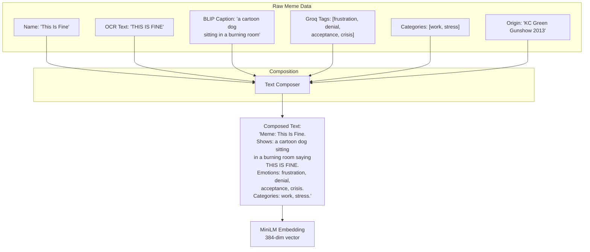

# MemeGPT — Chunking Strategy

> **Document Version:** 2.0 · **Last Updated:** 2026-08-02

---

## Purpose

Complete documentation of how MemeGPT chunks and prepares text data for embedding — meme metadata aggregation, text composition, and embedding-ready text generation.

---

## Background

Unlike traditional RAG systems that chunk long documents (PDFs, articles), MemeGPT's "chunking" is about **composing multiple metadata fields into a single rich text** for embedding. Each meme has 5–8 metadata fields that must be combined intelligently to produce the best possible search embedding.

---

## MemeGPT vs Traditional RAG Chunking

| Aspect | Traditional RAG | MemeGPT |
|---|---|---|
| **Input** | Long documents (5K–100K tokens) | Short metadata fields (50–200 tokens total) |
| **Problem** | Text too long for embedding model | Text too short/sparse for good embeddings |
| **Strategy** | Split into overlapping chunks | Combine multiple fields into rich text |
| **Chunk size** | 500–1000 tokens per chunk | ~100–200 tokens per meme |
| **Overlap** | 50–100 tokens | N/A (no overlap needed) |

---

## Text Composition Pipeline



---

## Text Composition Function

```python
def compose_meme_text(meme: dict) -> str:
    """
    Combine all meme metadata fields into a single rich text
    optimized for MiniLM embedding.
    
    Order matters! Most important info first — embedding models
    pay more attention to early tokens.
    """
    parts = []
    
    # 1. Name (most important — users search by meme name)
    if meme.get("name"):
        parts.append(f"Meme: {meme['name']}.")
    
    # 2. Description/caption (visual content)
    if meme.get("blip_caption"):
        parts.append(f"Shows: {meme['blip_caption']}.")
    
    # 3. OCR text (text visible in the meme image)
    if meme.get("ocr_text") and len(meme["ocr_text"].strip()) > 3:
        parts.append(f"Text in image: {meme['ocr_text']}.")
    
    # 4. Emotional tags (critical for emotion-based search)
    if meme.get("emotions"):
        parts.append(f"Emotions: {', '.join(meme['emotions'])}.")
    
    # 5. Situations (contextual usage)
    if meme.get("situations"):
        parts.append(f"Used when: {', '.join(meme['situations'][:5])}.")
    
    # 6. Categories
    if meme.get("categories"):
        parts.append(f"Categories: {', '.join(meme['categories'])}.")
    
    # 7. Keywords (LLM-generated search terms)
    if meme.get("keywords"):
        parts.append(f"Keywords: {', '.join(meme['keywords'][:10])}.")
    
    composed = " ".join(parts)
    
    # Truncate to 512 tokens (MiniLM limit)
    # Approximate: 1 token ≈ 4 characters
    return composed[:2048]

# Example output:
# "Meme: This Is Fine. Shows: a cartoon dog sitting in a burning room.
#  Text in image: THIS IS FINE. Emotions: frustration, denial, acceptance.
#  Used when: ignoring problems, pretending everything is ok, crisis at work.
#  Categories: work, stress, relatable. Keywords: fine, fire, calm, denial."
```

---

## Query Text Composition

For search queries, MemeGPT also composes a rich text from the user input + AI analysis:

```python
def compose_query_text(
    user_text: str,
    intent: dict,
    emotion: dict
) -> str:
    """Compose rich query text for embedding."""
    return f"""
User said: {user_text}
Situation: {intent.get('situation', '')}
Emotion: {emotion['primary']}, {emotion.get('secondary', '')}
Tone: {intent.get('tone', '')}
Keywords: {', '.join(intent.get('keywords', []))}
Meme type needed: {intent.get('meme_format', 'reaction')}
""".strip()
```

---

## Token Budget

| Field | Avg Tokens | Max Tokens | Priority |
|---|---|---|---|
| Name | 5 | 20 | 🔴 Critical |
| BLIP caption | 15 | 50 | 🔴 Critical |
| OCR text | 10 | 30 | 🟡 Important |
| Emotions | 8 | 20 | 🔴 Critical |
| Situations | 15 | 40 | 🟡 Important |
| Categories | 5 | 15 | 🟢 Nice to have |
| Keywords | 10 | 30 | 🟢 Nice to have |
| **Total** | **~68** | **~205** | Well under 512 limit |

---

## Best Practices

1. **Most important fields first** — embedding models weight early tokens more
2. **Use natural language** — "Shows: a dog sitting" beats "dog, sitting, room"
3. **Deduplicate** — if OCR text = meme name, skip OCR
4. **Truncate at 512 tokens** — MiniLM ignores tokens beyond this
5. **Include emotion words explicitly** — "frustration" in text improves emotion-based search
6. **Clean OCR output** — remove artifacts, fix common OCR errors

---

> **Related Documents:**
> - [Embeddings.md](./Embeddings.md) — Embedding model details
> - [Retrieval.md](./Retrieval.md) — Search and retrieval pipeline
> - [AI_Pipeline.md](./AI_Pipeline.md) — Full offline/online pipeline
