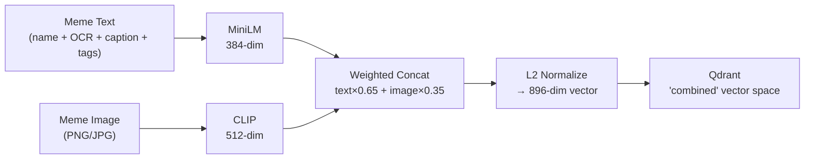

# MemeGPT — Embeddings (Complete Model Reference)

> **Document Version:** 2.0 · **Last Updated:** 2026-08-02

---

## Purpose

Complete documentation of all embedding models used in MemeGPT — model specs, installation, usage code, dimension details, and design rationale.

---

## Model Catalog

| # | Model | Purpose | Size | Dimensions | Runtime | Cost |
|---|---|---|---|---|---|---|
| 1 | `all-MiniLM-L6-v2` | **Text embedding** (core search) | 80 MB | 384 | Real-time | Free |
| 2 | `clip-vit-base-patch32` | **Image embedding** (multimodal) | 400 MB | 512 | Indexing only | Free |
| 3 | `blip-image-captioning-base` | **Image captioning** | 446 MB | N/A | Indexing only | Free |
| 4 | `emotion-english-distilroberta-base` | **Emotion detection** | 250 MB | 7 classes | Real-time | Free |
| 5 | `llama-3.1-8b-instant` (Groq) | **Intent parsing** (LLM) | Cloud | N/A | Real-time | Free (6K/day) |
| 6 | Tesseract OCR | **Text extraction** from images | 20 MB | N/A | Indexing only | Free |

---

## Model 1: MiniLM-L6-v2 — Text Embedding (Core)

**The backbone of MemeGPT's search engine.**

| Property | Value |
|---|---|
| Full Name | `sentence-transformers/all-MiniLM-L6-v2` |
| Output Dimensions | **384** |
| Inference Speed | ~14,000 sentences/sec (CPU) |
| Model Size | 80 MB |
| License | Apache 2.0 (commercial OK) |
| HuggingFace | [link](https://huggingface.co/sentence-transformers/all-MiniLM-L6-v2) |

### What It Does

Converts any text into a 384-dimensional vector. This vector captures semantic meaning — so "I'm stressed about work" and "Monday morning struggle" will be close together in vector space, even though they share no keywords.

### Installation & Usage

```python
pip install sentence-transformers

from sentence_transformers import SentenceTransformer

model = SentenceTransformer('all-MiniLM-L6-v2')

query = "when the code works on first try and you don't know why"
embedding = model.encode(query, normalize_embeddings=True)
# Returns: numpy array of shape (384,)
# L2-normalized for cosine similarity
```

### Why This Model Over Others

| Model | Size | Dimensions | Speed | Accuracy |
|---|---|---|---|---|
| **MiniLM-L6-v2** ✅ | 80 MB | 384 | 14K sent/s | Excellent |
| mpnet-base-v2 | 420 MB | 768 | 2.8K sent/s | +5% better |
| BERT-base | 440 MB | 768 | 1.2K sent/s | Baseline |
| GTE-small | 67 MB | 384 | 15K sent/s | Comparable |

**Decision:** MiniLM is the sweet spot — 5× faster than BERT with only ~2% accuracy loss, and fits in free hosting (512MB RAM).

---

## Model 2: CLIP ViT-B/32 — Image Embedding

**Used during indexing only (not real-time).**

| Property | Value |
|---|---|
| Full Name | `openai/clip-vit-base-patch32` |
| Output Dimensions | **512** |
| License | MIT (commercial OK) |
| Usage Phase | **Indexing only** — run on local machine |

### What It Does

Generates a 512-dim embedding from a meme image that captures visual content. CLIP aligns text and images in the same space — so the text "cat shocked at vegetables" maps near the "Woman Yelling at Cat" meme image.

### Usage

```python
from transformers import CLIPProcessor, CLIPModel
from PIL import Image
import torch

model = CLIPModel.from_pretrained("openai/clip-vit-base-patch32")
processor = CLIPProcessor.from_pretrained("openai/clip-vit-base-patch32")

image = Image.open("drake_pointing.jpg").convert("RGB")
inputs = processor(images=image, return_tensors="pt")
with torch.no_grad():
    image_features = model.get_image_features(**inputs)
    image_features = image_features / image_features.norm(dim=-1, keepdim=True)
# Returns: torch tensor of shape (1, 512) — L2-normalized
```

---

## Model 3: BLIP — Image Captioning

**Generates natural language descriptions of meme images.**

| Property | Value |
|---|---|
| Full Name | `Salesforce/blip-image-captioning-base` |
| License | BSD-3 (commercial OK) |
| Usage Phase | **Indexing only** |

### What It Does

Auto-generates a caption like _"A man in a suit pointing at a TV screen"_ — this gets added to the meme's text metadata, dramatically improving search quality for visual memes.

```python
from transformers import BlipProcessor, BlipForConditionalGeneration

processor = BlipProcessor.from_pretrained("Salesforce/blip-image-captioning-base")
model = BlipForConditionalGeneration.from_pretrained("Salesforce/blip-image-captioning-base")

def caption_meme(image_path):
    img = Image.open(image_path).convert('RGB')
    inputs = processor(img, return_tensors="pt")
    out = model.generate(**inputs, max_new_tokens=50)
    return processor.decode(out[0], skip_special_tokens=True)
# Example output: "a man in a business suit pointing at a television"
```

---

## Model 4: Emotion Detection — DistilRoBERTa

| Property | Value |
|---|---|
| Full Name | `j-hartmann/emotion-english-distilroberta-base` |
| Emotions | anger, disgust, fear, joy, neutral, sadness, surprise |
| Size | 250 MB |
| Speed | ~100ms on CPU |
| License | MIT (free) |

```python
from transformers import pipeline

classifier = pipeline(
    "text-classification",
    model="j-hartmann/emotion-english-distilroberta-base",
    return_all_scores=True
)

result = classifier("I just got rejected after 5 rounds of interviews")
# Returns: [{'label': 'sadness', 'score': 0.72}, {'label': 'anger', 'score': 0.18}, ...]
```

---

## Model 5: Groq LLM — Intent Parsing

| Property | Value |
|---|---|
| Model | `llama-3.1-8b-instant` |
| Speed | 500+ tokens/second |
| Free Tier | **6,000 requests/day** (30 req/min) |
| Signup | https://console.groq.com |

```python
from groq import Groq

client = Groq(api_key="YOUR_FREE_GROQ_KEY")

def parse_meme_intent(user_input: str) -> dict:
    prompt = f"""You are a meme expert AI. Analyze this input and return ONLY JSON.
User input: "{user_input}"
Return: {{"primary_emotion": "...", "situation": "...", "tone": "...",
  "keywords": [...], "meme_format_hint": "...", "intensity": 0.0,
  "cultural_refs": [...]}}"""

    response = client.chat.completions.create(
        model="llama-3.1-8b-instant",
        messages=[{"role": "user", "content": prompt}],
        temperature=0.1,
        max_tokens=200
    )
    return json.loads(response.choices[0].message.content)
```

---

## Model 6: Tesseract OCR — Text Extraction

| Property | Value |
|---|---|
| Cost | Free (open-source) |
| License | Apache 2.0 |
| Usage Phase | Indexing only |

```python
import pytesseract
from PIL import Image, ImageFilter

def extract_meme_text(image_path: str) -> str:
    img = Image.open(image_path)
    img = img.convert('L')              # Grayscale
    img = img.filter(ImageFilter.SHARPEN)
    text = pytesseract.image_to_string(img, config='--psm 6')
    return text.strip()
# Example: "ONE DOES NOT SIMPLY / WALK INTO MORDOR"
```

---

## Combined Embedding Strategy

### How Text + Image Combine to 896 Dimensions



**Text weight: 65%** — meme search is primarily semantic (text-based).  
**Image weight: 35%** — visual features supplement for edge cases.

---

## RAM Budget

| Runtime | Models Loaded | RAM Required |
|---|---|---|
| **Production (online)** | MiniLM (80MB) + Emotion (250MB) + overhead | **~700 MB** |
| **Indexing (offline)** | All 6 models (MiniLM + CLIP + BLIP + Emotion + Tesseract) | **~4 GB** |

> **Critical:** Only load MiniLM + Emotion in production. CLIP, BLIP, and Tesseract run on your local machine during the offline indexing phase.

---

> **Related Documents:**
> - [AI_Pipeline.md](./AI_Pipeline.md) — Full pipeline implementation
> - [Vector_Database.md](./Vector_Database.md) — Qdrant configuration
> - [Image_Analysis.md](./Image_Analysis.md) — BLIP + CLIP + OCR
> - [LLM_Workflow.md](./LLM_Workflow.md) — Groq integration detail
