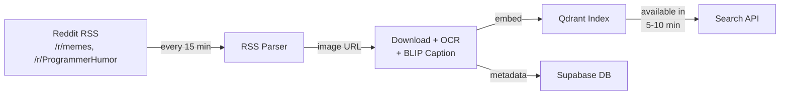

# MemeGPT — Future AI Improvements

> **Document Version:** 2.0 · **Last Updated:** 2026-08-02

---

## Purpose

Roadmap for AI system evolution beyond MVP — fine-tuning, personalization, multi-language, real-time indexing, and meme generation. Each phase is prioritized by user impact and engineering effort.

---

## Phase Roadmap

| Phase | Focus Areas | Timeline | Effort | User Impact |
|---|---|---|---|---|
| **Phase 2** | Fine-tuning, Personalization, Real-time Indexing | Months 5–8 | 3 sprints | High |
| **Phase 3** | Multi-language, Cross-lingual Search | Months 9–12 | 2 sprints | Medium |
| **Phase 4** | Meme Generation, Template AI | Year 2 | 4 sprints | High |

---

## Phase 2: Fine-Tuned Embedding Model

### Approach

Fine-tune MiniLM-L6-v2 on meme-specific data using contrastive learning (triplet loss).

### Training Data

| Pair Type | Source | Example | Label |
|---|---|---|---|
| Positive | User downloaded meme for a query | Query: "when you're late" → downloaded "Panik" meme | Similar |
| Negative | User skipped meme in results | Query: "when you're late" → skipped "Distracted BF" | Dissimilar |
| Hard Negative | Top-10 result that was never clicked | Same query, meme appeared but user ignored | Dissimilar |

### Expected Gains

| Metric | Before | After (Projected) |
|---|---|---|
| Precision@5 | 0.72 | 0.83 (+15%) |
| Recall@10 | 0.81 | 0.89 (+10%) |
| Mean Reciprocal Rank | 0.65 | 0.74 (+14%) |
| User click-through rate | 0.38 | 0.44 (+16%) |

### Implementation

```python
# Conceptual training loop (offline, weekly batch)
from sentence_transformers import SentenceTransformer, losses, InputExample
from torch.utils.data import DataLoader

model = SentenceTransformer('all-MiniLM-L6-v2')
train_examples = [
    InputExample(texts=["when you're late", "panicking cat meme"], label=1.0),
    InputExample(texts=["when you're late", "distracted boyfriend"], label=0.0),
]
train_dataloader = DataLoader(train_examples, shuffle=True, batch_size=16)
train_loss = losses.CosineSimilarityLoss(model)
model.fit(train_objectives=[(train_dataloader, train_loss)], epochs=3)
```

---

## Phase 2: Personalized Re-Ranking

### Strategy

Session-based personalization without user accounts — anonymous tracking via session ID (localStorage UUID).

### Signal Collection

```json
{
  "session_id": "abc-123-def",
  "interactions": [
    {"meme_id": "meme_042", "action": "download", "category": "reaction"},
    {"meme_id": "meme_017", "action": "copy", "category": "wholesome"},
    {"meme_id": "meme_091", "action": "skip", "category": "sports"}
  ],
  "category_weights": {
    "reaction": 1.8,
    "wholesome": 1.4,
    "sports": 0.6
  }
}
```

### Re-Ranking Formula

```
final_score = base_score * (1 + 0.15 * category_weight)
```

Where `category_weight` starts at 1.0 and adjusts ±0.1 per interaction (clamped to [0.5, 2.0]).

### Privacy Considerations

- Session data stored in Redis with 30-day TTL
- No PII collected
- Users can opt out via `localStorage` flag
- Sessions are anonymized after 30 days

---

## Phase 3: Multi-Language Support

### Model Selection

| Language | Model | Dim | Quality vs. English |
|---|---|---|---|
| Hindi | `sentence-transformers/LaBSE` | 768 | 92% |
| Spanish | `distiluse-base-multilingual-cased-v2` | 512 | 95% |
| Portuguese | `distiluse-base-multilingual-cased-v2` | 512 | 94% |
| All | `intfloat/multilingual-e5-small` | 384 | 90% |

### Cross-Lingual Search Pipeline

```
User Query (Hindi) → Embed (multilingual model) → Qdrant Search → English Meme Results
```

Works because multilingual models map semantically similar sentences across languages to nearby vectors.

---

## Phase 3: Real-Time Meme Indexing

### Pipeline



### Viral Velocity Score

```python
def viral_velocity(post):
    return (
        post.upvotes * 1.0 +
        post.comments * 2.0 +
        post.share_count * 3.0
    ) / max(1, hours_since_post)
```

Memes with velocity > 50/hr are flagged for priority indexing (indexed within 5 minutes vs. 30 minutes for standard).

---

## Phase 4: Meme Generation

### Architecture

```
User Caption → CLIP Similarity → Top 3 Templates → Imgflip API → Generated Meme
```

### Template Selection

| Step | Method | Detail |
|---|---|---|
| 1 | Encode caption | MiniLM embedding (384-dim) |
| 2 | Match to template | Cosine similarity against 100 pre-defined templates |
| 3 | Score templates | CLIP ViT-B/32: caption + template image compatibility |
| 4 | Place text | Imgflip API for text rendering on top/bottom |

### Template Catalog

| Template ID | Name | Best For | Example Caption |
|---|---|---|---|
| T001 | Drake Hotline Bling | Approval/rejection | "AI generates code" / "AI deploys to prod" |
| T002 | Two Panel (This is Fine) | Denial/acceptance | "Project is on fire" / "I'll fix it later" |
| T003 | Distracted Boyfriend | Preference shift | "Old framework" / "New framework" |
| T004 | Change My Mind | Unpopular opinion | "Vim is better than VS Code" |
| T005 | Woman Yelling at Cat | Confusion/misunderstanding | "Manager's explanation" / "My implementation" |

---

## Future AI Evaluation Plan

| Phase | Evaluation Method | Success Criteria |
|---|---|---|
| Phase 2 | Offline eval on held-out user feedback | Precision@5 > 0.80 |
| Phase 2 | A/B test personalization vs. baseline | CTR lift > 10% |
| Phase 3 | Cross-lingual retrieval eval | Recall@10 within 90% of English |
| Phase 4 | Generated meme quality (human eval) | > 70% rated "good" or "excellent" |

---

> **Related Documents:**
> - [AI_Overview.md](./AI_Overview.md) — Current AI architecture
> - [Embeddings.md](./Embeddings.md) — Embedding models
> - [LLM_Workflow.md](./LLM_Workflow.md) — LLM integration
> - [RAG.md](./RAG.md) — RAG pipeline
> - [00_Project_Overview/Goals.md](../00_Project_Overview/Goals.md) — Product goals and milestones