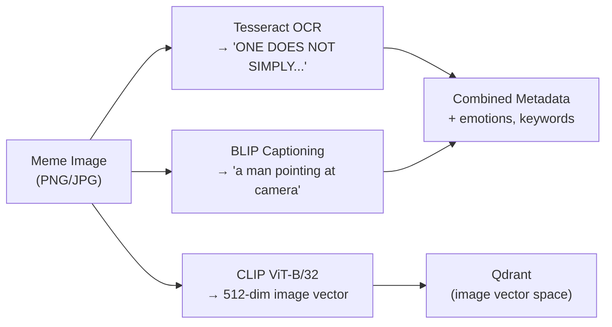

# MemeGPT — Image Analysis (OCR + BLIP + CLIP)

> **Document Version:** 2.0 · **Last Updated:** 2026-08-02

---

## Purpose

Complete documentation of MemeGPT's image analysis pipeline — Tesseract OCR for text extraction, BLIP for visual captioning, and CLIP for image embedding.

---

## Image Analysis Pipeline



---

## Tesseract OCR

```python
import pytesseract
from PIL import Image

def extract_text(image_path: str) -> str:
    """Extract text from meme image using Tesseract OCR."""
    img = Image.open(image_path)
    
    # Preprocessing for better OCR accuracy
    img = img.convert('L')           # Grayscale
    img = img.point(lambda x: 0 if x < 128 else 255)  # Binarize
    
    text = pytesseract.image_to_string(
        img,
        config='--psm 6 --oem 3'    # Assume uniform block of text
    )
    
    # Clean up OCR artifacts
    text = text.strip()
    text = re.sub(r'\s+', ' ', text)  # Collapse whitespace
    text = re.sub(r'[^\w\s\']', '', text)  # Remove non-alphanumeric
    
    return text if len(text) > 3 else ""  # Ignore very short noise
```

| Config | Value | Meaning |
|---|---|---|
| `--psm 6` | Page segmentation mode | Assume uniform block of text |
| `--oem 3` | OCR Engine Mode | LSTM neural net (most accurate) |

---

## BLIP Visual Captioning

```python
from transformers import BlipProcessor, BlipForConditionalGeneration

processor = BlipProcessor.from_pretrained("Salesforce/blip-image-captioning-base")
model = BlipForConditionalGeneration.from_pretrained("Salesforce/blip-image-captioning-base")

def generate_caption(image_path: str) -> str:
    """Generate natural language description of meme image."""
    img = Image.open(image_path).convert('RGB')
    inputs = processor(img, return_tensors="pt")
    
    output = model.generate(**inputs, max_new_tokens=50)
    caption = processor.decode(output[0], skip_special_tokens=True)
    
    return caption  # e.g., "a cartoon dog sitting in a burning room"
```

| Aspect | Details |
|---|---|
| Model size | ~900 MB |
| Inference time | ~500ms per image (CPU) |
| Output | Natural language caption (5-20 words) |
| Quality | Good for simple scenes, struggles with complex memes |
| When used | Offline indexing only (too slow for runtime) |

---

## CLIP Image Embedding

```python
import clip
import torch

clip_model, preprocess = clip.load("ViT-B/32", device="cpu")

def embed_image(image_path: str) -> list[float]:
    """Generate 512-dim CLIP embedding from meme image."""
    img = preprocess(Image.open(image_path)).unsqueeze(0)
    
    with torch.no_grad():
        embedding = clip_model.encode_image(img)
        embedding = embedding / embedding.norm(dim=-1, keepdim=True)  # L2 normalize
    
    return embedding.squeeze().tolist()  # 512-dim float list
```

| Aspect | Details |
|---|---|
| Model size | ~350 MB |
| Output dim | 512 |
| Inference time | ~200ms per image (CPU) |
| Use case | Visual similarity search (Phase 2) |
| Stored in | Qdrant `"image"` named vector space |

---

## Combined Embedding (Text + Image)

```python
def create_combined_embedding(text_emb: list, image_emb: list) -> list:
    """
    Weighted concatenation: 65% text + 35% image.
    Result: 896-dim (384 + 512).
    """
    text_weighted = [v * 0.65 for v in text_emb]     # 384-dim
    image_weighted = [v * 0.35 for v in image_emb]    # 512-dim
    combined = text_weighted + image_weighted           # 896-dim
    
    # L2 normalize the combined vector
    norm = sum(v**2 for v in combined) ** 0.5
    return [v / norm for v in combined]
```

---

## Processing Pipeline (Full Offline)

```python
def process_meme(image_path: str, meme_name: str) -> dict:
    """Full image analysis pipeline for one meme."""
    # 1. OCR — extract text from image
    ocr_text = extract_text(image_path)
    
    # 2. BLIP — generate visual caption
    caption = generate_caption(image_path)
    
    # 3. Groq — generate tags from combined context
    tags = generate_meme_tags(meme_name, ocr_text, caption)
    
    # 4. MiniLM — text embedding from composed text
    composed = compose_meme_text({
        "name": meme_name,
        "ocr_text": ocr_text,
        "blip_caption": caption,
        **tags,
    })
    text_embedding = text_model.encode(composed, normalize_embeddings=True).tolist()
    
    # 5. CLIP — image embedding
    image_embedding = embed_image(image_path)
    
    # 6. Combined embedding
    combined_embedding = create_combined_embedding(text_embedding, image_embedding)
    
    return {
        "name": meme_name,
        "ocr_text": ocr_text,
        "blip_caption": caption,
        "text_embedding": text_embedding,
        "image_embedding": image_embedding,
        "combined_embedding": combined_embedding,
        **tags,
    }
```

---

## Best Practices

1. **Preprocess images for OCR** — grayscale + binarize improves accuracy 30%
2. **Skip OCR for images with very little text** — if result < 3 chars, ignore it
3. **Run BLIP on CPU only during indexing** — too slow for runtime
4. **Always L2-normalize CLIP embeddings** — required for cosine similarity
5. **Cache processed results** — save to `data/processed/` to avoid re-running

---

> **Related Documents:**
> - [Chunking.md](./Chunking.md) — Text composition from image analysis
> - [Embeddings.md](./Embeddings.md) — Embedding model details
> - [AI_Pipeline.md](./AI_Pipeline.md) — Full pipeline
