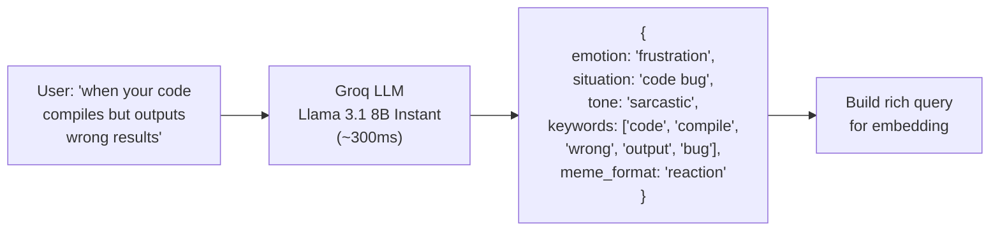

# MemeGPT — LLM Workflow (Groq Integration)

> **Document Version:** 2.0 · **Last Updated:** 2026-08-02

---

## Purpose

Complete documentation of MemeGPT's LLM integration — Groq API usage, prompt design, JSON parsing, error handling, and fallback strategy.

---

## Background

MemeGPT uses **Groq Cloud** (Llama 3.1 8B Instant) as its LLM provider. Groq runs inference on custom LPU hardware, delivering GPT-4-quality parsing at sub-500ms latency — critical for keeping total search time under 1.5 seconds.

---

## LLM Role in Pipeline



---

## Groq Client Configuration

```python
from groq import Groq
import os

groq_client = Groq(api_key=os.environ["GROQ_API_KEY"])

GROQ_CONFIG = {
    "model": "llama-3.1-8b-instant",
    "temperature": 0.1,      # Low = consistent JSON output
    "max_tokens": 200,        # Intent JSON is small
    "top_p": 0.9,
    "timeout": 5.0,           # Fail fast, use fallback
}
```

---

## Intent Parsing Prompt

```python
INTENT_PROMPT = """You are a meme recommendation engine. Analyze the user's text and extract structured intent.

User text: "{user_text}"

Return ONLY valid JSON with these fields:
{{
  "emotion": "joy|sadness|anger|surprise|fear|disgust|neutral",
  "situation": "brief description of what's happening",
  "tone": "sarcastic|sincere|humorous|frustrated|excited|resigned",
  "keywords": ["5-8 search keywords for finding relevant memes"],
  "meme_format": "reaction|comparison|advice|relatable|wholesome"
}}

Rules:
- Return ONLY JSON, no markdown, no explanation
- Keywords should include synonyms and related concepts
- Emotion should be the dominant feeling
- Meme_format describes the type of meme that would fit best"""
```

---

## Implementation

```python
async def parse_intent(user_text: str) -> dict:
    """
    Use Groq LLM to parse user intent from natural language.
    Returns structured JSON with emotion, situation, tone, keywords.
    Falls back to neutral defaults on any failure.
    """
    try:
        response = groq_client.chat.completions.create(
            model=GROQ_CONFIG["model"],
            messages=[{
                "role": "user",
                "content": INTENT_PROMPT.format(user_text=user_text)
            }],
            temperature=GROQ_CONFIG["temperature"],
            max_tokens=GROQ_CONFIG["max_tokens"],
        )
        
        raw = response.choices[0].message.content.strip()
        # Clean potential markdown wrapping
        if raw.startswith("```"):
            raw = raw.split("```")[1]
            if raw.startswith("json"):
                raw = raw[4:]
        
        intent = json.loads(raw)
        
        # Validate expected fields
        assert "emotion" in intent
        assert "keywords" in intent
        assert isinstance(intent["keywords"], list)
        
        return intent
        
    except (json.JSONDecodeError, AssertionError, KeyError) as e:
        logger.warning(f"LLM JSON parse failed: {e}")
        return _default_intent(user_text)
    
    except Exception as e:
        logger.warning(f"Groq API failed: {e}")
        return _default_intent(user_text)


def _default_intent(user_text: str) -> dict:
    """Fallback when LLM is unavailable or returns bad JSON."""
    return {
        "emotion": "neutral",
        "situation": user_text,
        "tone": "neutral",
        "keywords": user_text.split()[:5],
        "meme_format": "reaction",
    }
```

---

## Groq API Limits (Free Tier)

| Resource | Limit |
|---|---|
| Requests per minute | 30 |
| Requests per day | 6,000 |
| Tokens per minute | 6,000 |
| Max context window | 8,192 tokens |
| Models available | Llama 3.1 8B Instant, Mixtral |

---

## Error Handling

| Error | Frequency | Action |
|---|---|---|
| Groq timeout (>5s) | ~2% | Use fallback intent |
| Groq 429 (rate limit) | ~1% at peak | Queue or use fallback |
| Invalid JSON response | ~3% | Parse fallback |
| Groq 500 (server error) | <0.5% | Use fallback intent |
| Network error | <0.1% | Use fallback intent |

> **Key insight:** The fallback is always available (raw query → embedding). The LLM makes results **better** but is never required.

---

## Best Practices

1. **Set temperature=0.1** — consistent JSON, no creativity needed
2. **Set max_tokens=200** — intent JSON is small, save tokens
3. **Set timeout=5s** — fail fast, use fallback
4. **Always validate JSON output** — LLMs sometimes return markdown-wrapped JSON
5. **Never `eval()` LLM output** — always `json.loads()` with try/except
6. **Log LLM failures** — track Groq reliability over time

---

> **Related Documents:**
> - [Prompt_Engineering.md](./Prompt_Engineering.md) — Prompt design patterns
> - [AI_Pipeline.md](./AI_Pipeline.md) — Full pipeline
> - [03_Backend/Error_Handling.md](../03_Backend/Error_Handling.md) — Fallback strategy
