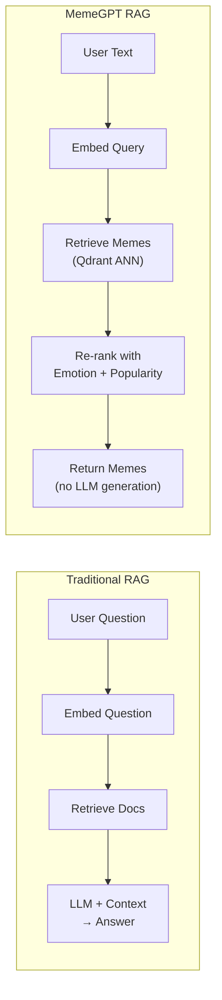

# MemeGPT — RAG (Retrieval-Augmented Generation)

> **Document Version:** 2.0 · **Last Updated:** 2026-08-02

---

## Purpose

How MemeGPT adapts the RAG pattern — retrieving relevant memes from a vector store and using them to augment the AI-powered recommendation, rather than traditional document retrieval.

---

## MemeGPT's RAG Adaptation

Traditional RAG retrieves text chunks to augment LLM context. MemeGPT adapts this pattern:



| Aspect | Traditional RAG | MemeGPT RAG |
|---|---|---|
| **Retrieval source** | Document chunks | Meme embeddings |
| **Embedding model** | All-MiniLM / OpenAI | MiniLM-L6-v2 |
| **Vector store** | Pinecone / Chroma | Qdrant Cloud |
| **Generation step** | LLM generates answer | No generation — return memes directly |
| **Augmentation** | Context → LLM prompt | Emotion + popularity → re-ranking |
| **Chunk strategy** | Split long docs | Compose short metadata fields |

---

## RAG Pipeline Stages

### 1. Indexing (Offline)

```
Raw Meme Data → OCR + BLIP + Groq Tags → Composed Text → MiniLM Embedding → Qdrant Upsert
```

### 2. Retrieval (Online)

```
User Query → Intent Parsing + Emotion → Query Embedding → Qdrant ANN Search → Top 10 candidates
```

### 3. Augmentation (Online)

```
Top 10 candidates + Emotion Match + Popularity Score + Format Preference → Composite Score → Top 5
```

---

## Why No Generation Step?

MemeGPT skips the traditional "generation" step because:

1. **Memes ARE the output** — users want images, not text answers
2. **No hallucination risk** — retrieved memes are real, verifiable content
3. **Faster** — skipping LLM generation saves 500ms+
4. **The LLM enriches the QUERY, not the RESPONSE** — intent parsing happens before retrieval

---

## Comparison with Standard RAG Architectures

| RAG Pattern | Example | MemeGPT Uses? |
|---|---|---|
| Naive RAG | Embed → Retrieve → Generate | ❌ (no generation) |
| Advanced RAG | Query rewriting → Retrieve → Re-rank → Generate | ✅ Partially (query enrichment + re-ranking) |
| Modular RAG | Routing → Retrieve → Filter → Generate | ✅ Partially (emotion routing + filtering) |
| Agentic RAG | Multi-step with tool calls | ❌ (single-step retrieval is sufficient) |

---

## Best Practices

1. **Enriching the query > augmenting the context** — LLM improves the search, not the output
2. **Re-ranking is your "generation"** — business logic replaces LLM text generation
3. **Feedback loop closes the RAG cycle** — user votes improve future rankings
4. **Keep retrieval fast** — Qdrant HNSW returns results in <50ms

---

> **Related Documents:**
> - [Retrieval.md](./Retrieval.md) — Retrieval implementation
> - [Chunking.md](./Chunking.md) — Text composition strategy
> - [Vector_Database.md](./Vector_Database.md) — Qdrant configuration
> - [AI_Pipeline.md](./AI_Pipeline.md) — Full pipeline
