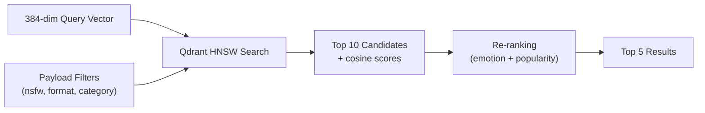

# MemeGPT — Retrieval

> **Document Version:** 2.0 · **Last Updated:** 2026-08-02

---

## Purpose

Complete documentation of MemeGPT's retrieval system — how vectors are searched, filtered, and returned from Qdrant, including search strategies, filter logic, and retrieval optimization.

---

## Background

Retrieval is the bridge between query embedding and result ranking. MemeGPT retrieves 10 candidate memes from Qdrant using approximate nearest-neighbor (ANN) search, then re-ranks them with business logic to produce the final 5 results.

---

## Retrieval Pipeline



---

## Search Strategies

### Strategy 1: Text-Only Search (Default, Phase 1)

```python
results = qdrant.search(
    collection_name="memes",
    query_vector=("text", query_embedding),  # 384-dim
    limit=10,
    score_threshold=0.45,
    with_payload=True,
)
```

### Strategy 2: Combined Search (Phase 2)

```python
# Uses the combined 896-dim vector (65% text + 35% image)
results = qdrant.search(
    collection_name="memes",
    query_vector=("combined", combined_embedding),  # 896-dim
    limit=10,
    score_threshold=0.40,
    with_payload=True,
)
```

### Strategy 3: Image-Only Search (Phase 3)

```python
# For reverse image search — "upload a meme, find similar"
results = qdrant.search(
    collection_name="memes",
    query_vector=("image", image_embedding),  # 512-dim CLIP
    limit=10,
    with_payload=True,
)
```

---

## Filter System

```python
from qdrant_client.models import Filter, FieldCondition, MatchValue, MatchAny

def build_search_filter(
    nsfw: bool = False,
    format_pref: str = "any",
    categories: list[str] = None,
    exclude_ids: list[str] = None
) -> Filter:
    """Build Qdrant filter from user preferences."""
    
    must_conditions = [
        FieldCondition(key="nsfw", match=MatchValue(value=nsfw))
    ]
    
    if format_pref == "gif":
        must_conditions.append(
            FieldCondition(key="has_gif", match=MatchValue(value=True))
        )
    elif format_pref == "video":
        must_conditions.append(
            FieldCondition(key="has_video", match=MatchValue(value=True))
        )
    
    if categories:
        must_conditions.append(
            FieldCondition(key="categories", match=MatchAny(any=categories))
        )
    
    must_not_conditions = []
    if exclude_ids:
        for eid in exclude_ids:
            must_not_conditions.append(
                FieldCondition(key="meme_id", match=MatchValue(value=eid))
            )
    
    return Filter(
        must=must_conditions,
        must_not=must_not_conditions if must_not_conditions else None
    )
```

---

## Score Threshold Strategy

| Threshold | Behavior | When to Use |
|---|---|---|
| **0.45** (default) | Good results only | Normal search |
| **0.35** (lowered) | Include borderline matches | When default returns <3 results |
| **0.25** (emergency) | Include weak matches | When lowered returns 0 results |
| **0.00** (disabled) | Return anything | Never (returns noise) |

```python
# Adaptive threshold — lower if too few results
results = vector_search(query_vector, threshold=0.45)
if len(results) < 3:
    results = vector_search(query_vector, threshold=0.35)
if len(results) == 0:
    results = vector_search(query_vector, threshold=0.25)
if len(results) == 0:
    results = get_trending_memes(limit=5)  # Final fallback
```

---

## Performance Optimization

| Optimization | Impact | Implementation |
|---|---|---|
| **HNSW ef=128** | Balanced speed/recall | Qdrant config |
| **Payload filtering** | Server-side (fast) | Qdrant Filter objects |
| **Named vectors** | Search specific spaces | `query_vector=("text", ...)` |
| **Score threshold** | Skip low-quality results | `score_threshold=0.45` |
| **Limit=10** | Don't over-fetch | Only need top 5, fetch 10 for re-ranking |
| **Redis cache** | Skip search entirely | Cache key: `md5(query:format:nsfw)` |

---

## Best Practices

1. **Always fetch 2× what you need** — fetch 10, return 5 (re-ranking changes order)
2. **Filter in Qdrant, not Python** — `query_filter` is 10× faster than post-filtering
3. **Use named vectors** — search `"text"` space for text queries, `"image"` for image queries
4. **Set score_threshold** — never return irrelevant noise to users
5. **Adaptive thresholds** — lower the bar if too few results, never return empty

---

> **Related Documents:**
> - [Vector_Database.md](./Vector_Database.md) — Qdrant configuration
> - [Chunking.md](./Chunking.md) — Text composition for embedding
> - [Scoring_Logic.md](./Scoring_Logic.md) — Re-ranking after retrieval
> - [Embeddings.md](./Embeddings.md) — Embedding model details
