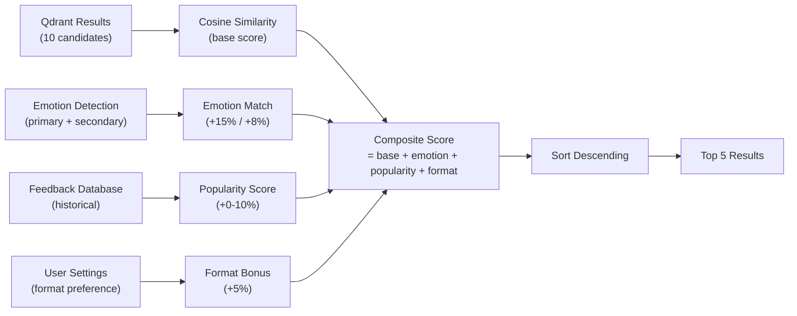

# MemeGPT — Scoring Logic

> **Document Version:** 2.0 · **Last Updated:** 2026-08-02

---

## Purpose

Complete documentation of MemeGPT's meme scoring and ranking system — the composite score formula, re-ranking pipeline, popularity calculation, and weekly retraining loop.

---

## Background

MemeGPT's scoring system combines **three signals** to produce a final relevance score: vector similarity (how semantically close the meme is to the query), emotion matching (how well the meme's emotions align with detected user emotions), and popularity (how often users have engaged with this meme).

---

## Scoring Pipeline



---

## Composite Score Formula

```python
def calculate_composite_score(
    cosine_similarity: float,     # 0.0–1.0 from Qdrant
    meme_emotions: list[str],     # Meme's tagged emotions
    user_emotion_primary: str,    # Detected from user query
    user_emotion_secondary: str,  # Secondary detected emotion
    popularity_score: float,      # 0.0–1.0 historical engagement
    format_match: bool,           # User's preferred format available
) -> float:
    """
    Composite relevance score for meme ranking.
    
    Components:
    - Base: cosine similarity (0.0–1.0)
    - Emotion primary match: +15%
    - Emotion secondary match: +8%
    - Popularity boost: +0-10% (weighted)
    - Format preference match: +5%
    - Cap: 1.0 maximum
    """
    score = cosine_similarity
    
    # Emotion matching (+15% primary, +8% secondary)
    if user_emotion_primary in meme_emotions:
        score += 0.15
    if user_emotion_secondary and user_emotion_secondary in meme_emotions:
        score += 0.08
    
    # Popularity boost (0–10%)
    score += popularity_score * 0.10
    
    # Format preference match (+5%)
    if format_match:
        score += 0.05
    
    return min(score, 1.0)  # Cap at 1.0
```

---

## Score Component Weights

| Component | Weight | Source | Purpose |
|---|---|---|---|
| **Cosine similarity** | Base (0.0–1.0) | Qdrant HNSW | Core semantic relevance |
| **Primary emotion match** | +15% | DistilRoBERTa | Emotional accuracy |
| **Secondary emotion match** | +8% | DistilRoBERTa | Emotional nuance |
| **Popularity score** | +0%–10% | Feedback database | Surface well-known memes |
| **Format preference match** | +5% | User setting | Convenience / usability |
| **Maximum possible** | **1.0** (capped) | — | Prevents >100% display |

---

## Popularity Score Calculation

```python
def calculate_popularity_score(meme_id: str) -> float:
    """
    Aggregate engagement signals from the last 30 days.
    Normalized to 0.0–1.0 range.
    Run weekly via cron job.
    """
    feedback = get_feedback_last_30_days(meme_id)
    
    raw_score = (
        feedback.get("view_count", 0)      * 0.1 +
        feedback.get("click_count", 0)     * 0.5 +
        feedback.get("copy_count", 0)      * 1.0 +
        feedback.get("download_count", 0)  * 2.0 +
        feedback.get("share_count", 0)     * 3.0 +
        feedback.get("thumbs_up", 0)       * 2.0 +
        feedback.get("thumbs_down", 0)     * -1.0
    )
    
    # Normalize: divide by max expected score
    # Top memes get ~10,000 raw score per month
    normalized = min(1.0, max(0.0, raw_score / 10000))
    
    return round(normalized, 4)
```

---

## Trending Score (Different from Popularity)

```python
def calculate_trending_score(meme_id: str) -> float:
    """
    Short-term velocity — measures engagement in the LAST 24 HOURS.
    Used for the /trending endpoint, not for search ranking.
    """
    feedback_24h = get_feedback_last_24_hours(meme_id)
    
    raw = (
        feedback_24h.get("view_count", 0)      * 0.1 +
        feedback_24h.get("download_count", 0)  * 2.0 +
        feedback_24h.get("share_count", 0)     * 3.0 +
        feedback_24h.get("thumbs_up", 0)       * 2.0
    )
    
    return min(1.0, raw / 1000)  # Normalize to 0–1
```

| Score Type | Time Window | Used For | Update Frequency |
|---|---|---|---|
| **Relevance Score** | Per-query | Search results ranking | Real-time |
| **Popularity Score** | 30 days | Boost in search ranking | Weekly |
| **Trending Score** | 24 hours | `/trending` endpoint | Hourly |

---

## Feedback Signal Weights

| Action | Weight | Interpretation |
|---|---|---|
| `view` | +0.1 | Weak positive — appeared in results |
| `click` | +0.5 | Medium positive — user was curious |
| `copy` | +1.0 | Strong positive — user shared it |
| `download` | +2.0 | Very strong positive — user saved it |
| `share` | +3.0 | Strongest positive — user shared externally |
| `thumbs_up` | +2.0 | Explicit positive vote |
| `thumbs_down` | -1.0 | Explicit negative — reduces popularity |
| `skip` | -0.3 | Weak negative — scrolled past |

---

## Weekly Retraining Cron

```yaml
# .github/workflows/retrain.yml
name: Weekly Popularity Recalculation
on:
  schedule:
    - cron: '0 3 * * 0'  # Every Sunday at 3 AM UTC

jobs:
  retrain:
    runs-on: ubuntu-latest
    steps:
      - uses: actions/checkout@v4
      - run: pip install -r services/api/requirements.txt
      - run: python services/api/scripts/recalculate_popularity.py
        env:
          DATABASE_URL: ${{ secrets.DATABASE_URL }}
          QDRANT_URL: ${{ secrets.QDRANT_URL }}
          QDRANT_API_KEY: ${{ secrets.QDRANT_API_KEY }}
```

```python
# scripts/recalculate_popularity.py
def recalculate_all_popularity_scores():
    """Recalculate popularity for ALL memes and update Qdrant payload."""
    all_memes = db.memes.find_many()
    
    for meme in all_memes:
        new_score = calculate_popularity_score(meme.id)
        
        # Update Supabase
        db.memes.update(
            where={"id": meme.id},
            data={"popularity_score": new_score}
        )
        
        # Update Qdrant payload (no re-embedding needed!)
        qdrant.set_payload(
            collection_name="memes",
            payload={"popularity_score": new_score},
            points=[meme.qdrant_point_id]
        )
    
    print(f"Updated {len(all_memes)} memes")
```

---

## Score Display in UI

| Score Range | Display | Color |
|---|---|---|
| 0.90–1.00 | 🎯 94% match | Green (#22C55E) |
| 0.70–0.89 | 🎯 78% match | Amber (#F59E0B) |
| 0.50–0.69 | 🎯 62% match | Orange (#FB923C) |
| <0.50 | Not shown | — (filtered out by `score_threshold`) |

---

## Best Practices

1. **Cap scores at 1.0** — prevents confusing >100% displays
2. **Use `score_threshold=0.45`** — below this is noise, not results
3. **Update popularity weekly** — more frequent is unnecessary, less frequent misses trends
4. **Weight downloads > views** — downloads indicate true relevance
5. **Negative signals matter** — thumbs_down should reduce future ranking
6. **Don't re-embed for popularity updates** — only update Qdrant payload

---

> **Related Documents:**
> - [05_AI_System/AI_Pipeline.md](../05_AI_System/AI_Pipeline.md) — Full pipeline
> - [03_Backend/Services.md](../03_Backend/Services.md) — Re-ranking service
> - [08_Features/Trending_System.md](../08_Features/Trending_System.md) — Trending feature
