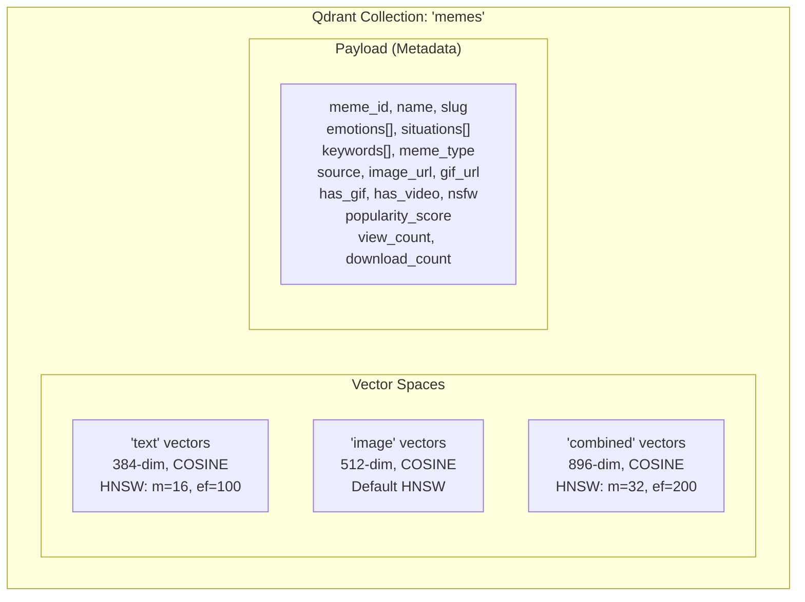

# MemeGPT — Vector Database (Qdrant Configuration)

> **Document Version:** 2.0 · **Last Updated:** 2026-08-02

---

## Purpose

Complete documentation of MemeGPT's Qdrant vector database configuration — collection setup, named vector spaces, HNSW parameters, payload filtering, search queries, and performance tuning.

---

## Background

MemeGPT uses Qdrant Cloud (free tier: 1GB, ~1M vectors) to store and search meme embeddings. Qdrant was chosen over Pinecone and ChromaDB because of its **named vector** support — a single meme point can have three separate embedding spaces (text, image, combined), enabling targeted search modes.

---

## Collection Architecture



---

## Collection Creation

```python
from qdrant_client import QdrantClient
from qdrant_client.models import (
    Distance, VectorParams, HnswConfigDiff
)

client = QdrantClient(
    url=os.environ["QDRANT_URL"],
    api_key=os.environ["QDRANT_API_KEY"]
)

def create_collection():
    """
    Create meme collection with 3 named vector spaces.
    - text: for semantic text search (primary)
    - image: for visual similarity search (Phase 2)
    - combined: for hybrid search (default index)
    """
    client.recreate_collection(
        collection_name="memes",
        vectors_config={
            "text": VectorParams(
                size=384,                  # MiniLM-L6-v2 output
                distance=Distance.COSINE,
                hnsw_config=HnswConfigDiff(
                    m=16,                  # 16 connections per node
                    ef_construct=100       # Build accuracy
                )
            ),
            "image": VectorParams(
                size=512,                  # CLIP ViT-B/32 output
                distance=Distance.COSINE,
            ),
            "combined": VectorParams(
                size=896,                  # 384 + 512 concatenated
                distance=Distance.COSINE,
                hnsw_config=HnswConfigDiff(
                    m=32,                  # More connections (important)
                    ef_construct=200       # Higher build accuracy
                )
            ),
        }
    )
```

---

## HNSW Parameters Explained

| Parameter | `text` Space | `combined` Space | What It Controls |
|---|---|---|---|
| `m` | 16 | 32 | Connections per node. Higher = better recall, more RAM |
| `ef_construct` | 100 | 200 | Build accuracy. Higher = slower indexing, better graph |
| `ef` (search) | 128 | 128 | Search accuracy. Higher = slower search, better recall |

### Why `combined` gets higher values

The combined vector space (896-dim) is the **primary search path**. Higher HNSW parameters ensure:
- Better recall for high-dimensional vectors
- More accurate nearest-neighbor results
- Worth the extra RAM since this is the default search mode

---

## Point Structure (Upsert)

```python
from qdrant_client.models import PointStruct

point = PointStruct(
    id=abs(hash(meme["id"])) % (10**18),  # Int ID from string hash
    vectors={
        "text": meme["text_embedding"],      # 384-dim, L2-normalized
        "image": meme["image_embedding"],     # 512-dim, L2-normalized
        "combined": meme["combined_embedding"], # 896-dim, L2-normalized
    },
    payload={
        "meme_id": meme["id"],
        "name": meme["name"],
        "slug": meme["name"].lower().replace(" ", "-"),
        "emotions": meme.get("emotions", []),
        "situations": meme.get("situations", []),
        "keywords": meme.get("keywords", []),
        "meme_type": meme.get("meme_type", "reaction"),
        "source": meme.get("source", ""),
        "image_url": meme.get("image_url", ""),
        "gif_url": meme.get("gif_url", ""),
        "mp4_url": meme.get("mp4_url", ""),
        "thumb_url": meme.get("thumb_url", ""),
        "has_gif": bool(meme.get("gif_url")),
        "has_video": bool(meme.get("mp4_url")),
        "nsfw": meme.get("nsfw", False),
        "popularity_score": min(1.0, meme.get("score", 0) / 10000),
        "view_count": 0,
        "download_count": 0,
    }
)
```

---

## Search Queries

### Primary Search (Text Similarity + Filters)

```python
from qdrant_client.models import Filter, FieldCondition, MatchValue

results = client.search(
    collection_name="memes",
    query_vector=("text", query_embedding),  # Named vector space
    query_filter=Filter(
        must=[
            FieldCondition(key="nsfw", match=MatchValue(value=False)),
        ],
        should=[
            FieldCondition(key="has_gif", match=MatchValue(value=True)),
        ]
    ),
    limit=10,
    with_payload=True,
    score_threshold=0.45,  # Minimum similarity — below this is noise
)

# Each result has:
# - result.id: point ID
# - result.score: cosine similarity (0.0–1.0)
# - result.payload: full metadata dict
```

### GIF-Only Search

```python
results = client.search(
    collection_name="memes",
    query_vector=("text", query_embedding),
    query_filter=Filter(must=[
        FieldCondition(key="nsfw", match=MatchValue(value=False)),
        FieldCondition(key="has_gif", match=MatchValue(value=True)),
    ]),
    limit=10,
    score_threshold=0.45,
)
```

### Emotion-Filtered Search

```python
results = client.search(
    collection_name="memes",
    query_vector=("text", query_embedding),
    query_filter=Filter(must=[
        FieldCondition(key="emotions", match=MatchValue(value="joy")),
    ]),
    limit=10,
)
```

---

## Batch Upsert (Indexing)

```python
def index_memes(memes: list, batch_size: int = 100):
    """Upsert memes in batches for efficiency."""
    for batch_start in range(0, len(memes), batch_size):
        batch = memes[batch_start:batch_start + batch_size]
        points = [build_point(meme) for meme in batch]
        client.upsert(collection_name="memes", points=points)
        print(f"  Indexed batch {batch_start}–{batch_start + len(batch)}")
```

---

## Verification Script

```python
def verify_index():
    """Confirm the index is working with a test query."""
    info = client.get_collection("memes")
    print(f"Vectors: {info.vectors_count}")
    print(f"Status: {info.status}")
    
    # Test search
    from sentence_transformers import SentenceTransformer
    model = SentenceTransformer('all-MiniLM-L6-v2')
    test_vector = model.encode("when the code finally works",
                                normalize_embeddings=True).tolist()
    
    results = client.search(
        collection_name="memes",
        query_vector=("text", test_vector),
        limit=3
    )
    
    print(f"\nTest: 'when the code finally works'")
    for r in results:
        print(f"  Score: {r.score:.3f} | {r.payload['name']}")
    # Expected: "Success Kid" or "This Is Fine" in top 3
```

---

## Performance Benchmarks

| Metric | Value | Configuration |
|---|---|---|
| Search latency (1K vectors) | ~10ms | ef=128, cosine |
| Search latency (10K vectors) | ~30ms | ef=128, cosine |
| Search latency (100K vectors) | ~50ms | ef=128, cosine |
| Indexing speed | ~500 vectors/sec | Batch size 100 |
| RAM usage (10K vectors) | ~50MB | 3 named vectors |
| RAM usage (100K vectors) | ~400MB | 3 named vectors |

---

## Free Tier Limits

| Resource | Limit | MemeGPT Usage |
|---|---|---|
| Storage | 1 GB | ~1M vectors (plenty) |
| Collections | Unlimited | 1 ("memes") |
| API calls | Unlimited | No rate limits |
| Backups | None | Re-index from source data |

---

## Best Practices

1. **Always use named vectors** — enables text-only, image-only, or combined search
2. **Batch upserts** — 100 points per batch for optimal throughput
3. **Set `score_threshold=0.45`** — below this is noise, not relevant results
4. **Use `ef=128` for search** — good balance of speed and accuracy
5. **L2-normalize all vectors** — cosine distance requires normalized inputs
6. **Store filterable fields as payload** — enables Qdrant-side filtering (faster than app-side)
7. **Re-index weekly** — update popularity_score in payload without rebuilding vectors

---

## Common Mistakes

| Mistake | Consequence | Fix |
|---|---|---|
| Not normalizing vectors | Wrong cosine scores | Always L2-normalize before upsert |
| Using default HNSW for 896-dim | Lower recall | Set `m=32, ef_construct=200` |
| Filtering in Python after search | 10× slower | Use Qdrant `query_filter` |
| No `score_threshold` | Returns irrelevant noise | Set `score_threshold=0.45` |
| String IDs | Qdrant requires int/UUID | Hash string to int: `abs(hash(id)) % 10**18` |

---

> **Related Documents:**
> - [05_AI_System/Embeddings.md](../05_AI_System/Embeddings.md) — Model details
> - [05_AI_System/AI_Pipeline.md](../05_AI_System/AI_Pipeline.md) — Pipeline implementation
> - [06_Database/Schema.md](../06_Database/Schema.md) — PostgreSQL schema
