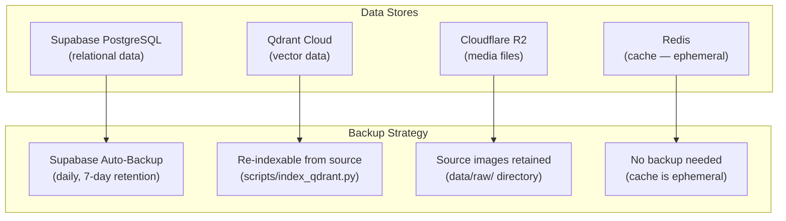

# MemeGPT — Database Backup

> **Document Version:** 2.0 · **Last Updated:** 2026-08-02

---

## Purpose

Complete backup strategy for all MemeGPT data stores — Supabase PostgreSQL, Qdrant vectors, Cloudflare R2 media, and Redis cache.

---

## Backup Architecture



---

## Backup Matrix

| Data Store | Backup Method | Frequency | Retention | Recovery Time |
|---|---|---|---|---|
| **Supabase** (relational) | Automatic daily backup | Daily | 7 days (free tier) | ~5 minutes |
| **Qdrant** (vectors) | Re-index from source data | On-demand | N/A (regenerated) | ~30 minutes |
| **R2** (media files) | Source images in `data/raw/` | N/A (source of truth) | Permanent | ~1 hour |
| **Redis** (cache) | No backup | N/A | N/A (ephemeral) | Instant (cold start) |

---

## Supabase Backup

```bash
# Export database (manual backup)
supabase db dump -f backup_$(date +%Y%m%d).sql

# Restore from backup
supabase db restore backup_20260801.sql

# Point-in-time recovery (Pro plan only)
# Available via Supabase dashboard
```

### What's Backed Up

| Table | Rows (est.) | Criticality | Backup |
|---|---|---|---|
| `memes` | 10,000 | 🔴 Critical | ✅ Daily |
| `search_logs` | 100,000+ | 🟡 Important | ✅ Daily |
| `feedback` | 50,000+ | 🟡 Important | ✅ Daily |
| `api_keys` | 100 | 🔴 Critical | ✅ Daily |

---

## Qdrant Backup (Re-indexing)

Qdrant free tier has **no backup feature**. The recovery strategy is re-indexing:

```bash
# Full re-index from processed data
python scripts/generate_embeddings.py  # ~30 min for 10K memes
python scripts/index_qdrant.py          # ~5 min to upsert
python scripts/verify_index.py          # ~1 min to verify
```

> **Important:** Always keep `data/processed/` directory — it contains the pre-computed metadata needed for re-indexing without re-running OCR/BLIP/Groq.

---

## Best Practices

1. **Never rely on a single backup** — Supabase auto + manual monthly export
2. **Keep processed data locally** — `data/processed/` is your Qdrant recovery source
3. **Test recovery annually** — verify backups actually work
4. **Export before migrations** — `supabase db dump` before every schema change
5. **Redis needs no backup** — it's a cache, cold start refills it naturally

---

> **Related Documents:**
> - [Recovery.md](./Recovery.md) — Recovery procedures
> - [Schema.md](./Schema.md) — Database schema
> - [12_Deployment/Infrastructure.md](../12_Deployment/Infrastructure.md) — Infrastructure map
