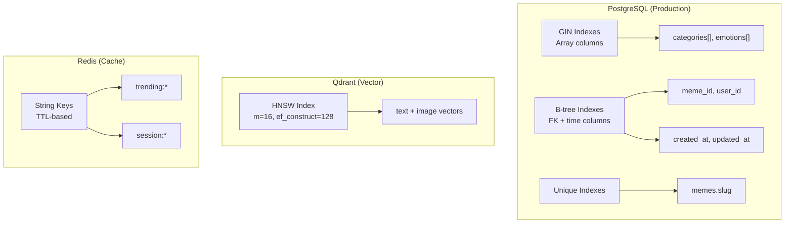

# MemeGPT — Database Indexing

> **Document Version:** 2.0 · **Last Updated:** 2026-08-02

---

## Purpose

Comprehensive index strategy for the MemeGPT database — optimizing query performance for SQLite (development) and PostgreSQL (production).

---

## Index Strategy Overview



---

## PostgreSQL Indexes (Production)

### GIN Indexes — Array Columns

```sql
-- Fast category membership queries
CREATE INDEX idx_memes_categories ON memes USING GIN(categories);
-- Query: SELECT * FROM memes WHERE categories @> ARRAY['tech'];

-- Fast emotion filtering
CREATE INDEX idx_memes_emotions ON memes USING GIN(emotions);
-- Query: SELECT * FROM memes WHERE emotions && ARRAY['amusement', 'joy'];
```

| Index | Size Estimate | Query Speedup |
|---|---|---|
| `idx_memes_categories` | ~2 MB | 50–100× vs. sequential scan |
| `idx_memes_emotions` | ~2 MB | 50–100× vs. sequential scan |

### B-tree Indexes — Standard Columns

```sql
-- Foreign keys
CREATE INDEX idx_feedback_meme_id ON feedback(meme_id);
CREATE INDEX idx_saved_memes_user_id ON saved_memes(user_id);
CREATE INDEX idx_search_logs_query_hash ON search_logs(query_hash);

-- Time-based queries
CREATE INDEX idx_feedback_created_at ON feedback(created_at);
CREATE INDEX idx_search_logs_created ON search_logs(created_at);

-- Sorting and filtering
CREATE INDEX idx_memes_usage_count ON memes(usage_count DESC);
CREATE INDEX idx_memes_viral_score ON memes(viral_score DESC);
CREATE INDEX idx_memes_name ON memes(name);
```

### Partial Indexes

```sql
-- Only index memes with viral_score > 0 (avoids indexing 0-score memes)
CREATE INDEX idx_memes_viral_active ON memes(viral_score)
  WHERE viral_score > 0;

-- Only index feedback from the last 30 days
CREATE INDEX idx_feedback_recent ON feedback(created_at)
  WHERE created_at > NOW() - INTERVAL '30 days';
```

### Composite Indexes

```sql
-- Cover common query patterns
CREATE INDEX idx_memes_category_usage ON memes(categories, usage_count DESC);
-- Query: top memes in a category sorted by popularity

CREATE INDEX idx_feedback_meme_action ON feedback(meme_id, action, created_at DESC);
-- Query: recent interactions for a specific meme
```

---

## SQLite Indexes (Development)

```prisma
// schema.prisma — SQLite-compatible indexes

model Meme {
  id          String   @id @default(uuid())
  name        String
  slug        String   @unique
  categories  String   // JSON array stored as text
  usageCount  Int      @default(0)
  viralScore  Float    @default(0)

  @@index([slug])                    // Fast lookup by slug
  @@index([usageCount(sort: Desc)])  // Trending queries
  @@index([viralScore(sort: Desc)])  // Popular memes
  @@index([categories])              // Category filtering (LIKE)
}
```

> **Note:** SQLite doesn't support GIN indexes or array columns. Categories are stored as JSON strings with `LIKE` queries. For production, always use PostgreSQL.

---

## Query Performance Targets

| Query Pattern | Index Used | Target Time | Worst Case |
|---|---|---|---|
| Get meme by slug | `memes_slug_unique` (unique) | <2 ms | <5 ms |
| Search memes by category | `idx_memes_categories` (GIN) | <5 ms | <20 ms |
| Top trending (ORDER BY usage) | `idx_memes_usage_count` (B-tree) | <10 ms | <50 ms |
| Recent feedback for a meme | `idx_feedback_meme_action` (composite) | <5 ms | <15 ms |
| User's saved memes | `idx_saved_memes_user_id` (B-tree) | <5 ms | <10 ms |
| Search logs by query hash | `idx_search_logs_query_hash` (B-tree) | <2 ms | <5 ms |
| Recent search logs (last 24h) | `idx_search_logs_created` (B-tree) | <10 ms | <100 ms |

---

## Index Maintenance

### Monitoring Index Health

```sql
-- Check index usage statistics
SELECT
  schemaname,
  tablename,
  indexname,
  idx_scan AS index_scans,
  indexrelid::regclass AS index_name
FROM pg_stat_user_indexes
WHERE schemaname = 'public'
ORDER BY idx_scan ASC;

-- Find unused indexes (low scan count)
SELECT
  indexrelid::regclass AS index_name,
  idx_scan
FROM pg_stat_user_indexes
WHERE idx_scan < 100;
```

### Rebuilding Indexes

```sql
-- Rebuild a specific index (minimal lock)
REINDEX INDEX idx_memes_usage_count;

-- Rebuild all indexes on a table (exclusive lock)
REINDEX TABLE memes;

-- Concurrent rebuild (PostgreSQL 12+, no lock)
REINDEX INDEX CONCURRENTLY idx_memes_usage_count;
```

### Bloat Management

| Index Type | Bloat Risk | Rebuild Frequency |
|---|---|---|
| B-tree on high-write table | Medium | Monthly |
| B-tree on read-only table | Low | Quarterly |
| GIN on array column | Low | Quarterly |
| Partial index | Very Low | Yearly |

---

## Qdrant HNSW Index

For vector search performance, Qdrant uses HNSW (Hierarchical Navigable Small World) indexes:

```yaml
# Qdrant collection configuration
vector:
  size: 384         # MiniLM embedding dimension
  distance: Cosine  # Similarity metric

hnsw_config:
  m: 16              # Number of bi-directional links per node (higher = recall, lower = speed)
  ef_construct: 128  # Search breadth during indexing (higher = recall, longer build)
  full_scan_threshold: 10000  # Fall back to full scan below this row count
```

| Parameter | Recommendation | Trade-off |
|---|---|---|
| `m` | 16 | 8 = faster but lower recall, 32 = higher recall but slower |
| `ef_construct` | 128 | 64 = faster indexing, 256 = better recall |
| `full_scan_threshold` | 10000 | Below this, Qdrant brute-forces for speed |

---

> **Related Documents:**
> - [Schema.md](./Schema.md) — Full schema definition
> - [Database_Overview.md](./Database_Overview.md) — Polyglot persistence strategy
> - [Performance.md](./Performance.md) — Database performance targets
> - [05_AI_System/Vector_Database.md](../05_AI_System/Vector_Database.md) — Qdrant configuration