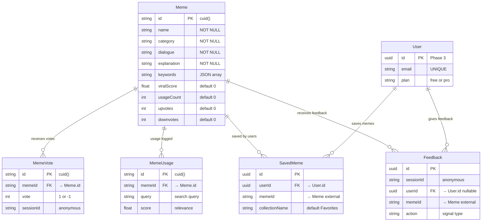

# MemeGPT — Database Relationships

> **Document Version:** 1.0 · **Last Updated:** 2026-08-02

---

## Purpose

Documentation of all entity relationships, foreign keys, cascade behaviors, and referential integrity rules.

---

## Entity Relationship Diagram

---

## Foreign Key Relationships

| Relationship | From Table | To Table | Type | On Delete |
|---|---|---|---|---|
| MemeVote → Meme | `meme_votes.memeId` | `memes.id` | Many-to-One | CASCADE |
| MemeUsage → Meme | `meme_usage.memeId` | `memes.id` | Many-to-One | CASCADE |
| SavedMeme → User | `saved_memes.userId` | `users.id` | Many-to-One | CASCADE |
| Feedback → User | `feedback.userId` | `users.id` | Many-to-One | SET NULL |

### Cascade Behaviors

| Event | Behavior | Reason |
|---|---|---|
| Delete a meme | Cascade delete votes + usage logs | Orphan data serves no purpose |
| Delete a user | Cascade delete saved memes | User's data should be fully removable (GDPR) |
| Delete a user | Set NULL on feedback.userId | Anonymous feedback still has analytics value |

---

## Relationship Cardinality

| Entity A | Relationship | Entity B | Cardinality |
|---|---|---|---|
| Meme | has | MemeVotes | 1:N (one meme, many votes) |
| Meme | logged in | MemeUsage | 1:N (one meme, many usage entries) |
| User | saves | Memes | M:N (via SavedMeme join table) |
| User | provides | Feedback | 1:N (one user, many feedback entries) |
| Meme | receives | Feedback | 1:N (one meme, many feedback entries) |

---

## Best Practices

1. **Always use foreign keys** — enforce referential integrity at the DB level
2. **CASCADE delete** children when parent is deleted (votes, usage logs)
3. **SET NULL** when child data has independent value (feedback analytics)
4. **Never delete memes in production** — soft-delete with `is_active` flag
5. **Index all FK columns** — required for efficient JOIN operations

---

> **Related Documents:**
> - [Tables.md](./Tables.md) · [Schema.md](./Schema.md) · [Indexing.md](./Indexing.md)
