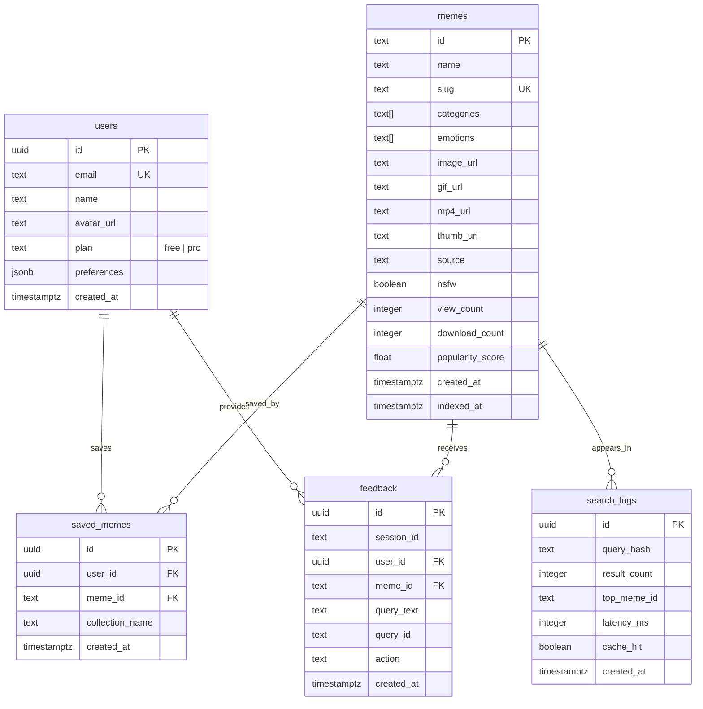

# MemeGPT — Database Schema (Complete Specification)

> **Document Version:** 2.0 · **Last Updated:** 2026-08-02

---

## Purpose

This document provides the complete database schema specification for MemeGPT — the Entity-Relationship model, full SQL DDL (Supabase PostgreSQL), Prisma ORM schema, column-level documentation, and all indexes.

---

## Background

MemeGPT uses a **polyglot persistence** strategy:

| Store | Technology | Data Stored | Why |
|---|---|---|---|
| **Vector DB** | Qdrant Cloud | Meme embeddings (384/512/896-dim) | Sub-50ms cosine similarity search |
| **Relational DB** | Supabase PostgreSQL (prod) / SQLite (dev) | Users, metadata, feedback, analytics | Structured queries, ACID compliance |
| **Cache** | Upstash Redis | Search results, rate limits | 10K free cmds/day, serverless |
| **Object Storage** | Cloudflare R2 | GIF, PNG, MP4, WebP files | 10GB free, global CDN |

---

## Entity-Relationship Diagram



---

## Full SQL DDL (Supabase PostgreSQL)

```sql
-- ═══════════════════════════════════════════════════
-- MemeGPT Database Schema — Supabase PostgreSQL
-- ═══════════════════════════════════════════════════

-- Users table
CREATE TABLE users (
    id          UUID PRIMARY KEY DEFAULT gen_random_uuid(),
    email       TEXT UNIQUE NOT NULL,
    name        TEXT,
    avatar_url  TEXT,
    plan        TEXT DEFAULT 'free',  -- 'free' | 'pro'
    preferences JSONB DEFAULT '{}',   -- {format_pref, nsfw, categories}
    created_at  TIMESTAMPTZ DEFAULT NOW()
);

-- Memes metadata table
CREATE TABLE memes (
    id               TEXT PRIMARY KEY,    -- matches Qdrant payload meme_id
    name             TEXT NOT NULL,
    slug             TEXT UNIQUE NOT NULL,
    categories       TEXT[] DEFAULT '{}',
    emotions         TEXT[] DEFAULT '{}',
    image_url        TEXT,
    gif_url          TEXT,
    mp4_url          TEXT,
    thumb_url        TEXT,
    source           TEXT,              -- 'imgflip' | 'reddit' | 'tenor' | 'manual'
    nsfw             BOOLEAN DEFAULT FALSE,
    view_count       INTEGER DEFAULT 0,
    download_count   INTEGER DEFAULT 0,
    popularity_score FLOAT DEFAULT 0.0, -- 0.0 – 1.0, recalculated weekly
    created_at       TIMESTAMPTZ DEFAULT NOW(),
    indexed_at       TIMESTAMPTZ DEFAULT NOW()
);

-- User feedback / interaction signals
CREATE TABLE feedback (
    id          UUID PRIMARY KEY DEFAULT gen_random_uuid(),
    session_id  TEXT,                            -- anonymous session tracking
    user_id     UUID REFERENCES users(id),       -- NULL for anonymous users
    meme_id     TEXT REFERENCES memes(id),
    query_text  TEXT,                            -- hashed in application layer
    query_id    TEXT,
    action      TEXT NOT NULL,                   -- see valid actions below
    created_at  TIMESTAMPTZ DEFAULT NOW()
);
-- Valid actions: 'view'|'click'|'copy'|'download'|'share'|'thumbs_up'|'thumbs_down'|'skip'

-- User saved memes
CREATE TABLE saved_memes (
    id              UUID PRIMARY KEY DEFAULT gen_random_uuid(),
    user_id         UUID REFERENCES users(id) NOT NULL,
    meme_id         TEXT REFERENCES memes(id) NOT NULL,
    collection_name TEXT DEFAULT 'Favorites',
    created_at      TIMESTAMPTZ DEFAULT NOW(),
    UNIQUE(user_id, meme_id)         -- prevent duplicate saves
);

-- Search analytics (aggregated, no PII)
CREATE TABLE search_logs (
    id              UUID PRIMARY KEY DEFAULT gen_random_uuid(),
    query_hash      TEXT,              -- MD5 of query (anonymized)
    result_count    INTEGER,
    top_meme_id     TEXT,
    latency_ms      INTEGER,
    cache_hit       BOOLEAN,
    created_at      TIMESTAMPTZ DEFAULT NOW()
);

-- ═══════════════════════════════════════════════════
-- INDEXES (Critical for Performance)
-- ═══════════════════════════════════════════════════

CREATE INDEX idx_memes_slug ON memes(slug);
CREATE INDEX idx_memes_categories ON memes USING GIN(categories);
CREATE INDEX idx_memes_emotions ON memes USING GIN(emotions);
CREATE INDEX idx_memes_popularity ON memes(popularity_score DESC);
CREATE INDEX idx_memes_nsfw ON memes(nsfw);

CREATE INDEX idx_feedback_meme_id ON feedback(meme_id);
CREATE INDEX idx_feedback_query_id ON feedback(query_id);
CREATE INDEX idx_feedback_created_at ON feedback(created_at);
CREATE INDEX idx_feedback_action ON feedback(action);

CREATE INDEX idx_saved_memes_user_id ON saved_memes(user_id);
CREATE INDEX idx_saved_memes_meme_id ON saved_memes(meme_id);

CREATE INDEX idx_search_logs_created_at ON search_logs(created_at);
CREATE INDEX idx_search_logs_query_hash ON search_logs(query_hash);
```

---

## Prisma Schema (Development — SQLite)

```prisma
datasource db {
  provider = "sqlite"
  url      = env("DATABASE_URL")
}

generator client {
  provider = "prisma-client-js"
}

model Meme {
  id               String      @id @default(cuid())
  name             String
  slug             String      @unique
  category         String      @default("general")
  dialogue         String      @default("")
  explanation      String      @default("")
  keywords         String      @default("[]")  // JSON string in SQLite
  emotions         String      @default("[]")
  imageUrl         String?     @map("image_url")
  gifUrl           String?     @map("gif_url")
  mp4Url           String?     @map("mp4_url")
  thumbUrl         String?     @map("thumb_url")
  videoRef         String?     @map("video_ref")
  gifRef           String?     @map("gif_ref")
  source           String      @default("manual")
  nsfw             Boolean     @default(false)
  viralScore       Float       @default(0.0)   @map("viral_score")
  usageCount       Int         @default(0)     @map("usage_count")
  upvotes          Int         @default(0)
  downvotes        Int         @default(0)
  downloadCount    Int         @default(0)     @map("download_count")
  popularityScore  Float       @default(0.0)   @map("popularity_score")
  createdAt        DateTime    @default(now())  @map("created_at")
  updatedAt        DateTime    @updatedAt       @map("updated_at")

  votes            MemeVote[]
  usageLogs        MemeUsage[]
  feedback         Feedback[]
  savedBy          SavedMeme[]

  @@map("memes")
}

model MemeVote {
  id        String   @id @default(cuid())
  memeId    String   @map("meme_id")
  vote      Int      // +1 or -1
  sessionId String   @map("session_id")
  createdAt DateTime @default(now()) @map("created_at")

  meme      Meme     @relation(fields: [memeId], references: [id])

  @@map("meme_votes")
}

model MemeUsage {
  id        String   @id @default(cuid())
  memeId    String   @map("meme_id")
  query     String
  score     Float
  createdAt DateTime @default(now()) @map("created_at")

  meme      Meme     @relation(fields: [memeId], references: [id])

  @@map("meme_usage")
}

model Feedback {
  id         String   @id @default(cuid())
  sessionId  String?  @map("session_id")
  memeId     String   @map("meme_id")
  queryText  String?  @map("query_text")
  queryId    String?  @map("query_id")
  action     String
  createdAt  DateTime @default(now()) @map("created_at")

  meme       Meme     @relation(fields: [memeId], references: [id])

  @@map("feedback")
}

model SavedMeme {
  id             String   @id @default(cuid())
  userId         String   @map("user_id")
  memeId         String   @map("meme_id")
  collectionName String   @default("Favorites") @map("collection_name")
  createdAt      DateTime @default(now()) @map("created_at")

  meme           Meme     @relation(fields: [memeId], references: [id])

  @@unique([userId, memeId])
  @@map("saved_memes")
}

model SearchLog {
  id          String   @id @default(cuid())
  queryHash   String   @map("query_hash")
  resultCount Int      @map("result_count")
  topMemeId   String?  @map("top_meme_id")
  latencyMs   Int      @map("latency_ms")
  cacheHit    Boolean  @map("cache_hit")
  createdAt   DateTime @default(now()) @map("created_at")

  @@map("search_logs")
}
```

---

## Column-Level Documentation

### `memes` Table — Complete Reference

| Column | Type | Null | Default | Validation | Description |
|---|---|---|---|---|---|
| `id` | TEXT | No | cuid() | Unique | Primary key, matches Qdrant payload `meme_id` |
| `name` | TEXT | No | — | max 200 chars | Human-readable meme template name |
| `slug` | TEXT | No | — | Unique, URL-safe | SEO-friendly URL slug (`drake-pointing`) |
| `categories` | TEXT[] | No | `{}` | — | Array of categories: work, gaming, etc. |
| `emotions` | TEXT[] | No | `{}` | — | Array of emotions: joy, sadness, etc. |
| `image_url` | TEXT | Yes | NULL | Valid URL | CDN URL for PNG/JPG image |
| `gif_url` | TEXT | Yes | NULL | Valid URL | CDN URL for animated GIF |
| `mp4_url` | TEXT | Yes | NULL | Valid URL | CDN URL for MP4 video |
| `thumb_url` | TEXT | Yes | NULL | Valid URL | CDN URL for 200×200 WebP thumbnail |
| `source` | TEXT | No | `'manual'` | Enum-like | Where the meme came from |
| `nsfw` | BOOLEAN | No | FALSE | — | NSFW content flag |
| `view_count` | INT | No | 0 | ≥0 | Total times shown in results |
| `download_count` | INT | No | 0 | ≥0 | Total downloads |
| `popularity_score` | FLOAT | No | 0.0 | 0.0–1.0 | Normalized popularity, recalculated weekly |
| `created_at` | TIMESTAMPTZ | No | NOW() | — | When the meme was first indexed |
| `indexed_at` | TIMESTAMPTZ | No | NOW() | — | Last time embeddings were regenerated |

### `feedback` Table — Valid Actions

| Action | Signal Weight | Description |
|---|---|---|
| `view` | +0.1 | Meme appeared in results (implicit) |
| `click` | +0.5 | User clicked to preview |
| `copy` | +1.0 | Copied to clipboard |
| `download` | +2.0 | Downloaded the file |
| `share` | +3.0 | Shared via native share sheet |
| `thumbs_up` | +2.0 | Explicit positive vote |
| `thumbs_down` | -1.0 | Explicit negative vote |
| `skip` | -0.3 | Scrolled past without interaction |

---

## Best Practices

1. **Always use parameterized queries** — Prisma handles this automatically
2. **Use GIN indexes for array columns** — essential for `categories` and `emotions` filtering
3. **Hash query text before storage** — MD5 hash for privacy (no raw PII)
4. **Use UNIQUE constraints** — prevent duplicate saves (`saved_memes.user_id + meme_id`)
5. **Cascade deletes carefully** — don't cascade on `memes.id` (would wipe feedback data)
6. **Partition `search_logs` by month** — at scale, millions of rows accumulate
7. **Add `indexed_at` timestamps** — track when embeddings were last generated

---

## Common Mistakes

| Mistake | Consequence | Fix |
|---|---|---|
| Storing raw query text | PII exposure, GDPR violation | Store `query_hash` only |
| No index on `slug` | O(n) lookup for every SEO page | `CREATE INDEX idx_memes_slug` |
| Using TEXT for categories (not array) | Can't use GIN index, slow LIKE queries | Use `TEXT[]` with GIN |
| No composite unique on saved_memes | Duplicate favorites | `UNIQUE(user_id, meme_id)` |
| Not expiring search_logs | Table grows indefinitely | Auto-purge after 90 days |
| Storing embeddings in PostgreSQL | 10× slower than Qdrant | Embeddings in Qdrant only |

---

## Edge Cases

| Scenario | Expected Behavior | Implementation |
|---|---|---|
| Same meme saved twice | Ignored, UNIQUE prevents dupe | `ON CONFLICT DO NOTHING` |
| Delete user with feedback | Feedback preserved (NULL user_id) | `SET NULL` cascade |
| Meme deleted from catalog | Feedback preserved, foreign key nullable | Soft-delete preferred |
| `popularity_score` exceeds 1.0 | Capped | `FLOAT CHECK (popularity_score <= 1.0)` |
| Unicode in meme name | Supported | UTF-8 by default in PostgreSQL |
| Very long query text | Truncated before hashing | `query_text[:500]` in app layer |

---

## Security Considerations

- **No PII in `search_logs`** — queries are MD5-hashed before storage
- **`user_id` nullable in `feedback`** — anonymous users can provide feedback
- **Row Level Security (RLS)** — Supabase enables RLS by default on all tables
- **`preferences` JSONB validated in app** — never trust raw JSON from client
- **No direct database access** — all reads/writes go through the API layer

---

## Performance Targets

| Query | Expected Latency | Index Used |
|---|---|---|
| `GET /memes/{slug}` | <5ms | `idx_memes_slug` |
| `GET /trending` (top 20) | <10ms | `idx_memes_popularity` |
| Filter by category | <15ms | GIN `idx_memes_categories` |
| Insert feedback | <3ms | No index needed for writes |
| Count downloads for meme | <5ms | `idx_feedback_meme_id` |
| Analytics (last 7 days) | <50ms | `idx_search_logs_created_at` |

---

## Future Improvements

1. **Partitioning** — partition `feedback` and `search_logs` by month at scale
2. **Materialized views** — pre-computed trending scores, updated hourly
3. **Read replicas** — Supabase supports read replicas for high-read workloads
4. **Connection pooling** — PgBouncer for >100 concurrent connections
5. **Full-text search** — PostgreSQL `tsvector` for meme name search (complement to vector search)

---

> **Related Documents:**
> - [Database_Overview.md](./Database_Overview.md) — Storage strategy
> - [Tables.md](./Tables.md) — Extended table docs
> - [Relationships.md](./Relationships.md) — FK and cascade details
> - [Indexing.md](./Indexing.md) — Index strategy deep dive
> - [Performance.md](./Performance.md) — Query optimization
> - [Backup_Recovery.md](./Backup_Recovery.md) — Disaster recovery
